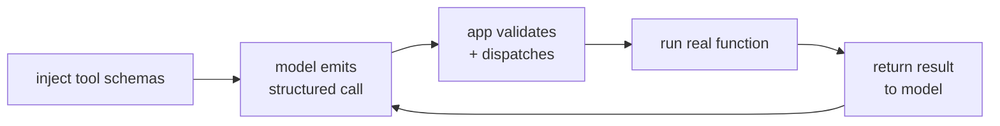

A model on its own can only produce text. To *act*, look up a live stock price, query
a database, send an email, it needs to call code, and the code lives in your
application, not in the model. **Tool use** (also called function calling) is the
protocol that bridges the two: you tell the model what functions exist, it emits a
structured request to call one, and your application runs it and returns the result<FN n="1" />.
The [mechanism](E/function-calling) was introduced from the model side; here we build
the application side, the part you own.

## The loop

Tool use is a four-step round trip, and the model never touches your code directly:



- **Inject schemas.** Along with the user's message, you put a machine-readable
  description of each available tool into the model's context: its name, what it does,
  and the parameters it takes. This is the model's entire knowledge of what it can do.
- **Model emits a call.** Instead of answering in prose, the model returns a
  *structured* object, a tool name and a set of argument values, signaling it wants
  that function run. Modern APIs guarantee this is well-formed JSON matching the
  schema.
- **Validate and dispatch.** Your application checks the call against the schema
  (known tool? required arguments present?) and routes it to the real function. This
  validation step is a security boundary, not a formality: the model's output is
  untrusted input.
- **Return the result.** The function's return value is fed back into the
  conversation, and the model continues with the result in hand.

The key shift is that the model does not *execute* anything; it *requests*. Your code
decides whether to honor the request. That separation is what makes a single tool
call safe, and it is the atom the next lesson assembles into an agent<FN n="2" />.

## Worked example

We define a small tool registry, generate the schemas to inject, dispatch a
well-formed call from the model, and confirm the validation layer rejects a
hallucinated tool and a call with a missing argument.

```python
def add(a, b): return a + b
def get_stock(ticker): return {"AAPL": 192.3, "GOOG": 141.8}.get(ticker)

# Registry: each tool pairs a schema (for the model) with an implementation (yours).
TOOLS = {
    "add":       {"fn": add,       "params": ["a", "b"],  "desc": "Add two numbers."},
    "get_stock": {"fn": get_stock, "params": ["ticker"],  "desc": "Get a stock price."},
}

def schemas():                                  # injected into the model's context
    return [{"name": n, "description": t["desc"], "parameters": t["params"]}
            for n, t in TOOLS.items()]

def dispatch(call):                             # validate, then run the real function
    name, args = call["name"], call["arguments"]
    if name not in TOOLS:
        raise ValueError(f"unknown tool '{name}'")
    missing = [p for p in TOOLS[name]["params"] if p not in args]
    if missing:
        raise ValueError(f"missing args {missing} for '{name}'")
    return TOOLS[name]["fn"](**args)

print("injected schemas:")
for s in schemas():
    print(" ", s)

# The model, shown the schemas, emits a STRUCTURED call rather than prose:
model_call = {"name": "get_stock", "arguments": {"ticker": "AAPL"}}
result = dispatch(model_call)
print("\ntool result fed back to model:", result)
assert result == 192.3

# The validation boundary rejects bad calls instead of executing them:
for bad in [{"name": "delete_db", "arguments": {}},
            {"name": "add", "arguments": {"a": 1}}]:
    try:
        dispatch(bad)
    except ValueError as e:
        print("rejected:", e)
```

The well-formed call runs and returns the price for the model to use, while the
hallucinated `delete_db` and the under-specified `add` are rejected at the boundary
before any code runs.

## Exercises

**Exercise 1.** The lesson calls the validate-and-dispatch step "a security
boundary, not a formality," because "the model's output is untrusted input." Given
the registry from the worked example, classify each of the following model-emitted
calls as accepted or rejected by `dispatch`, and name the precise check that
decides each.

```json
{"name": "get_stock", "arguments": {"ticker": "GOOG"}}
{"name": "add", "arguments": {"a": 3, "b": 4}}
{"name": "wipe_disk", "arguments": {}}
{"name": "get_stock", "arguments": {}}
```

<details>
<summary>Solution</summary>

**Step 1.** Recall the two checks in `dispatch`: first, the name must be a key in
`TOOLS` (else `unknown tool`); second, every parameter in the tool's `params` list
must be present in `arguments` (else `missing args`).

**Step 2.** Apply them in order to each call.

- `get_stock` with `ticker` present: known tool, all params present. **Accepted**,
  returns the price for `GOOG`.
- `add` with `a` and `b` present: known tool, both required params present.
  **Accepted**, returns `7`.
- `wipe_disk`: not a key in `TOOLS`. **Rejected** by the unknown-tool check, before
  any arguments are looked at.
- `get_stock` with empty arguments: known tool, but the required `ticker` is
  missing. **Rejected** by the missing-args check.

**Step 3.** The two rejections are exactly the boundary's job: a hallucinated tool
name and an under-specified call are both stopped before any function runs.

</details>

**Exercise 2.** Suppose a model emits a call whose `name` is a real tool but whose
`arguments` contains an extra key the tool does not accept, for example `get_stock`
with `{"ticker": "AAPL", "exchange": "NYSE"}`. Trace `dispatch` on it and state
what happens, then explain what additional validation a stricter boundary would add
and why the model's untrusted-output status motivates it.

<details>
<summary>Solution</summary>

**Step 1.** Trace the current `dispatch`. The name `get_stock` is in `TOOLS`, so
the unknown-tool check passes. The missing-args check tests only that each declared
param (`ticker`) is present; it does not test for *extra* keys, so it passes too.
Then `TOOLS["get_stock"]["fn"](**args)` is called as `get_stock(ticker="AAPL",
exchange="NYSE")`, and since `get_stock` takes only `ticker`, Python raises a
`TypeError` for the unexpected keyword argument.

**Step 2.** Name the stricter check. A robust boundary would reject any argument
key not in the tool's declared `params` (an allowlist on arguments), returning a
clean validation error instead of letting an unexpected keyword reach the function.

**Step 3.** Motivate it. The model's output is untrusted; an extra or misspelled
key is the kind of malformed call the boundary exists to catch. Validating the full
argument set, not just presence of required keys, keeps a single confused or
adversarial call from crashing or misdriving the real function.

</details>

**Exercise 3 (code).** Extend the worked dispatcher with strict argument validation:
reject a call if its name is unknown, if any required parameter is missing, *or* if
it carries any argument key the tool does not declare. Then route a batch of model
calls and assert exactly which ones are accepted.

<details>
<summary>Solution</summary>

```python
import numpy as np

def add(a, b): return a + b
def get_stock(ticker): return {"AAPL": 192.3, "GOOG": 141.8}.get(ticker)

TOOLS = {
    "add":       {"fn": add,       "params": ["a", "b"]},
    "get_stock": {"fn": get_stock, "params": ["ticker"]},
}

def dispatch(call):
    name, args = call["name"], call["arguments"]
    if name not in TOOLS:
        raise ValueError(f"unknown tool '{name}'")
    declared = set(TOOLS[name]["params"])
    missing = declared - set(args)
    extra = set(args) - declared
    if missing:
        raise ValueError(f"missing args {sorted(missing)}")
    if extra:
        raise ValueError(f"unexpected args {sorted(extra)}")     # strict allowlist
    return TOOLS[name]["fn"](**args)

batch = [
    {"name": "get_stock", "arguments": {"ticker": "AAPL"}},      # ok
    {"name": "add",       "arguments": {"a": 1, "b": 2}},        # ok
    {"name": "wipe_disk", "arguments": {}},                      # unknown name
    {"name": "get_stock", "arguments": {}},                      # missing ticker
    {"name": "get_stock", "arguments": {"ticker": "AAPL", "exchange": "NYSE"}},  # extra
]

accepted = []
for call in batch:
    try:
        dispatch(call)
        accepted.append(call["name"])
    except ValueError:
        pass

assert accepted == ["get_stock", "add"]
print("accepted calls:", accepted)
```

Only the two well-formed calls survive the boundary; the unknown tool, the missing
required argument, and the undeclared extra argument are each rejected before any
function runs.

</details>

One tool call answers one question; looping the model so it can chain several calls
toward a goal is the [ReAct loop](react-loop).

<Footnotes>
  <FNItem n="1">**Schick, T., et al.** (2023). "Toolformer: language models can teach themselves to use tools". *NeurIPS*. [arXiv:2302.04761](https://arxiv.org/abs/2302.04761). Models learn when and how to call external APIs.</FNItem>
  <FNItem n="2">**Huyen, C.** (2024). *AI Engineering: Building Applications with Foundation Models.* O'Reilly. The application-side function-calling protocol and its validation boundary.</FNItem>
</Footnotes>
