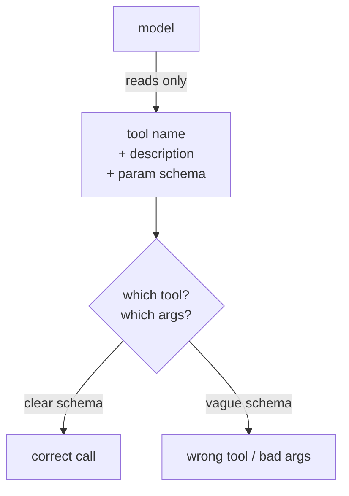

An [MCP server](mcp-protocol) is only as good as the tools it exposes, and "good" here
means *good for a model to use*, which is not the same as good for a human. A model
discovers your tools from their schemas and decides which to call based on their names
and descriptions, with no documentation to read and no engineer to ask<FN n="1" />. Three design
choices determine whether it succeeds: granularity, description, and versioning.

## Granularity: how much each tool does

The first choice is how to slice capability into tools. Two failure modes bracket the
answer:

- **Too coarse.** One mega-tool like `manage_database(action, table, payload)` that
  does everything forces the model to assemble a complex, error-prone argument and
  gives it no signal about which actions are even available. The model guesses, and
  guesses wrong.
- **Too fine.** Fifty micro-tools (`get_user_first_name`, `get_user_last_name`, ...)
  flood the model's context with schemas, make the right choice harder to find, and
  turn one logical task into many round trips.

The sweet spot is **one tool per coherent action the model would actually want to
take**: `search_users`, `get_user`, `create_ticket`. Each does one understandable
thing, takes a small set of clear arguments, and maps to a verb the model can reason
about. Granularity is really about matching the tool set to the model's decision, not
to your internal API surface.

## Descriptions are the interface

For a model, the tool's **description and parameter names are the documentation, the
type system, and the help text, all at once**. The model has nothing else to go on. So
descriptions must state what the tool does, when to use it (and when not to), and what
each argument means, in plain language. `query` is a worse parameter name than
`search_terms`; "Get data" is a worse description than "Search the support knowledge
base by keyword; returns the top 5 articles." Writing tool descriptions is prompt
engineering: every word is read by the model on every call, and vague wording shows up
directly as wrong tool calls<FN n="2" />.

## Versioning: evolving without breaking clients

An MCP server is a contract with every client connected to it, and those clients are
out in the world. So changes must be **backward compatible**: adding a new tool, or a
new *optional* argument, is safe because existing calls still work. Renaming a tool,
removing one, or making a previously optional argument required is a **breaking
change** that silently breaks every client still calling the old way. The discipline is
the same as any public API: treat removals and signature changes as a new version,
keep the old surface working through a deprecation window, and never repurpose an
existing tool name to mean something new. A model that learned to call `search_users`
with a keyword should never one day find that name now deletes users.

Get these three right, sensible granularity, model-facing descriptions, compatible
evolution, and your server is one a model can use correctly and that keeps working as
it grows. Building tools is one half of systems thinking; knowing whether the whole
system actually *works* is the other half, which is [evaluation](llm-as-judge).

<Footnotes>
  <FNItem n="1">**Anthropic.** (2024). "Model Context Protocol". [modelcontextprotocol.io](https://modelcontextprotocol.io). Server-side tool, resource, and prompt specifications a model discovers from schemas.</FNItem>
  <FNItem n="2">**Huyen, C.** (2024). *AI Engineering: Building Applications with Foundation Models.* O'Reilly. Tool descriptions as prompt engineering and the design of model-facing interfaces.</FNItem>
</Footnotes>
