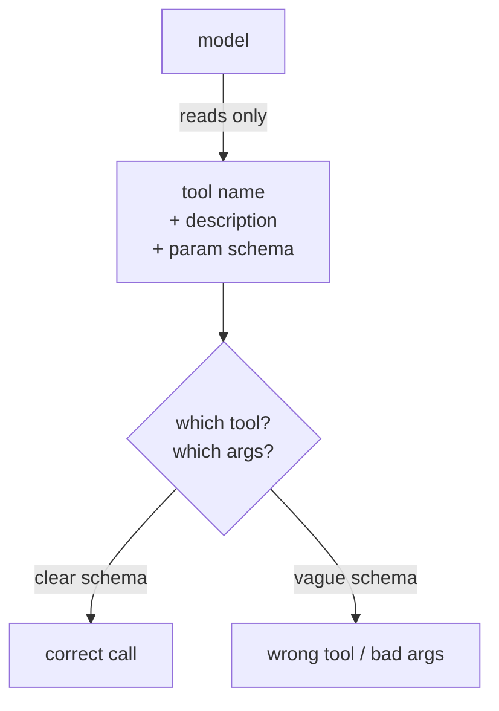

An [MCP server](mcp-protocol) is only as good as the tools it exposes, and "good" here
means *good for a model to use*, which is not the same as good for a human. A model
discovers your tools from their schemas and decides which to call based on their names
and descriptions, with no documentation to read and no engineer to ask<FN n="1" />. Three design
choices determine whether it succeeds: granularity, description, and versioning.

## Granularity: how much each tool does

The first choice is how to slice capability into tools. Two failure modes bracket the
answer:

- **Too coarse.** One mega-tool like `manage_database(action, table, payload)` that
  does everything forces the model to assemble a complex, error-prone argument and
  gives it no signal about which actions are even available. The model guesses, and
  guesses wrong.
- **Too fine.** Fifty micro-tools (`get_user_first_name`, `get_user_last_name`, ...)
  flood the model's context with schemas, make the right choice harder to find, and
  turn one logical task into many round trips.

The sweet spot is **one tool per coherent action the model would actually want to
take**: `search_users`, `get_user`, `create_ticket`. Each does one understandable
thing, takes a small set of clear arguments, and maps to a verb the model can reason
about. Granularity is really about matching the tool set to the model's decision, not
to your internal API surface.

## Descriptions are the interface

For a model, the tool's **description and parameter names are the documentation, the
type system, and the help text, all at once**. The model has nothing else to go on. So
descriptions must state what the tool does, when to use it (and when not to), and what
each argument means, in plain language. `query` is a worse parameter name than
`search_terms`; "Get data" is a worse description than "Search the support knowledge
base by keyword; returns the top 5 articles." Writing tool descriptions is prompt
engineering: every word is read by the model on every call, and vague wording shows up
directly as wrong tool calls<FN n="2" />.

## Versioning: evolving without breaking clients

An MCP server is a contract with every client connected to it, and those clients are
out in the world. So changes must be **backward compatible**: adding a new tool, or a
new *optional* argument, is safe because existing calls still work. Renaming a tool,
removing one, or making a previously optional argument required is a **breaking
change** that silently breaks every client still calling the old way. The discipline is
the same as any public API: treat removals and signature changes as a new version,
keep the old surface working through a deprecation window, and never repurpose an
existing tool name to mean something new. A model that learned to call `search_users`
with a keyword should never one day find that name now deletes users.

## Exercises

**Exercise 1.** A server exposes a single tool `manage_files(action, path, content)`
where `action` is one of `"read"`, `"write"`, `"list"`, `"delete"`. Identify which
granularity failure mode this is, explain the concrete symptom a model will exhibit,
and propose a tool set that fixes it.

Solution

**Step 1.** This is the **too-coarse** failure: one mega-tool dispatching on an
`action` argument. The schema shows the model the parameter names but gives it no
per-action signal, so the model cannot see from the schema that `content` is required
for `"write"` but meaningless for `"list"`.

**Step 2.** The concrete symptom is malformed calls: the model invokes
`manage_files("delete", path)` while omitting `content` (correct here) but also
`manage_files("write", path)` with no `content` (now broken), because nothing in the
schema couples the action to its required arguments. It guesses argument combinations
and gets them wrong.

**Step 3.** Split into one tool per coherent action, each with only the arguments that
action needs: `read_file(path)`, `write_file(path, content)`, `list_files(path)`,
`delete_file(path)`. Now `content` appears only where it is required, and the model
reasons over four clear verbs instead of one overloaded dispatcher.

**Exercise 2.** Classify each change to a live server as backward-compatible or
breaking, and justify each in one sentence: (a) adding a new tool `archive_ticket`;
(b) adding an optional `priority` argument to `create_ticket`; (c) renaming
`search_users` to `find_users`; (d) making the previously optional `limit` argument of
`search_users` required.

Solution

**Step 1.** (a) **Compatible.** Adding a tool cannot break existing clients; none of
them called a tool that did not exist, so every prior call still resolves.

**Step 2.** (b) **Compatible.** An optional argument defaults when omitted, so existing
`create_ticket` calls that never pass `priority` keep working unchanged.

**Step 3.** (c) **Breaking.** Every client that calls `search_users` by name now hits
an unknown tool; the old name stops resolving, which is a removal in disguise.

**Step 4.** (d) **Breaking.** Calls that omitted `limit` (valid before) now fail
validation, so a previously correct client is silently rejected. The safe path for
(c) and (d) is to ship the change as a new tool or version and keep the old surface
through a deprecation window.

**Exercise 3.** A support team has internal REST endpoints `GET /users?q=`,
`GET /users/{id}`, `GET /users/{id}/tickets`, and `POST /tickets`. A junior engineer
proposes mirroring them one-to-one as MCP tools `get_users`, `get_user_by_id`,
`get_user_tickets`, `post_tickets`. Critique this mapping against the lesson's three
design principles and give a revised tool set with model-facing descriptions for two
of the tools.

Solution

**Step 1.** **Granularity.** Mirroring the API one-to-one matches the *internal API
surface*, not the model's decision, which the lesson warns against. The four endpoints
happen to be reasonably coherent actions here, so the count is acceptable, but the
mapping principle is wrong: tools should be chosen for the actions a model wants to
take, and a tool like `get_user_tickets` is justified only if "list a user's tickets"
is a real model task, not because the REST route exists.

**Step 2.** **Descriptions.** The names are HTTP-shaped (`post_tickets`,
`get_user_by_id`) rather than model-facing verbs. `post_tickets` reads as plumbing;
`create_ticket` reads as an action the model can reason about. The descriptions and
parameter meanings (what `q` searches, what a ticket payload contains) are absent, and
for a model the description *is* the documentation.

**Step 3.** Revised tool set: `search_users(search_terms)`, `get_user(user_id)`,
`list_user_tickets(user_id)`, `create_ticket(user_id, summary)`. Two model-facing
descriptions:

- `search_users`: "Search the user directory by name or email keyword; returns up to
  20 matching users with their ids. Use this when you have a name or email but not a
  user id."
- `create_ticket`: "Open a new support ticket for an existing user. Requires the
  user's id (from `search_users` or `get_user`) and a one-line summary of the issue."

**Step 4.** **Versioning** is untouched by the initial design, but the revised names
must now be treated as a stable contract: once `create_ticket` ships, it can gain
optional arguments but must never be renamed or repurposed.

Get these three right, sensible granularity, model-facing descriptions, compatible
evolution, and your server is one a model can use correctly and that keeps working as
it grows. Building tools is one half of systems thinking; knowing whether the whole
system actually *works* is the other half, which is [evaluation](llm-as-judge).

<Footnotes>
  <FNItem n="1">**Anthropic.** (2024). "Model Context Protocol". [modelcontextprotocol.io](https://modelcontextprotocol.io). Server-side tool, resource, and prompt specifications a model discovers from schemas.</FNItem>
  <FNItem n="2">**Huyen, C.** (2024). *AI Engineering: Building Applications with Foundation Models.* O'Reilly. Tool descriptions as prompt engineering and the design of model-facing interfaces.</FNItem>
</Footnotes>
