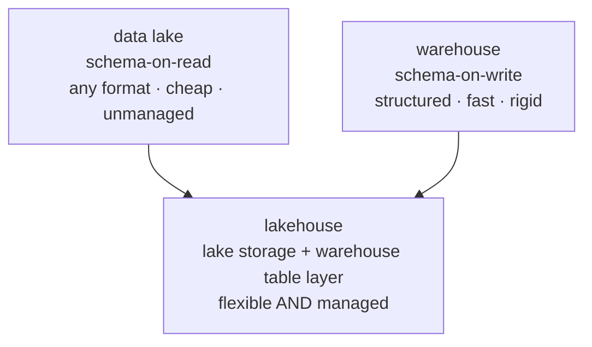

An AI system's data has to live somewhere, and the choice of *where* shapes what you
can do with it<FN n="1" />. The [pipeline](I1/pipeline-paradigms) feeds one of three storage
architectures, and they differ on a single axis: **when structure is imposed**. That
one decision, schema-on-write versus schema-on-read, cascades into cost, flexibility,
and which workloads run well.

## The warehouse: schema-on-write

A **data warehouse** (BigQuery, Snowflake, Redshift) requires data to fit a defined
schema *before* it is loaded. You decide the tables and column types up front, and the
load step (the "T" in [ETL](I1/pipeline-paradigms)) conforms the data to them. Because
everything is structured and typed, queries are fast and analytics tools work out of
the box. The cost is rigidity: data that does not fit the schema (images, raw text,
JSON of varying shape) is awkward or impossible to store, and changing the schema means
reworking pipelines. Warehouses are built for structured, known, query-heavy analytics.

## The lake: schema-on-read

A **data lake** (files on object storage like S3) stores raw data in whatever format it
arrives, structure is imposed only *when you read it*. Anything goes in cheaply:
Parquet tables, PDFs, images, logs, model checkpoints. This flexibility is exactly what
ML and AI workloads need, since training data is often unstructured and you do not know
in advance every way you will use it. The cost is the mirror image of the warehouse:
with no enforced schema, a lake can rot into a "data swamp" of undocumented files,
queries are slower, and there are no transactional guarantees, two jobs writing at once
can leave the data inconsistent.

## The lakehouse: both at once

The **lakehouse** (Databricks Delta Lake, Apache Iceberg, Hudi) is the architecture
that tries to keep the lake's flexibility while adding the warehouse's reliability. It
keeps data in cheap open-format files on object storage (the lake), but adds a
**metadata and transaction layer** on top that provides table semantics: ACID
transactions so concurrent writes stay consistent, schema enforcement and evolution
where you want it, and time travel to query past versions<FN n="2" />. You get warehouse-grade
management *and* lake-grade openness from one copy of the data, instead of copying
between a lake for ML and a warehouse for analytics.

## Exercises

**Exercise 1.** For each workload, name the architecture that fits best and state the
single deciding property: (a) a finance team running daily SQL dashboards over clean,
typed sales tables; (b) a research team dumping millions of raw PDFs, images, and logs
of unknown future use; (c) a platform that must serve both the typed sales tables and
the raw documents from one managed copy with concurrent writers.

Solution

**Step 1.** (a) **Warehouse.** The data is structured, known, and query-heavy, which
is exactly schema-on-write's strength: typed tables give fast analytics out of the
box, and the rigidity costs nothing because the schema is stable.

**Step 2.** (b) **Data lake.** The deciding property is unknown, heterogeneous,
unstructured input. Schema-on-read lets anything land cheaply now and be structured
later, which is what an undefined future use requires.

**Step 3.** (c) **Lakehouse.** The deciding property is "one managed copy serving both
shapes with concurrent writers": that demands lake-grade openness plus warehouse-grade
ACID transactions and schema enforcement, which only the lakehouse's table layer over
object storage provides.

**Exercise 2.** The lesson says a data lake has "no transactional guarantees, two jobs
writing at once can leave the data inconsistent." Describe a concrete two-writer
scenario on a plain object-storage lake that corrupts a logical table, then explain
which specific lakehouse feature prevents it.

Solution

**Step 1.** Take a logical table stored as a set of Parquet files under one prefix.
Job X is appending a new day's files while job Y is compacting (rewriting many small
files into fewer large ones and deleting the originals). A reader listing the prefix
mid-operation sees some of X's new files, some of Y's deleted-but-not-yet-gone files,
and some of Y's new files: a mix that corresponds to no single consistent table state.

**Step 2.** On a plain lake there is no notion of a "version" of the table; the table
*is* whatever files currently exist, so partial writes are visible. A reader can double
count rows or miss them, and a crash mid-job leaves orphaned or half-written files.

**Step 3.** The lakehouse's **ACID transaction layer** prevents this. Each write
commits atomically to a transaction log that defines which files constitute the table
at each version. Readers resolve the table through the log, so they always see one
committed snapshot (and never X's and Y's half-states), and concurrent writers are
serialized or made to conflict-and-retry rather than silently interleaving. **Time
travel** then lets a reader query a past committed version explicitly.

**Exercise 3.** A team currently keeps two copies of the same dataset: a warehouse copy
for the analytics team and a lake copy for the ML team, kept in sync by a nightly job.
Argue the trade-offs of consolidating onto a single lakehouse, and name one cost or
risk of the consolidation, not just the benefits.

Solution

**Step 1.** **Benefit: one copy, no skew.** The nightly sync job is itself a source of
bugs and lag: the two copies disagree for up to a day, and the job must be maintained
forever. A lakehouse holds one transactional copy that both teams read, so analytics
and ML see the same data with no copy-and-reconcile step and no duplicated storage
cost.

**Step 2.** **Benefit: each team keeps its access pattern.** The table layer gives the
analytics team warehouse-grade typed queries while the ML team still reads the
underlying open-format files directly for training, so neither team loses what the
separate stores gave them.

**Step 3.** **Cost / risk.** A mature warehouse is often faster on pure structured
analytics than a lakehouse query engine, so the analytics team may see a query-latency
regression. Consolidation also concentrates risk: one substrate now serves two
critical workloads, so an outage or a bad schema change hits both teams at once,
whereas the two-copy setup isolated them. The decision is a real trade-off, not a free
win.

This is why the lakehouse has become the default substrate for AI data platforms: a
single store that holds the unstructured documents a [RAG](production-rag) system
ingests, the structured features an analytics team queries, and the training data a
model consumes, all under one transactional table layer. With the platform substrate
settled, the next subsection takes these pieces to production: the APIs, governance,
deployment, and security that turn a working pipeline into a [running service](J3/serving-api-design).

<Footnotes>
  <FNItem n="1">**Huyen, C.** (2024). *AI Engineering: Building Applications with Foundation Models.* O'Reilly. Where the documents, features, and training data of an AI system are stored.</FNItem>
  <FNItem n="2">**Armbrust, M., Ghodsi, A., Xin, R., & Zaharia, M.** (2021). "Lakehouse: a new generation of open platforms that unify data warehousing and advanced analytics". *CIDR*. The paper introducing the lakehouse, its transactional table layer over object storage.</FNItem>
</Footnotes>
