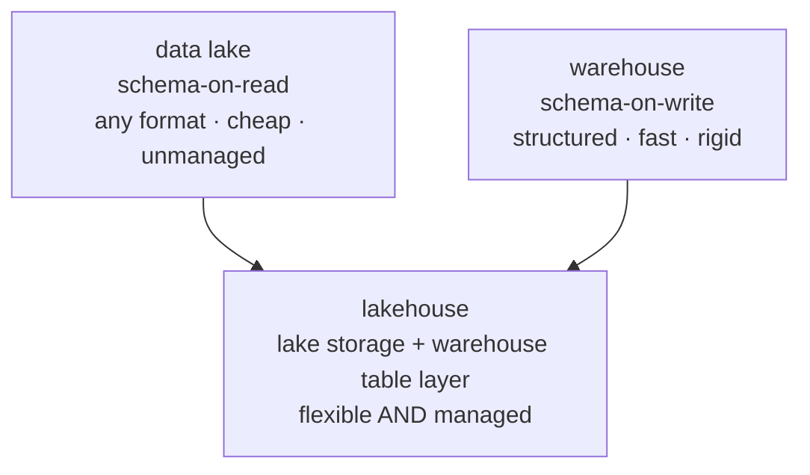

An AI system's data has to live somewhere, and the choice of *where* shapes what you
can do with it<FN n="1" />. The [pipeline](I1/pipeline-paradigms) feeds one of three storage
architectures, and they differ on a single axis: **when structure is imposed**. That
one decision, schema-on-write versus schema-on-read, cascades into cost, flexibility,
and which workloads run well.

## The warehouse: schema-on-write

A **data warehouse** (BigQuery, Snowflake, Redshift) requires data to fit a defined
schema *before* it is loaded. You decide the tables and column types up front, and the
load step (the "T" in [ETL](I1/pipeline-paradigms)) conforms the data to them. Because
everything is structured and typed, queries are fast and analytics tools work out of
the box. The cost is rigidity: data that does not fit the schema (images, raw text,
JSON of varying shape) is awkward or impossible to store, and changing the schema means
reworking pipelines. Warehouses are built for structured, known, query-heavy analytics.

## The lake: schema-on-read

A **data lake** (files on object storage like S3) stores raw data in whatever format it
arrives, structure is imposed only *when you read it*. Anything goes in cheaply:
Parquet tables, PDFs, images, logs, model checkpoints. This flexibility is exactly what
ML and AI workloads need, since training data is often unstructured and you do not know
in advance every way you will use it. The cost is the mirror image of the warehouse:
with no enforced schema, a lake can rot into a "data swamp" of undocumented files,
queries are slower, and there are no transactional guarantees, two jobs writing at once
can leave the data inconsistent.

## The lakehouse: both at once

The **lakehouse** (Databricks Delta Lake, Apache Iceberg, Hudi) is the architecture
that tries to keep the lake's flexibility while adding the warehouse's reliability. It
keeps data in cheap open-format files on object storage (the lake), but adds a
**metadata and transaction layer** on top that provides table semantics: ACID
transactions so concurrent writes stay consistent, schema enforcement and evolution
where you want it, and time travel to query past versions<FN n="2" />. You get warehouse-grade
management *and* lake-grade openness from one copy of the data, instead of copying
between a lake for ML and a warehouse for analytics.

This is why the lakehouse has become the default substrate for AI data platforms: a
single store that holds the unstructured documents a [RAG](production-rag) system
ingests, the structured features an analytics team queries, and the training data a
model consumes, all under one transactional table layer. With the platform substrate
settled, the next subsection takes these pieces to production: the APIs, governance,
deployment, and security that turn a working pipeline into a [running service](J3/serving-api-design).

<Footnotes>
  <FNItem n="1">**Huyen, C.** (2024). *AI Engineering: Building Applications with Foundation Models.* O'Reilly. Where the documents, features, and training data of an AI system are stored.</FNItem>
  <FNItem n="2">**Armbrust, M., Ghodsi, A., Xin, R., & Zaharia, M.** (2021). "Lakehouse: a new generation of open platforms that unify data warehousing and advanced analytics". *CIDR*. The paper introducing the lakehouse, its transactional table layer over object storage.</FNItem>
</Footnotes>
