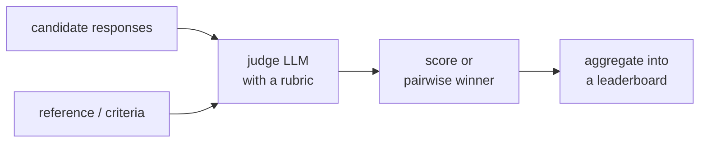

When a model's output is a paragraph, a summary, a chatbot reply, there is no gold
label to match against, so [exact-match metrics](I4/llm-evaluation) do not apply. The
practical answer is **LLM-as-judge**: use a strong model to score the outputs against a
rubric ("is this answer helpful and correct? yes/no")<FN n="1" />. It is fast and cheap enough to
run on every build<FN n="2" />. But a judge is only useful if it agrees with human judgment, and
that agreement has to be *measured*, not assumed, before the judge can gate releases.

## Why raw agreement is not enough

The obvious check is to have humans label a sample, have the judge label the same
sample, and compute the fraction they agree on. The trap is that **raw agreement is
inflated by chance**, especially when one label dominates. If $90\%$ of outputs are
"acceptable," two raters who both just guess "acceptable" every time agree $90\%$ of the
time while sharing no real skill. A high agreement number can hide a worthless judge.

**Cohen's kappa** corrects for this by subtracting the agreement you would expect from
chance alone. With observed agreement $p_o$ (the fraction of items the two raters
label identically) and chance agreement $p_e$ (the agreement expected if each rater
kept its own label frequencies but assigned them independently),

$$
\kappa = \frac{p_o - p_e}{1 - p_e}.
$$

The numerator is the agreement *above chance*; the denominator $1 - p_e$ is the most
agreement-above-chance possible, so $\kappa$ normalizes to $[{-1}, 1]$: $1$ is perfect
agreement, $0$ is exactly chance, negative is worse than chance. The chance term for two
binary raters with positive-label rates $p_J$ and $p_H$ is

$$
p_e = p_J p_H + (1 - p_J)(1 - p_H),
$$

the probability they both say "yes" plus the probability they both say "no" by
independent luck. The rule of thumb: $\kappa > 0.6$ is "substantial" agreement, enough
to trust the judge as a stand-in for human raters; below that, fix the rubric before
relying on it.

## The regression suite

Once the judge is validated, it becomes a **regression gate**<FN n="3" />. Keep a fixed evaluation
dataset and a baseline pass rate. Every new build (a prompt change, a model upgrade, a
new retrieval setup) is scored by the judge on that dataset, and the new pass rate is
compared against the baseline. Because the pass rate is a proportion estimated on a
finite set, a drop must clear sampling noise to count, the same [A/B-test](B/ab-testing)
logic: a one-sided test against the baseline tells you whether the build genuinely
regressed or just drew an unlucky sample. This is what turns "it seems worse" into a
release-blocking signal.



## Worked example

We measure judge-human agreement with Cohen's kappa, then run a regression gate that
flags a build whose judge-scored pass rate dropped significantly below baseline.

```python
import numpy as np
rng = np.random.default_rng(0)
N = 200

human = rng.binomial(1, 0.7, size=N)               # human labels: 1 = acceptable
flip = rng.random(N) < 0.12                         # judge disagrees 12% of the time
judge = np.where(flip, 1 - human, human)

po = np.mean(judge == human)                        # observed agreement
pJ, pH = judge.mean(), human.mean()                 # each rater's positive rate
pe = pJ * pH + (1 - pJ) * (1 - pH)                  # agreement expected by chance
kappa = (po - pe) / (1 - pe)
print(f"observed {po:.3f}  chance {pe:.3f}  kappa {kappa:.3f}")
assert kappa > 0.6                                  # substantial: trust the judge

# Regression gate: does a new build drop below the baseline pass rate?
baseline_pass = 0.82
new_pass = rng.binomial(1, 0.74, size=N).mean()     # this build regressed
se = np.sqrt(baseline_pass * (1 - baseline_pass) / N)
z = (new_pass - baseline_pass) / se                 # one-sided vs baseline
regressed = z < -1.645                              # significant drop at 5%
print(f"new pass {new_pass:.3f} vs baseline {baseline_pass:.2f}: z={z:.2f}, "
      f"regressed={regressed}")
assert regressed
```

The judge agrees with humans at $\kappa = 0.75$, well past the "substantial" bar, so it
is trustworthy enough to gate on; and the regression check catches the degraded build,
whose pass rate fell far enough below baseline to clear the noise threshold.

## Exercises

**Exercise 1.** A judge and a human each label $100$ items as accept/reject. They agree
on $90$ items. The judge accepts $80$ of the $100$; the human accepts $85$. Compute
Cohen's kappa by hand, and explain why the raw $90\%$ agreement overstates the judge's
quality here.

<details>
<summary>Solution</summary>

**Step 1.** Observed agreement is the fraction labelled identically:
$p_o = 90/100 = 0.90$.

**Step 2.** Chance agreement uses each rater's positive rate, $p_J = 0.80$ and
$p_H = 0.85$:

$$
p_e = p_J p_H + (1 - p_J)(1 - p_H) = 0.80 \cdot 0.85 + 0.20 \cdot 0.15 = 0.68 + 0.03 = 0.71.
$$

**Step 3.** Apply the kappa formula:

$$
\kappa = \frac{p_o - p_e}{1 - p_e} = \frac{0.90 - 0.71}{1 - 0.71} = \frac{0.19}{0.29} \approx 0.655.
$$

**Step 4.** Both raters accept most items ($80\%$ and $85\%$), so two raters that just
echoed "accept" would already agree about $71\%$ of the time. The raw $0.90$ counts
that chance agreement as skill; kappa subtracts it, leaving $\kappa \approx 0.66$,
"substantial" but well short of what $90\%$ suggested.

</details>

**Exercise 2.** Suppose the human accept rate is $p_H$ and the judge is a pure
chance-guesser that accepts independently at rate $p_J$. Show that Cohen's kappa is
exactly $0$ in expectation, regardless of $p_H$ and $p_J$.

<details>
<summary>Solution</summary>

**Step 1.** "Pure chance-guesser, independent of the human" means the judge's label is
statistically independent of the human's. Then the probability they agree is computed
by summing the independent joint probabilities of (both accept) and (both reject).

**Step 2.** Both accept with probability $p_J p_H$; both reject with probability
$(1 - p_J)(1 - p_H)$. So the expected observed agreement is

$$
p_o = p_J p_H + (1 - p_J)(1 - p_H).
$$

**Step 3.** That expression is the definition of $p_e$. Substituting $p_o = p_e$:

$$
\kappa = \frac{p_o - p_e}{1 - p_e} = \frac{0}{1 - p_e} = 0.
$$

The kappa denominator $1 - p_e$ is positive whenever the raters are not both
degenerate, so kappa is exactly $0$. Kappa reports "no skill above chance" for an
independent guesser at any accept rate, which is the property raw agreement lacks.

</details>

**Exercise 3 (code).** A judge has a known **positivity bias**: when the true (human)
label is reject, the judge wrongly accepts $20\%$ of the time, but when the true label
is accept, the judge agrees $97\%$ of the time. Simulate $5000$ items with a $60\%$
human accept rate, then (a) confirm the judge's measured accept rate exceeds the
human's, and (b) compute Cohen's kappa from the simulated labels. Use numpy only.

<details>
<summary>Solution</summary>

```python
import numpy as np
rng = np.random.default_rng(0)
N = 5000

human = rng.binomial(1, 0.60, size=N)              # 1 = accept (the true label)
# judge: 97% agree when human accepts; 20% false-accept when human rejects
p_accept = np.where(human == 1, 0.97, 0.20)
judge = rng.binomial(1, p_accept)

# (a) positivity bias inflates the judge's accept rate above the human's
pJ, pH = judge.mean(), human.mean()
assert pJ > pH

# (b) Cohen's kappa from the simulated labels, implemented directly
po = np.mean(judge == human)
pe = pJ * pH + (1 - pJ) * (1 - pH)
kappa = (po - pe) / (1 - pe)
print(f"human accept {pH:.3f}  judge accept {pJ:.3f}  kappa {kappa:.3f}")
assert 0.5 < kappa < 0.8                            # real but imperfect agreement
```

The false-accepts on rejected items push the judge's accept rate above the human's, and
kappa lands in the "moderate-to-substantial" band rather than near $1$, flagging that
the bias erodes agreement even though the judge is right most of the time.

</details>

Evaluation tells you *whether* the system works; the next lesson improves the part most
often responsible when it does not, the [retrieval pipeline](production-rag).

<Footnotes>
  <FNItem n="1">**Zheng, L., et al.** (2023). "Judging LLM-as-a-judge with MT-Bench and Chatbot Arena". *NeurIPS*. [arXiv:2306.05685](https://arxiv.org/abs/2306.05685). Establishes and validates the LLM-as-judge methodology against human preferences.</FNItem>
  <FNItem n="2">**Huyen, C.** (2024). *AI Engineering: Building Applications with Foundation Models.* O'Reilly. AI-as-judge evaluation and gating builds on a regression dataset.</FNItem>
  <FNItem n="3">**Es, S., James, J., Espinosa-Anke, L., & Schockaert, S.** (2024). "RAGAS: automated evaluation of retrieval augmented generation". *EACL*. [arXiv:2309.15217](https://arxiv.org/abs/2309.15217). Reference-free, model-scored metrics run automatically over a fixed set.</FNItem>
</Footnotes>
