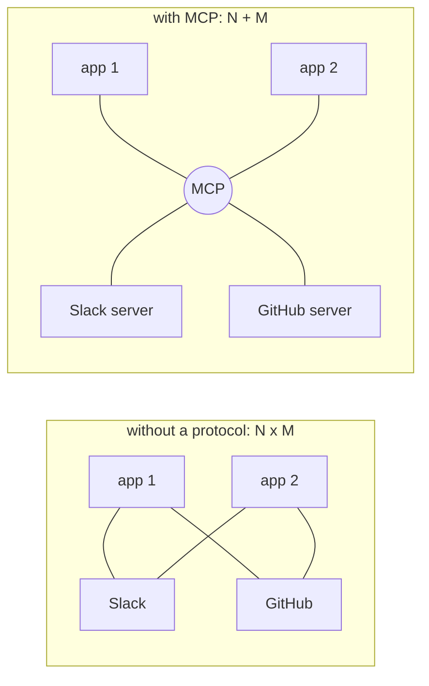
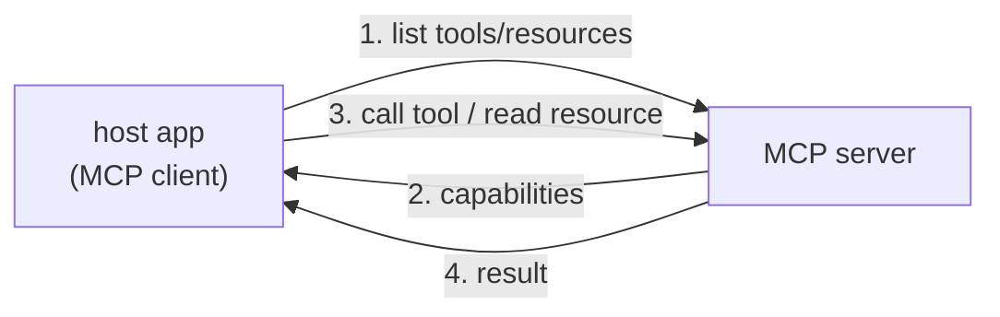

Once you have [tool use](J1/tool-use), every new capability means writing another
integration: this model, talking to that database, with bespoke glue. Do it for $N$
AI applications and $M$ data sources and you write $N \times M$ integrations, each one
custom, each one maintained forever. The **Model Context Protocol** (MCP) is a standard
that collapses this<FN n="1" />. By agreeing on *one* way for AI applications to talk to external
capabilities, it turns the $N \times M$ problem into $N + M$: each application speaks
MCP once, each source exposes MCP once, and they all interoperate.

## The N×M problem

The cost is combinatorial. Without a standard, connecting an assistant to Slack,
GitHub, and Postgres, then doing the same for a second and third assistant, means nine
separate integrations, and a fourth data source adds one per assistant.

A standard protocol is the same move that USB made for peripherals or HTTP made for
the web: agree on the interface once, and any compliant client works with any
compliant server. The integration count drops from a product to a sum, and an MCP
server someone else wrote becomes usable by *your* application for free.

## Client, server, and the three primitives

MCP is a **client-server** protocol. The **host** is the AI application (an IDE
assistant, a chat app); inside it an MCP **client** maintains a connection to each MCP
**server**, a separate process that wraps some capability (a filesystem, an API, a
database)<FN n="2" />. Servers expose three kinds of things:

- **Tools.** Functions the model can call to take an action, the [tool use](J1/tool-use)
  concept, now discovered over the protocol instead of hard-coded.
- **Resources.** Read-only data the application can load into context: a file's
  contents, a database row, a documentation page.
- **Prompts.** Reusable, parameterized prompt templates the server offers, so common
  workflows ship with the server rather than being reinvented per client.

The flow is a discovery handshake followed by use: the client asks a server what it
offers, the server replies with its tools, resources, and prompts, and from then on
the client can invoke them. Because discovery is part of the protocol, the host learns
a server's capabilities at runtime, so adding a new server to a running assistant
needs no change to the assistant's code.

That is the consumer's view of MCP. Building a *good* server, one that a model can use
correctly, is a design discipline of its own, which is the [next lesson](designing-mcp-servers).

<Footnotes>
  <FNItem n="1">**Anthropic.** (2024). "Model Context Protocol". [modelcontextprotocol.io](https://modelcontextprotocol.io). The open standard for connecting AI applications to external capabilities.</FNItem>
  <FNItem n="2">**Huyen, C.** (2024). *AI Engineering: Building Applications with Foundation Models.* O'Reilly. The integration surface between models and external systems.</FNItem>
</Footnotes>
