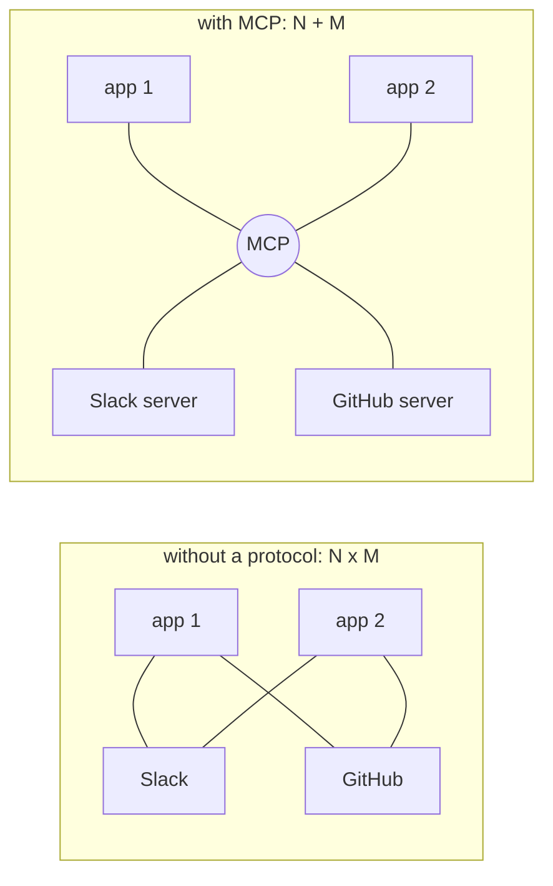
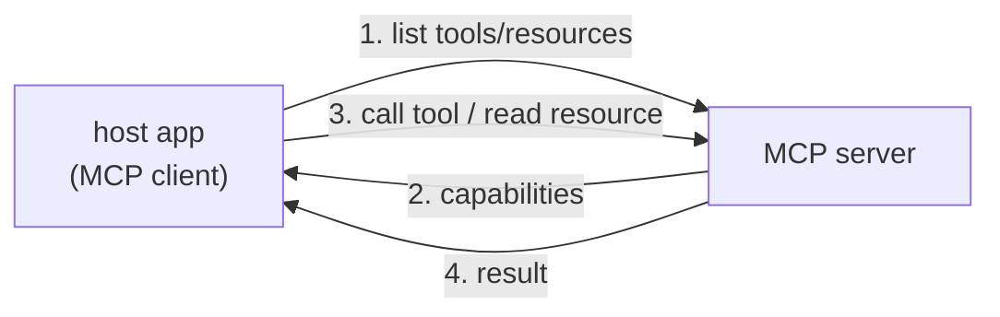

Once you have [tool use](J1/tool-use), every new capability means writing another
integration: this model, talking to that database, with bespoke glue. Do it for $N$
AI applications and $M$ data sources and you write $N \times M$ integrations, each one
custom, each one maintained forever. The **Model Context Protocol** (MCP) is a standard
that collapses this<FN n="1" />. By agreeing on *one* way for AI applications to talk to external
capabilities, it turns the $N \times M$ problem into $N + M$: each application speaks
MCP once, each source exposes MCP once, and they all interoperate.

## The N×M problem

The cost is combinatorial. Without a standard, connecting an assistant to Slack,
GitHub, and Postgres, then doing the same for a second and third assistant, means nine
separate integrations, and a fourth data source adds one per assistant.

A standard protocol is the same move that USB made for peripherals or HTTP made for
the web: agree on the interface once, and any compliant client works with any
compliant server. The integration count drops from a product to a sum, and an MCP
server someone else wrote becomes usable by *your* application for free.

## Client, server, and the three primitives

MCP is a **client-server** protocol. The **host** is the AI application (an IDE
assistant, a chat app); inside it an MCP **client** maintains a connection to each MCP
**server**, a separate process that wraps some capability (a filesystem, an API, a
database)<FN n="2" />. Servers expose three kinds of things:

- **Tools.** Functions the model can call to take an action, the [tool use](J1/tool-use)
  concept, now discovered over the protocol instead of hard-coded.
- **Resources.** Read-only data the application can load into context: a file's
  contents, a database row, a documentation page.
- **Prompts.** Reusable, parameterized prompt templates the server offers, so common
  workflows ship with the server rather than being reinvented per client.

The flow is a discovery handshake followed by use: the client asks a server what it
offers, the server replies with its tools, resources, and prompts, and from then on
the client can invoke them. Because discovery is part of the protocol, the host learns
a server's capabilities at runtime, so adding a new server to a running assistant
needs no change to the assistant's code.

## Exercises

**Exercise 1.** A company runs $7$ AI applications and connects each to $5$ data
sources. Compute the number of integrations to build and maintain (a) with bespoke
glue per pair, and (b) after every application and source adopts MCP. State the
general formula for each case.

Solution

**Step 1.** Bespoke glue is one integration per (application, source) pair, so the
count is the product $N \times M = 7 \times 5 = 35$.

**Step 2.** Under MCP, each application speaks the protocol once and each source
exposes it once, so the count is the sum $N + M = 7 + 5 = 12$.

**Step 3.** The general formulas are $N \times M$ versus $N + M$. The saving grows with
scale: at $7 \times 5$ it is $35$ versus $12$, and adding a sixth source costs $7$ new
integrations in the bespoke world but only $1$ under MCP.

**Exercise 2.** Classify each as a **tool**, a **resource**, or a **prompt** under
MCP's three primitives, and justify each by the primitive's defining property: (a) the
current contents of `config.yaml`; (b) an operation that creates a GitHub issue; (c) a
reusable "summarize this PR" template the server ships; (d) a single row fetched from a
database for the model to read.

Solution

**Step 1.** (a) **Resource.** A file's contents are read-only data loaded into context,
which is the resource primitive exactly.

**Step 2.** (b) **Tool.** Creating an issue is a function the model calls to *take an
action* and change external state, which defines a tool.

**Step 3.** (c) **Prompt.** A reusable, parameterized template the server offers is the
prompt primitive, shipping a common workflow with the server instead of reinventing it
per client.

**Step 4.** (d) **Resource.** A database row loaded for the model to read is read-only
context, not an action, so it is a resource. The dividing line is action (tool) versus
read-only context (resource) versus reusable template (prompt).

**Exercise 3.** MCP makes capability discovery part of the protocol: the client asks a
server what it offers at runtime. Explain why this runtime handshake, rather than
hard-coding each server's tools into the host, is what lets you add a new server to a
running assistant without changing the assistant's code. Then give one operational
risk this same dynamism introduces.

Solution

**Step 1.** Because the host learns a server's tools, resources, and prompts from the
discovery reply at connect time, the host code contains no per-server knowledge: it
issues the same "list capabilities" request to any compliant server and works with
whatever comes back. Adding a server is then a configuration change (point the client
at a new process), not a code change, since the assistant already knows how to discover
and invoke arbitrary capabilities.

**Step 2.** The trade-off is that the host trusts capabilities it has never seen.
Because tools arrive at runtime, a server can advertise a tool with a misleading name
or description, or change its surface between connections, and the host will surface it
to the model without a code review having vetted it. Runtime discovery moves the
integration cost down but moves trust and validation to runtime, which is a security
and reliability surface a hard-coded integration did not have.

That is the consumer's view of MCP. Building a *good* server, one that a model can use
correctly, is a design discipline of its own, which is the [next lesson](designing-mcp-servers).

<Footnotes>
  <FNItem n="1">**Anthropic.** (2024). "Model Context Protocol". [modelcontextprotocol.io](https://modelcontextprotocol.io). The open standard for connecting AI applications to external capabilities.</FNItem>
  <FNItem n="2">**Huyen, C.** (2024). *AI Engineering: Building Applications with Foundation Models.* O'Reilly. The integration surface between models and external systems.</FNItem>
</Footnotes>
