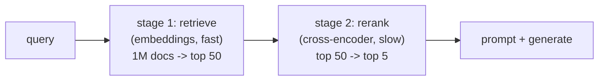

[Naive RAG](J1/rag-from-scratch), chunk, embed, take the top-k by cosine, gets you a
demo. Production RAG is the same skeleton with two parts done carefully, because
retrieval quality is usually the ceiling on the whole system's quality: the model can
only answer from what you put in front of it. The two parts are how you **chunk** the
documents and how you **rank** the candidates, and the ranking improvement is something
you can measure.

## Chunking is a real decision

A chunk is the atomic unit of retrieval: the thing that gets embedded, matched, and
pasted into the prompt. Its size trades two failures against each other. **Too large**,
and one chunk spans several topics, so its single embedding is a blurry average that
matches everything weakly and the prompt fills with irrelevant text. **Too small**, and
a chunk loses the surrounding context that gives it meaning, a sentence that only makes
sense given the paragraph it came from. The standard compromise is a few hundred tokens
with a **sliding overlap** between consecutive chunks, so a fact that straddles a
boundary survives in at least one chunk whole. Better still is **structure-aware**
chunking that splits on real boundaries (headings, paragraphs) rather than a fixed
character count. There is no universal best size; it depends on the documents, which is
why chunking is tuned, not defaulted.

## Two-stage retrieval: retrieve then rerank

The second improvement addresses a tension in the embedding search itself. Embedding
retrieval is **fast but coarse**: it compares two independently-computed vectors, so it
can tell roughly-related from unrelated but struggles with fine distinctions. Reading
each candidate *together with* the query would be far more accurate, but doing that
across a million documents is far too slow.

The resolution is a **two-stage pipeline**:



- **Stage 1, retrieve.** Use cheap embedding similarity to cut a huge corpus down to a
  shortlist of, say, $50$ candidates. Optimized for recall (don't miss good docs), not
  precise ordering.
- **Stage 2, rerank.** Run a **cross-encoder**, a model that reads the query and a
  candidate *jointly* and outputs a relevance score, over just those $50$. It is far
  more accurate but only affordable because the shortlist is small. Its scores reorder
  the candidates, and the true top $5$ go to the prompt.

The point of the split is to spend the expensive, accurate model only where it is
cheap to, on the shortlist, getting most of its accuracy at a fraction of its cost.

## Measuring the gain with nDCG

To show reranking helps, you need a ranking metric that rewards putting the *most*
relevant documents *highest*. **Normalized discounted cumulative gain** (nDCG) does
exactly that. Give each document a relevance grade; the discounted cumulative gain of a
ranking discounts each document's grade by its position,

$$
\text{DCG@}k = \sum_{i=1}^{k} \frac{\text{rel}_i}{\log_2(i+1)},
$$

so a relevant document high up contributes more than the same document buried deeper.
Dividing by the ideal DCG (the score of the perfect ranking, grades sorted descending)
normalizes to $[0,1]$, where $1$ is the best possible order. Comparing nDCG before and
after reranking quantifies the lift.

## Worked example

We score a candidate set by a noisy first-stage retriever and a less-noisy reranker,
and compare their nDCG@5 over many query realizations.

```python
import numpy as np
rng = np.random.default_rng(2)
rel = np.array([3, 2, 3, 0, 1, 2, 0, 1, 0, 0])     # true relevance grades per doc

def dcg(order, rel, k):
    g = rel[order][:k]
    return np.sum(g / np.log2(np.arange(2, k + 2)))   # discount by position
def ndcg(order, rel, k):
    ideal = np.argsort(rel)[::-1]                      # the perfect ranking
    return dcg(order, rel, k) / dcg(ideal, rel, k)

k = 5
s1_ndcg, s2_ndcg = [], []
for _ in range(2000):                                  # average over query realizations
    stage1 = rel + rng.normal(0, 1.5, size=rel.size)   # cheap retriever: noisy scores
    rerank = rel + rng.normal(0, 0.5, size=rel.size)   # cross-encoder: sharper scores
    s1_ndcg.append(ndcg(np.argsort(stage1)[::-1], rel, k))
    s2_ndcg.append(ndcg(np.argsort(rerank)[::-1], rel, k))

print(f"stage-1 retrieval nDCG@{k} = {np.mean(s1_ndcg):.3f}")
print(f"after reranking   nDCG@{k} = {np.mean(s2_ndcg):.3f}")
assert np.mean(s2_ndcg) > np.mean(s1_ndcg)
print(f"rerank lifts nDCG by {np.mean(s2_ndcg) - np.mean(s1_ndcg):.3f}")
```

The reranker lifts nDCG@5 from $0.83$ to $0.98$, pushing the genuinely most-relevant
documents to the top where the model will actually use them, for the cost of scoring
only a short shortlist. RAG, agents, evaluation, and retrieval are the application
layer; where the documents and vectors physically *live* is the platform question,
which the last lesson of this subsection frames as the [lakehouse](lakehouse-architecture).
