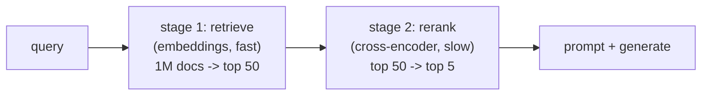

[Naive RAG](J1/rag-from-scratch), chunk, embed, take the top-k by cosine, gets you a
demo<FN n="1" />. Production RAG is the same skeleton with two parts done carefully, because
retrieval quality is usually the ceiling on the whole system's quality: the model can
only answer from what you put in front of it<FN n="2" />. The two parts are how you **chunk** the
documents and how you **rank** the candidates, and the ranking improvement is something
you can measure.

## Chunking is a real decision

A chunk is the atomic unit of retrieval: the thing that gets embedded, matched, and
pasted into the prompt. Its size trades two failures against each other. **Too large**,
and one chunk spans several topics, so its single embedding is a blurry average that
matches everything weakly and the prompt fills with irrelevant text. **Too small**, and
a chunk loses the surrounding context that gives it meaning, a sentence that only makes
sense given the paragraph it came from. The standard compromise is a few hundred tokens
with a **sliding overlap** between consecutive chunks, so a fact that straddles a
boundary survives in at least one chunk whole. Better still is **structure-aware**
chunking that splits on real boundaries (headings, paragraphs) rather than a fixed
character count. There is no universal best size; it depends on the documents, which is
why chunking is tuned, not defaulted.

## Two-stage retrieval: retrieve then rerank

The second improvement addresses a tension in the embedding search itself. Embedding
retrieval is **fast but coarse**: it compares two independently-computed vectors, so it
can tell roughly-related from unrelated but struggles with fine distinctions. Reading
each candidate *together with* the query would be far more accurate, but doing that
across a million documents is far too slow.

The resolution is a **two-stage pipeline**:



- **Stage 1, retrieve.** Use cheap embedding similarity to cut a huge corpus down to a
  shortlist of, say, $50$ candidates. Optimized for recall (don't miss good docs), not
  precise ordering.
- **Stage 2, rerank.** Run a **cross-encoder**, a model that reads the query and a
  candidate *jointly* and outputs a relevance score, over just those $50$<FN n="3" />. It is far
  more accurate but only affordable because the shortlist is small. Its scores reorder
  the candidates, and the true top $5$ go to the prompt.

The point of the split is to spend the expensive, accurate model only where it is
cheap to, on the shortlist, getting most of its accuracy at a fraction of its cost.

## Measuring the gain with nDCG

To show reranking helps, you need a ranking metric that rewards putting the *most*
relevant documents *highest*. **Normalized discounted cumulative gain** (nDCG) does
exactly that<FN n="4" />. Give each document a relevance grade; the discounted cumulative gain of a
ranking discounts each document's grade by its position,

$$
\text{DCG@}k = \sum_{i=1}^{k} \frac{\text{rel}_i}{\log_2(i+1)},
$$

so a relevant document high up contributes more than the same document buried deeper.
Dividing by the ideal DCG (the score of the perfect ranking, grades sorted descending)
normalizes to $[0,1]$, where $1$ is the best possible order. Comparing nDCG before and
after reranking quantifies the lift.

## Worked example

We score a candidate set by a noisy first-stage retriever and a less-noisy reranker,
and compare their nDCG@5 over many query realizations.

```python
import numpy as np
rng = np.random.default_rng(2)
rel = np.array([3, 2, 3, 0, 1, 2, 0, 1, 0, 0])     # true relevance grades per doc

def dcg(order, rel, k):
    g = rel[order][:k]
    return np.sum(g / np.log2(np.arange(2, k + 2)))   # discount by position
def ndcg(order, rel, k):
    ideal = np.argsort(rel)[::-1]                      # the perfect ranking
    return dcg(order, rel, k) / dcg(ideal, rel, k)

k = 5
s1_ndcg, s2_ndcg = [], []
for _ in range(2000):                                  # average over query realizations
    stage1 = rel + rng.normal(0, 1.5, size=rel.size)   # cheap retriever: noisy scores
    rerank = rel + rng.normal(0, 0.5, size=rel.size)   # cross-encoder: sharper scores
    s1_ndcg.append(ndcg(np.argsort(stage1)[::-1], rel, k))
    s2_ndcg.append(ndcg(np.argsort(rerank)[::-1], rel, k))

print(f"stage-1 retrieval nDCG@{k} = {np.mean(s1_ndcg):.3f}")
print(f"after reranking   nDCG@{k} = {np.mean(s2_ndcg):.3f}")
assert np.mean(s2_ndcg) > np.mean(s1_ndcg)
print(f"rerank lifts nDCG by {np.mean(s2_ndcg) - np.mean(s1_ndcg):.3f}")
```

The reranker lifts nDCG@5 from $0.83$ to $0.98$, pushing the genuinely most-relevant
documents to the top where the model will actually use them, for the cost of scoring
only a short shortlist.

## Exercises

**Exercise 1.** A ranking returns five documents with true relevance grades
$(3, 0, 2, 0, 1)$ in that order. Compute DCG@5 by hand, then the ideal DCG@5, and
report nDCG@5.

<details>
<summary>Solution</summary>

**Step 1.** DCG@5 discounts each grade by $\log_2(i+1)$ for position $i$:

$$
\text{DCG@}5 = \frac{3}{\log_2 2} + \frac{0}{\log_2 3} + \frac{2}{\log_2 4} + \frac{0}{\log_2 5} + \frac{1}{\log_2 6}.
$$

**Step 2.** Evaluate the discounts: $\log_2 2 = 1$, $\log_2 4 = 2$,
$\log_2 6 \approx 2.585$. The zero-grade terms vanish, leaving

$$
\text{DCG@}5 = 3 + \frac{2}{2} + \frac{1}{2.585} = 3 + 1 + 0.387 = 4.387.
$$

**Step 3.** The ideal ranking sorts the grades descending: $(3, 2, 1, 0, 0)$.

$$
\text{IDCG@}5 = \frac{3}{1} + \frac{2}{\log_2 3} + \frac{1}{\log_2 4} = 3 + \frac{2}{1.585} + \frac{1}{2} = 3 + 1.262 + 0.5 = 4.762.
$$

**Step 4.** Normalize: $\text{nDCG@}5 = 4.387 / 4.762 \approx 0.921$. The ranking is
close to ideal; it loses a little only because the grade-$2$ document sits at position
$3$ instead of $2$.

</details>

**Exercise 2.** Stage 1 is "optimized for recall, not precise ordering." Define
recall@$k$ for retrieval, and explain why a high stage-1 recall@$50$ is a precondition
for the reranker to help, no matter how accurate the reranker is.

<details>
<summary>Solution</summary>

**Step 1.** Recall@$k$ is the fraction of all truly relevant documents that appear
anywhere in the top $k$ returned: (relevant docs retrieved in the top $k$) divided by
(total relevant docs). It measures coverage, not ordering, a document counts whether it
lands at rank $1$ or rank $k$.

**Step 2.** The reranker only ever sees the stage-1 shortlist; it reorders those $50$
candidates and cannot conjure a document stage 1 missed. So any relevant document
absent from the top $50$ is unrecoverable downstream.

**Step 3.** Therefore stage-1 recall@$50$ caps the best achievable final result: if a
relevant document is not in the shortlist, even a perfect reranker leaves it out of the
prompt. High shortlist recall is the precondition; the reranker's job is precision
*within* a shortlist that already contains the good documents.

</details>

**Exercise 3 (code).** Quantify Exercise 2's claim. With the same relevance grades as
the worked example, treat "relevant" as grade $\geq 1$ and compare two stage-1
retrievers: a good one (noise $\sigma = 1.0$) and a poor one (noise $\sigma = 3.0$).
Over many query realizations, compute (a) mean recall@$5$ of each retriever's
shortlist, and (b) the mean nDCG@$5$ after a fixed reranker ($\sigma = 0.5$) is applied
to each shortlist of size $5$. Show the poor retriever's lower recall caps the reranked
nDCG. Use numpy only.

<details>
<summary>Solution</summary>

```python
import numpy as np
rng = np.random.default_rng(7)
rel = np.array([3, 2, 3, 0, 1, 2, 0, 1, 0, 0])     # true relevance grades per doc
relevant = rel >= 1                                  # binary relevance for recall
n_relevant = relevant.sum()
k = 5

def dcg(order, rel, k):
    g = rel[order][:k]
    return np.sum(g / np.log2(np.arange(2, k + 2)))
def ndcg(order, rel, k):
    ideal = np.argsort(rel)[::-1]
    return dcg(order, rel, k) / dcg(ideal, rel, k)

def run(stage1_sigma, trials=4000):
    recalls, ndcgs = [], []
    for _ in range(trials):
        s1 = rel + rng.normal(0, stage1_sigma, size=rel.size)
        shortlist = np.argsort(s1)[::-1][:k]           # stage 1: keep top k
        recalls.append(relevant[shortlist].sum() / n_relevant)
        # stage 2: reranker scores only the shortlist, then we order it
        rr = rel[shortlist] + rng.normal(0, 0.5, size=k)
        reordered = shortlist[np.argsort(rr)[::-1]]
        ndcgs.append(ndcg(reordered, rel, k))
    return np.mean(recalls), np.mean(ndcgs)

good_recall, good_ndcg = run(1.0)
poor_recall, poor_ndcg = run(3.0)
print(f"good retriever: recall@{k}={good_recall:.3f}  reranked nDCG@{k}={good_ndcg:.3f}")
print(f"poor retriever: recall@{k}={poor_recall:.3f}  reranked nDCG@{k}={poor_ndcg:.3f}")

assert good_recall > poor_recall                     # better stage 1 covers more relevant docs
assert good_ndcg > poor_ndcg                         # and that recall ceiling lifts final nDCG
```

The poor retriever drops relevant documents from the shortlist, so its recall@$5$ is
lower, and the reranker, confined to that worse shortlist, cannot recover them: its
final nDCG@$5$ stays below the good retriever's. Recall sets the ceiling; reranking
only realizes what is already inside it.

</details>

RAG, agents, evaluation, and retrieval are the application layer; where the documents
and vectors physically *live* is the platform question, which the last lesson of this
subsection frames as the [lakehouse](lakehouse-architecture).

<Footnotes>
  <FNItem n="1">**Lewis, P., et al.** (2020). "Retrieval-augmented generation for knowledge-intensive NLP tasks". *NeurIPS*. [arXiv:2005.11401](https://arxiv.org/abs/2005.11401). The base RAG architecture this lesson hardens.</FNItem>
  <FNItem n="2">**Gao, Y., et al.** (2023). "Retrieval-augmented generation for large language models: a survey". [arXiv:2312.10997](https://arxiv.org/abs/2312.10997). Surveys advanced RAG: chunking strategies, two-stage retrieval, and reranking.</FNItem>
  <FNItem n="3">**Karpukhin, V., et al.** (2020). "Dense passage retrieval for open-domain question answering". *EMNLP*. [arXiv:2004.04906](https://arxiv.org/abs/2004.04906). The dense first-stage retriever the reranker refines.</FNItem>
  <FNItem n="4">**Es, S., James, J., Espinosa-Anke, L., & Schockaert, S.** (2024). "RAGAS: automated evaluation of retrieval augmented generation". *EACL*. [arXiv:2309.15217](https://arxiv.org/abs/2309.15217). Measuring retrieval and answer quality in a RAG pipeline.</FNItem>
</Footnotes>
