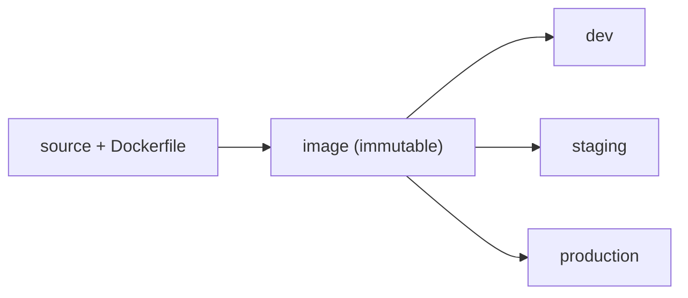

A service that runs on your laptop is not deployed. Getting it to run identically on a
server, and to keep running as you change it, is the deployment problem, and AI services
sharpen it: large dependencies (CUDA, model weights), heavy environments, and the need
to roll changes out safely. Three practices cover it: containers for reproducibility,
CI/CD for safe change, and externalized configuration and secrets.

## Containers: ship the environment, not just the code

"Works on my machine" is a version-and-dependency mismatch. A **container** (Docker)
solves it by packaging the application *together with* its entire environment, the OS
libraries, the Python version, the pinned dependencies, into one image that runs the
same anywhere a container runtime exists. The image is built once from a `Dockerfile`
and is **immutable**: the exact bytes that passed testing are the exact bytes that run
in production. For AI, this is what tames the notoriously fragile dependency stack;
multi-gigabyte model weights are usually mounted or pulled at startup rather than baked
in, to keep images lean.

## CI/CD: automate the path to production

**Continuous integration** (CI) runs your tests, linting, and image build automatically
on every code change, so a regression is caught in minutes rather than discovered in
production. **Continuous delivery/deployment** (CD) takes the image that passed CI and
promotes it through environments, dev, staging, production, on a button press or
automatically. The pipeline is the *only* path to production, which means every change
is tested and every deploy is reproducible from a commit. For models, the same pipeline
gates on an [evaluation suite](J2/llm-as-judge): a build whose quality regressed never
reaches users.

## Configuration and secrets: out of the image

The same image runs in dev, staging, and production, so anything that *differs* between
them, the database URL, the model endpoint, feature flags, cannot live inside the
image. It is injected at runtime as **environment configuration**. A special, dangerous
subset is **secrets**: API keys, database passwords, signing keys. Secrets must never be
committed to source control or baked into an image (where anyone who pulls it can read
them); they are stored in a dedicated **secrets manager** (AWS Secrets Manager, Vault)
and handed to the container at startup. The rule is blunt and absolute: configuration
and especially secrets are externalized, so the artifact stays the same across
environments and a leaked image never leaks a credential.

Together, an immutable image, an automated pipeline, and externalized config give you
deployments that are reproducible and safe to repeat, the [idempotent](I1/orchestration-dags)
discipline applied to shipping. Once it is running, you need to *see inside* it, which is
[observability](observability-tracing).
