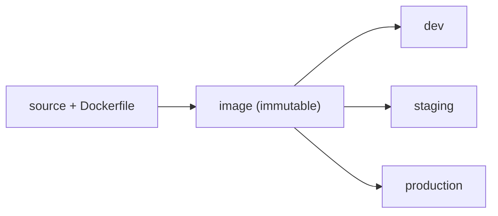

A service that runs on your laptop is not deployed. Getting it to run identically on a
server, and to keep running as you change it, is the deployment problem, and AI services
sharpen it: large dependencies (CUDA, model weights), heavy environments, and the need
to roll changes out safely. Three practices cover it: containers for reproducibility,
CI/CD for safe change, and externalized configuration and secrets.

## Containers: ship the environment, not just the code

"Works on my machine" is a version-and-dependency mismatch. A **container** (Docker)
solves it by packaging the application *together with* its entire environment, the OS
libraries, the Python version, the pinned dependencies, into one image that runs the
same anywhere a container runtime exists. The image is built once from a `Dockerfile`
and is **immutable**: the exact bytes that passed testing are the exact bytes that run
in production. For AI, this is what tames the notoriously fragile dependency stack;
multi-gigabyte model weights are usually mounted or pulled at startup rather than baked
in, to keep images lean<FN n="1" />.

## CI/CD: automate the path to production

**Continuous integration** (CI) runs your tests, linting, and image build automatically
on every code change, so a regression is caught in minutes rather than discovered in
production. **Continuous delivery/deployment** (CD) takes the image that passed CI and
promotes it through environments, dev, staging, production, on a button press or
automatically. The pipeline is the *only* path to production, which means every change
is tested and every deploy is reproducible from a commit<FN n="2" />. For models, the same pipeline
gates on an [evaluation suite](J2/llm-as-judge): a build whose quality regressed never
reaches users.

## Configuration and secrets: out of the image

The same image runs in dev, staging, and production, so anything that *differs* between
them, the database URL, the model endpoint, feature flags, cannot live inside the
image. It is injected at runtime as **environment configuration**. A special, dangerous
subset is **secrets**: API keys, database passwords, signing keys. Secrets must never be
committed to source control or baked into an image (where anyone who pulls it can read
them); they are stored in a dedicated **secrets manager** (AWS Secrets Manager, Vault)
and handed to the container at startup. The rule is blunt and absolute: configuration
and especially secrets are externalized, so the artifact stays the same across
environments and a leaked image never leaks a credential.

## Exercises

**Exercise 1.** A teammate proposes baking the 14 GB model weights directly into
the Docker image "so deployment is one self-contained artifact." Give two
concrete costs of this choice, and state the alternative the lesson recommends.

Solution

**Step 1.** Cost one, image size and transfer. Every build, push, and pull moves
the full 14 GB. CI gets slower, the registry fills up, and rolling out to many
nodes multiplies the transfer. A lean image of a few hundred MB pushes and pulls
in seconds; a 14 GB one does not.

**Step 2.** Cost two, rebuild coupling. The image is rebuilt for any code or
dependency change, so a one-line code fix forces a fresh 14 GB artifact even
though the weights did not change. Code and weights have different change rates
and should version independently.

**Step 3.** The recommended alternative is to keep the weights out of the image
and mount or pull them at startup (from object storage or a model registry),
keeping the image lean and decoupling the model artifact from the code artifact.

**Exercise 2.** The same immutable image is promoted dev to staging to
production, yet each environment must talk to a different database and use a
different API key. Explain how configuration and secrets reach the container
without changing the image, and why secrets are handled differently from
ordinary configuration.

Solution

**Step 1.** Anything that differs per environment cannot live inside the image,
because the image is identical across all three. It is injected at runtime as
environment configuration (environment variables or mounted config), so the same
bytes run everywhere and only the surrounding environment changes.

**Step 2.** The database URL is ordinary configuration: it differs per
environment but is not itself dangerous if seen. It can sit in plain environment
config for that environment.

**Step 3.** The API key is a secret. If baked into the image, anyone who pulls
the image reads the credential; if committed to source control, it leaks through
history. Secrets are therefore stored in a dedicated secrets manager (Vault, AWS
Secrets Manager) and handed to the container at startup, never written into the
image or the repo. The image stays identical and a leaked image leaks no
credential.

**Exercise 3.** Your CI pipeline already runs unit tests and the image build on
every commit. For an LLM service, name one additional gate the pipeline should
enforce before a build reaches users, and explain why a green unit-test suite is
not sufficient to catch the regression it guards against.

Solution

**Step 1.** The additional gate is an evaluation suite: the same quality
benchmark the team uses to judge the model (an offline eval set, an LLM-as-judge
scoring pass, or a held-out task suite) runs in CI, and a build whose quality
score regressed is blocked from promotion.

**Step 2.** Unit tests check that code behaves as specified: the function returns
the right shape, the endpoint returns 200, the parser handles edge cases. They
say nothing about *answer quality*. A prompt-template tweak, a model-version
bump, or a retrieval change can pass every unit test while making answers worse,
because the output is still well-formed text, just less correct or less helpful.

**Step 3.** Quality is a property of the model's outputs, not the code path, so
only an evaluation that scores those outputs can catch the regression. Gating the
pipeline on the eval suite makes "the pipeline is the only path to production"
also mean "no quality regression ships," the same way unit tests mean "no
behavioral regression ships."

Together, an immutable image, an automated pipeline, and externalized config give you
deployments that are reproducible and safe to repeat, the [idempotent](I1/orchestration-dags)
discipline applied to shipping. Once it is running, you need to *see inside* it, which is
[observability](observability-tracing).

<Footnotes>
  <FNItem n="1">**Huyen, C.** (2024). *AI Engineering: Building Applications with Foundation Models.* O'Reilly. Packaging, deployment, and inference infrastructure for foundation-model apps.</FNItem>
  <FNItem n="2">**Humble, J., & Farley, D.** (2010). *Continuous Delivery: Reliable Software Releases through Build, Test, and Deployment Automation.* Addison-Wesley. The deployment-pipeline discipline.</FNItem>
</Footnotes>
