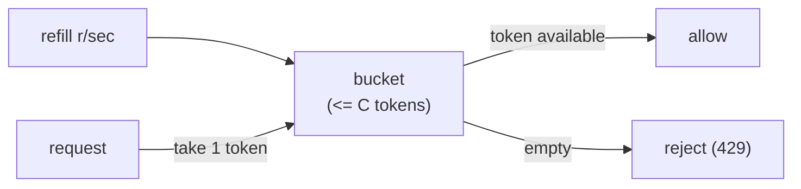

A model endpoint that anyone can call without limit is a liability: one buggy client can
exhaust your capacity, and one expensive tenant can run up a bill nobody can trace. The
**governance layer** is the gatekeeper that sits between callers and the model and
enforces three things, *who* may call (auth), *how much* they may call (rate limiting),
and *what it cost* whom (attribution). Auth is standard web practice; the two pieces
specific to a metered, expensive resource like an LLM are rate limiting and cost
attribution<FN n="1" />.

## Rate limiting with a token bucket

You need to cap how fast a client can call, both to protect capacity and to enforce
plan tiers. A good limiter must allow short **bursts** (real traffic is bursty) while
holding the **long-run average** below a ceiling. The **token-bucket** algorithm does
exactly this<FN n="2" />:

- A bucket holds up to **capacity** $C$ tokens and starts full.
- Tokens refill at a steady **rate** $r$ per second, up to the cap $C$.
- Each request must take one token (or more, for a costlier request). If the bucket has
  enough, the request is allowed and the tokens are removed; if not, it is rejected
  (HTTP 429).

The two parameters split the two concerns cleanly. The **refill rate $r$** sets the
sustained throughput: over a long window a client cannot exceed $r$ requests per second,
because that is how fast tokens arrive. The **capacity $C$** sets the burst size: a
client that has been quiet can fire up to $C$ requests at once from the tokens it
accumulated. A pure "max $r$ per second" counter would reject legitimate bursts; the
bucket permits them up to $C$ while still bounding the average at $r$.



## Cost attribution

Because each call burns tokens that [cost real money](I4/cost-monitoring), a
multi-tenant service must answer "who spent what." **Cost attribution** tags every
request with its caller (tenant, user, API key), records the input and output tokens it
consumed, and tallies the cost per tenant. This is what enables per-tenant billing,
budget alerts, and finding the one tenant responsible for a cost spike. It is plain
bookkeeping, but it only works if the tag is attached at the gateway, on the way in,
where the caller's identity from auth is still known.

## Worked example

We run a token-bucket limiter against a burst of requests, then tally per-tenant token
usage into a cost.

```python
class TokenBucket:
    def __init__(self, capacity, refill_per_sec):
        self.capacity, self.refill = capacity, refill_per_sec
        self.tokens, self.last = float(capacity), 0.0
    def allow(self, now, cost=1.0):
        # refill for the elapsed time, capped at capacity, then try to spend
        self.tokens = min(self.capacity, self.tokens + (now - self.last) * self.refill)
        self.last = now
        if self.tokens >= cost:
            self.tokens -= cost
            return True
        return False

# Capacity 5 (burst), refill 2/sec (sustained). Eight requests at t=0, then more later.
bucket = TokenBucket(capacity=5, refill_per_sec=2)
times =  [0, 0, 0, 0, 0, 0, 0, 0, 1.0, 1.0, 3.0]
allowed = [bucket.allow(t) for t in times]
print("allowed:", allowed)
print(f"{sum(allowed)} of {len(times)} requests admitted")
# first 5 drain the full bucket; next 3 in the same instant are throttled;
# by t=1 two tokens refilled (2 allowed), by t=3 four more (1 used here).
assert allowed == [True] * 5 + [False] * 3 + [True, True, True]

# Cost attribution: tag each call with its tenant, tally tokens, bill at a rate.
usage = {"acme": 0, "globex": 0}
for tenant, toks in [("acme", 1200), ("globex", 800), ("acme", 3000)]:
    usage[tenant] += toks
price_per_1k = 0.002
for tenant, toks in usage.items():
    print(f"{tenant}: {toks} tokens -> ${toks / 1000 * price_per_1k:.4f}")
assert usage["acme"] == 4200
```

The bucket admits the initial burst up to its capacity, throttles the overflow in the
same instant, and lets requests through again as tokens refill, while the attribution
tally rolls each tenant's tokens into a defensible bill.

## Exercises

**Exercise 1.** A token bucket has capacity $C = 10$ and refill rate $r = 4$
tokens per second, and starts full. A client fires 10 requests at $t = 0$, then
goes quiet. Compute, by hand, how many requests it can send at $t = 2$ s, and
state in one sentence which parameter set the burst and which set the sustained
rate.

<details>
<summary>Solution</summary>

**Step 1.** At $t = 0$ the bucket is full with 10 tokens. The 10 requests each
take one token, draining the bucket to 0. All 10 are admitted (the burst is
exactly the capacity).

**Step 2.** Refill is steady at $r = 4$ tokens per second, capped at $C = 10$.
Over the 2 s of quiet, the bucket gains $4 \times 2 = 8$ tokens. Starting from 0,
it now holds $\min(10,\ 0 + 8) = 8$ tokens, below the cap, so no clipping occurs.

**Step 3.** At $t = 2$ s the client can therefore send 8 requests before the
bucket empties again.

**Step 4.** The capacity $C = 10$ set the burst size (the most it could fire from
a full bucket), and the refill rate $r = 4$ per second set the sustained
throughput (the long-run ceiling on requests per second).

</details>

**Exercise 2.** A client is offered two limiter configurations with the *same*
sustained rate: (A) $C = 5,\ r = 5$ per second, and (B) $C = 50,\ r = 5$ per
second. Both cap the long-run average at 5 requests per second. Explain the
behavioral difference a bursty client sees, and why a plain "max 5 per second"
counter (with no bucket) would reject traffic that configuration B accepts.

<details>
<summary>Solution</summary>

**Step 1.** Same sustained rate. Both refill at $r = 5$ per second, so over any
long window neither client can exceed 5 requests per second on average: that is
set by $r$, not $C$.

**Step 2.** Different burst tolerance. After a quiet period, configuration A lets
the client fire at most 5 requests at once (its capacity), while configuration B
lets it fire up to 50 at once from accumulated tokens. B absorbs a much larger
spike before throttling, which suits genuinely bursty traffic; A clips spikes
hard while still allowing the same average.

**Step 3.** Why a plain per-second counter fails. A "max 5 per second" counter
allows at most 5 in any one-second window regardless of prior idleness, so a
client that was silent for a minute and then sends 30 requests is rejected on
request 6, even though its long-run average is far below 5 per second. The token
bucket instead saved those idle seconds as tokens (up to $C$), so configuration B
admits the legitimate 30-request burst while still bounding the average at $r$.
The bucket separates burst from average; the counter conflates them.

</details>

**Exercise 3 (code).** Implement the token-bucket limiter directly in numpy (no
external library) and verify two facts on a fixed schedule of request times:
(i) a full bucket of capacity $C = 4$ admits exactly the first 4 of a same-instant
burst of 6, and (ii) after 1.5 s of quiet at refill $r = 2$ per second, exactly
3 more are admitted.

<details>
<summary>Solution</summary>

```python
import numpy as np

class TokenBucket:
    def __init__(self, capacity, refill_per_sec):
        self.capacity = float(capacity)
        self.refill = float(refill_per_sec)
        self.tokens = float(capacity)   # starts full
        self.last = 0.0
    def allow(self, now, cost=1.0):
        # refill for elapsed time, cap at capacity, then try to spend one token
        self.tokens = min(self.capacity,
                          self.tokens + (now - self.last) * self.refill)
        self.last = now
        if self.tokens >= cost:
            self.tokens -= cost
            return True
        return False

bucket = TokenBucket(capacity=4, refill_per_sec=2)
# 6 requests at t=0 (burst), then 3 at t=1.5 after 1.5s of quiet
times = np.array([0.0, 0.0, 0.0, 0.0, 0.0, 0.0, 1.5, 1.5, 1.5])
allowed = np.array([bucket.allow(float(t)) for t in times])

# (i) full bucket admits the first 4 of the 6-burst, throttles the next 2
assert allowed[:6].tolist() == [True, True, True, True, False, False]
# (ii) 1.5s * 2/sec = 3 tokens refilled from empty -> exactly 3 admitted
assert allowed[6:].tolist() == [True, True, True]
assert allowed.sum() == 7
print("admitted:", allowed.sum(), "of", allowed.size)
```

**Step 1.** At $t = 0$ the bucket holds 4 tokens. The first 4 of the 6 requests
each spend a token, draining it to 0; requests 5 and 6 in the same instant find
the bucket empty and are rejected.

**Step 2.** By $t = 1.5$ s the bucket has refilled $2 \times 1.5 = 3$ tokens (from
0, below the cap of 4), so the next 3 requests are admitted and the bucket empties
again. The total admitted is $4 + 3 = 7$ of 9, which the asserts confirm.

</details>

Auth, limits, and attribution
make the service safe to expose; getting it *running* reproducibly across environments
is [deployment](deployment-cicd).

<Footnotes>
  <FNItem n="1">**OWASP.** (2025). "OWASP Top 10 for Large Language Model Applications". [owasp.org](https://owasp.org/www-project-top-10-for-large-language-model-applications/). Unbounded consumption and excessive agency as governance risks.</FNItem>
  <FNItem n="2">**Tanenbaum, A. S., & Wetherall, D. J.** (2011). *Computer Networks* (5th ed.). Pearson. The token-bucket traffic-shaping algorithm (§5.4).</FNItem>
</Footnotes>
