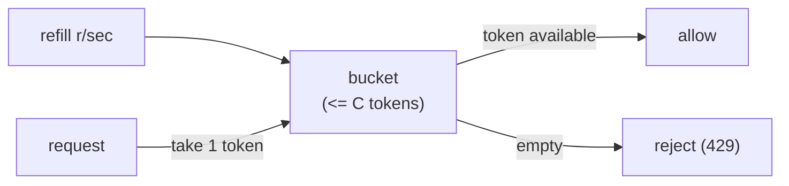

A model endpoint that anyone can call without limit is a liability: one buggy client can
exhaust your capacity, and one expensive tenant can run up a bill nobody can trace. The
**governance layer** is the gatekeeper that sits between callers and the model and
enforces three things, *who* may call (auth), *how much* they may call (rate limiting),
and *what it cost* whom (attribution). Auth is standard web practice; the two pieces
specific to a metered, expensive resource like an LLM are rate limiting and cost
attribution<FN n="1" />.

## Rate limiting with a token bucket

You need to cap how fast a client can call, both to protect capacity and to enforce
plan tiers. A good limiter must allow short **bursts** (real traffic is bursty) while
holding the **long-run average** below a ceiling. The **token-bucket** algorithm does
exactly this<FN n="2" />:

- A bucket holds up to **capacity** $C$ tokens and starts full.
- Tokens refill at a steady **rate** $r$ per second, up to the cap $C$.
- Each request must take one token (or more, for a costlier request). If the bucket has
  enough, the request is allowed and the tokens are removed; if not, it is rejected
  (HTTP 429).

The two parameters split the two concerns cleanly. The **refill rate $r$** sets the
sustained throughput: over a long window a client cannot exceed $r$ requests per second,
because that is how fast tokens arrive. The **capacity $C$** sets the burst size: a
client that has been quiet can fire up to $C$ requests at once from the tokens it
accumulated. A pure "max $r$ per second" counter would reject legitimate bursts; the
bucket permits them up to $C$ while still bounding the average at $r$.



## Cost attribution

Because each call burns tokens that [cost real money](I4/cost-monitoring), a
multi-tenant service must answer "who spent what." **Cost attribution** tags every
request with its caller (tenant, user, API key), records the input and output tokens it
consumed, and tallies the cost per tenant. This is what enables per-tenant billing,
budget alerts, and finding the one tenant responsible for a cost spike. It is plain
bookkeeping, but it only works if the tag is attached at the gateway, on the way in,
where the caller's identity from auth is still known.

## Worked example

We run a token-bucket limiter against a burst of requests, then tally per-tenant token
usage into a cost.

```python
class TokenBucket:
    def __init__(self, capacity, refill_per_sec):
        self.capacity, self.refill = capacity, refill_per_sec
        self.tokens, self.last = float(capacity), 0.0
    def allow(self, now, cost=1.0):
        # refill for the elapsed time, capped at capacity, then try to spend
        self.tokens = min(self.capacity, self.tokens + (now - self.last) * self.refill)
        self.last = now
        if self.tokens >= cost:
            self.tokens -= cost
            return True
        return False

# Capacity 5 (burst), refill 2/sec (sustained). Eight requests at t=0, then more later.
bucket = TokenBucket(capacity=5, refill_per_sec=2)
times =  [0, 0, 0, 0, 0, 0, 0, 0, 1.0, 1.0, 3.0]
allowed = [bucket.allow(t) for t in times]
print("allowed:", allowed)
print(f"{sum(allowed)} of {len(times)} requests admitted")
# first 5 drain the full bucket; next 3 in the same instant are throttled;
# by t=1 two tokens refilled (2 allowed), by t=3 four more (1 used here).
assert allowed == [True] * 5 + [False] * 3 + [True, True, True]

# Cost attribution: tag each call with its tenant, tally tokens, bill at a rate.
usage = {"acme": 0, "globex": 0}
for tenant, toks in [("acme", 1200), ("globex", 800), ("acme", 3000)]:
    usage[tenant] += toks
price_per_1k = 0.002
for tenant, toks in usage.items():
    print(f"{tenant}: {toks} tokens -> ${toks / 1000 * price_per_1k:.4f}")
assert usage["acme"] == 4200
```

The bucket admits the initial burst up to its capacity, throttles the overflow in the
same instant, and lets requests through again as tokens refill, while the attribution
tally rolls each tenant's tokens into a defensible bill. Auth, limits, and attribution
make the service safe to expose; getting it *running* reproducibly across environments
is [deployment](deployment-cicd).

<Footnotes>
  <FNItem n="1">**OWASP.** (2025). "OWASP Top 10 for Large Language Model Applications". [owasp.org](https://owasp.org/www-project-top-10-for-large-language-model-applications/). Unbounded consumption and excessive agency as governance risks.</FNItem>
  <FNItem n="2">**Tanenbaum, A. S., & Wetherall, D. J.** (2011). *Computer Networks* (5th ed.). Pearson. The token-bucket traffic-shaping algorithm (§5.4).</FNItem>
</Footnotes>
