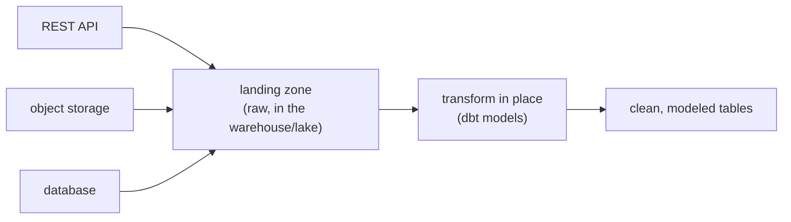

Enterprise AI rarely runs on one clean dataset. The useful context is scattered across a
CRM behind a REST API, documents in object storage, transactions in a production
database, and event logs in a stream. **Ingestion** is the job of pulling all of it into
one queryable place, and the prevailing pattern, [ELT](I1/pipeline-paradigms) with
in-warehouse transformation, is what dbt formalizes.

## Many sources, one landing zone

Each source speaks a different protocol and needs different extraction logic:

- **REST APIs** (the CRM, SaaS tools): paginated HTTP calls, with rate limits and auth to
  respect, often pulled incrementally by timestamp so you fetch only what changed.
- **Object storage** (S3, GCS): files, Parquet, CSV, PDFs, listed and read in bulk.
- **Databases** (the production Postgres): queried directly for a snapshot, or tracked
  continuously by [change data capture](J5/streaming-embeddings) to mirror updates.

The modern default is to **extract and load first, transform later** (ELT): land the raw
data from every source in the warehouse or lake essentially as-is, then transform it
*there*. Landing raw keeps the original around so a new requirement can be served by a new
transformation rather than a re-extraction, the same reason ELT beat ETL for analytics
and ML.

## The dbt mental model

Once the raw data has landed, the transformations themselves need structure, and **dbt**
(data build tool) provides the mental model that has become standard. Its core idea: a
transformation is just a `SELECT` statement, and a data model is a named query that other
queries can build on. From that, three properties follow that connect directly to ideas
already covered:

- **Transformations form a DAG.** Each model can reference others, so dbt builds a
  [dependency graph](I1/orchestration-dags) and runs models in topological order, exactly
  the orchestration pattern, but over SQL transformations in the warehouse.
- **Transformations are version-controlled and tested.** Models live in Git and carry
  data tests (not null, unique, accepted values), so a transformation is a reviewed,
  validated artifact rather than an ad-hoc query someone ran once.
- **Lineage is explicit.** Because the DAG is declared, dbt knows which downstream tables
  depend on which sources, so you can trace any column back to its origin and see the
  blast radius of a schema change before you make it.

The shift dbt encodes is treating analytics transformations like *software*, versioned,
tested, dependency-managed, which is why it anchors the [data platform](J5/dbt-transformations)
subsection later. Ingestion plus transformation gives you trustworthy data; this closes the
production-grade subsection. The next subsection turns to the advanced patterns that get
more out of the models themselves, starting with the discipline of knowing
[when not to fine-tune](J4/when-not-to-finetune).
