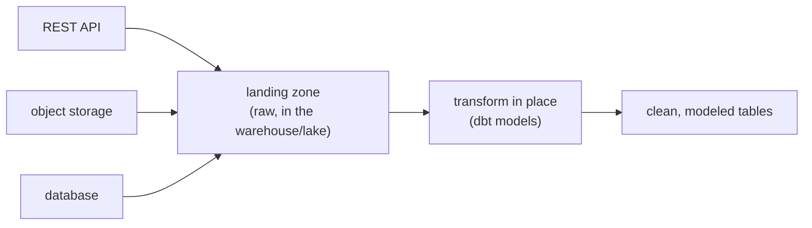

Enterprise AI rarely runs on one clean dataset. The useful context is scattered across a
CRM behind a REST API, documents in object storage, transactions in a production
database, and event logs in a stream. **Ingestion** is the job of pulling all of it into
one queryable place, and the prevailing pattern, [ELT](I1/pipeline-paradigms) with
in-warehouse transformation, is what dbt formalizes.

## Many sources, one landing zone

Each source speaks a different protocol and needs different extraction logic:

- **REST APIs** (the CRM, SaaS tools): paginated HTTP calls, with rate limits and auth to
  respect, often pulled incrementally by timestamp so you fetch only what changed.
- **Object storage** (S3, GCS): files, Parquet, CSV, PDFs, listed and read in bulk.
- **Databases** (the production Postgres): queried directly for a snapshot, or tracked
  continuously by [change data capture](J5/streaming-embeddings) to mirror updates.

The modern default is to **extract and load first, transform later** (ELT): land the raw
data from every source in the warehouse or lake essentially as-is, then transform it
*there*. Landing raw keeps the original around so a new requirement can be served by a new
transformation rather than a re-extraction, the same reason ELT beat ETL for analytics
and ML<FN n="1" />.

## The dbt mental model

Once the raw data has landed, the transformations themselves need structure, and **dbt**
(data build tool) provides the mental model that has become standard<FN n="2" />. Its core idea: a
transformation is just a `SELECT` statement, and a data model is a named query that other
queries can build on. From that, three properties follow that connect directly to ideas
already covered:

- **Transformations form a DAG.** Each model can reference others, so dbt builds a
  [dependency graph](I1/orchestration-dags) and runs models in topological order, exactly
  the orchestration pattern, but over SQL transformations in the warehouse.
- **Transformations are version-controlled and tested.** Models live in Git and carry
  data tests (not null, unique, accepted values), so a transformation is a reviewed,
  validated artifact rather than an ad-hoc query someone ran once.
- **Lineage is explicit.** Because the DAG is declared, dbt knows which downstream tables
  depend on which sources, so you can trace any column back to its origin and see the
  blast radius of a schema change before you make it.

## Exercises

**Exercise 1.** A team using ETL transforms data the moment it is extracted and
loads only the cleaned result, discarding the raw payload. Six months later a new
use case needs a field the original transformation dropped. Explain what ELT with
raw landing would have made possible here, and the general principle behind it.

Solution

**Step 1.** Under ETL, the dropped field is gone from the warehouse: the only way
to recover it is to re-extract from the source, which may have changed,
rate-limited the pull, or no longer hold the historical rows. The new requirement
is blocked on a fresh and possibly impossible extraction.

**Step 2.** Under ELT, the raw payload was landed as-is and kept. The new field
is already sitting in the raw landing zone, so serving the use case is a *new
transformation* over data already present, not a re-extraction.

**Step 3.** The principle: landing raw decouples extraction from transformation.
Extraction happens once and preserves the original; any number of transformations
can be added later without touching the source. This is why ELT displaced ETL for
analytics and ML, where requirements evolve and re-extraction is costly or
lossy.

**Exercise 2.** You must ingest from three sources: a SaaS CRM behind a REST API,
a bucket of Parquet files in object storage, and a production Postgres database
whose rows change continuously and must be mirrored with low lag. For each,
choose an extraction strategy from the lesson and justify it in one sentence.

Solution

**Step 1.** CRM REST API: paginated, incremental-by-timestamp HTTP pulls. The API
is rate-limited and returns pages, so respect pagination and auth, and fetch only
records changed since the last run to stay within limits and avoid re-pulling
everything.

**Step 2.** Object storage Parquet: bulk list-and-read. The files are static
objects, so enumerate the bucket and read the files in bulk; there is no
incremental protocol to honor beyond reading new objects.

**Step 3.** Production Postgres with continuous low-lag mirroring: change data
capture (CDC). A periodic snapshot query would miss intermediate changes and lag;
CDC streams the row-level inserts, updates, and deletes as they happen, mirroring
the database with low lag and without hammering it with repeated full scans.

**Exercise 3.** dbt's core idea is that a transformation is a `SELECT` statement
and a model is a named query other models can reference. A schema change is
proposed on a raw source table. Explain how the three dbt properties (DAG,
version control plus tests, explicit lineage) together let the team assess and
ship that change safely, where a folder of ad-hoc SQL scripts could not.

Solution

**Step 1.** Explicit lineage answers "what breaks." Because each model declares
the models and sources it references, dbt knows the full set of downstream tables
that depend on the changed source. The team sees the blast radius (every affected
column and table) *before* touching anything, instead of discovering breakage in
production.

**Step 2.** The DAG makes the rebuild correct and ordered. Once the change is
made, dbt re-runs the affected models in topological order, so each model rebuilds
only after its dependencies, and nothing runs against stale upstream output.

**Step 3.** Version control plus tests make the change reviewable and validated.
The modified models live in Git, so the change is a reviewed diff, and the data
tests (not null, unique, accepted values) run as part of the build, catching a
transformation that now violates an invariant before it ships.

**Step 4.** A folder of ad-hoc scripts has none of this: no declared dependency
graph (so the blast radius is unknown), no guaranteed run order, no review trail,
and no automated tests. The change is shipped blind and breakage surfaces
downstream. Treating transformations as software is exactly what closes that gap.

The shift dbt encodes is treating analytics transformations like *software*, versioned,
tested, dependency-managed, which is why it anchors the [data platform](J5/dbt-transformations)
subsection later. Ingestion plus transformation gives you trustworthy data; this closes the
production-grade subsection. The next subsection turns to the advanced patterns that get
more out of the models themselves, starting with the discipline of knowing
[when not to fine-tune](J4/when-not-to-finetune).

<Footnotes>
  <FNItem n="1">**Kleppmann, M.** (2017). *Designing Data-Intensive Applications.* O'Reilly. Batch and streaming data integration, raw landing, and derived-data pipelines.</FNItem>
  <FNItem n="2">**dbt Labs.** (2025). *dbt Documentation: About dbt projects.* [docs.getdbt.com](https://docs.getdbt.com/docs/build/projects). Models as `SELECT` statements, the transformation DAG, tests, and lineage.</FNItem>
</Footnotes>
