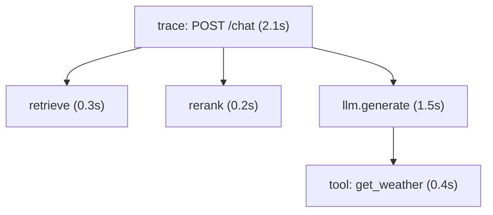

When an AI request is slow, wrong, or expensive, "the model gave a bad answer" is not a
diagnosis. A single user request fans out into many steps, embed the query, retrieve,
rerank, call the model, maybe call a tool and loop, and the problem lives in *one* of
them. **Observability** is the practice of instrumenting the system so you can see that
internal structure after the fact. For AI systems the right tool is distributed
**tracing**, because the unit of work is a multi-step pipeline, not a single function
call<FN n="1" />.

## Spans and traces

A **span** is a timed unit of work: it records a name, a start and end time (so its
duration), and metadata (tokens used, model name, document count). A **trace** is the
tree of spans for one request: a root span for the whole request, with child spans for
each step, nested to mirror the call structure.

Reading the tree answers the questions raw logs cannot. **Where did the latency go?**
Sum and compare span durations, here the model call dominates at $1.5$ s, so optimizing
retrieval would be wasted effort. **Where did the tokens (and cost) go?** Each span
carries its token count, so you can attribute spend to a step. **Where did it break?** A
failed span shows exactly which step errored and with what inputs. This is what turns a
[latency SLO](I4/slos-and-error-budgets) from a number into something you can act on: the
trace tells you which span to fix.

## Why AI needs more than metrics and logs

Traditional monitoring leans on aggregate **metrics** (p99 latency, error rate) and
**logs** (lines of text). Both fall short for AI. Metrics tell you *that* p99 rose but
not *which step* caused it. Logs record events but lose the causal structure, which log
line belongs to which request, and which step produced it, is guesswork once requests
interleave. Tracing keeps the structure: every span is tagged with its trace id, so the
full causal path of one request is reconstructable even under heavy concurrency<FN n="2" />.

AI adds a further demand: you usually need to see the **actual inputs and outputs** of
each step, the exact prompt sent, the documents retrieved, the raw model response,
because a "wrong answer" bug is almost always a bad prompt or bad retrieval, invisible in
timing data alone. This is precisely what LLM-focused tracing tools (LangSmith, and the
OpenTelemetry-based stacks) capture: the span tree *plus* the content flowing through it.
Recording prompts and outputs also raises a privacy concern, those traces can contain
user data, which is one more reason [security](prompt-injection-security) and governance
run through every layer.

## Exercises

**Exercise 1.** A trace for one `POST /chat` request has a root span of 2.1 s
containing three child spans: `retrieve` 0.3 s, `rerank` 0.2 s, and
`llm.generate` 1.5 s. A teammate, looking only at the p99 latency metric, plans
to spend a sprint caching the retriever to cut latency. Using the trace, compute
the best-case speedup that effort can deliver and say where the effort should go
instead.

Solution

**Step 1.** Read the span durations. Retrieval is 0.3 s out of the 2.1 s request,
about 14 percent. Even reducing retrieval to zero removes at most 0.3 s, taking
the request from 2.1 s to 1.8 s, a 14 percent improvement, and only if retrieval
is not overlapped with other work.

**Step 2.** The model call is 1.5 s, about 71 percent of the request. It
dominates, so latency work (smaller model, shorter outputs, speculative decoding,
streaming to cut perceived latency) targeting `llm.generate` has far more headroom
than caching retrieval.

**Step 3.** The metric alone could not have told the team this: p99 latency says
*that* the request is slow, not *which span* owns the time. The trace decomposes
the 2.1 s into its steps and redirects the sprint from a 0.3 s target to the 1.5 s
one.

**Exercise 2.** Metrics and logs are the traditional pillars of monitoring.
Construct a single AI-specific failure that neither a p99-latency metric nor a
stream of log lines can diagnose on its own, and explain what property of a trace
resolves it.

Solution

**Step 1.** The failure: under load, a fraction of `/chat` requests return
plausible but wrong answers, and a fraction are slow. The two problems may or may
not be the same requests.

**Step 2.** Why the metric fails. p99 latency reports that some requests are slow
but attributes nothing: it cannot say whether the slow ones are the wrong ones,
nor which internal step (retrieval, rerank, generation, a tool call) is
responsible. It is an aggregate with the causal structure averaged away.

**Step 3.** Why logs fail. Logs record events, but once many requests interleave
under concurrency, which log line belongs to which request, and which step
emitted it, is guesswork. The causal chain of a single request is lost in the
interleaving.

**Step 4.** What the trace resolves. Every span carries the trace id of its
request, so the full nested causal path of one request is reconstructable even
under heavy concurrency. The wrong-answer request's trace shows the exact prompt
and retrieved documents (revealing a bad-retrieval cause), and its span durations
show whether that same request was also the slow one. Structure and content per
request are precisely what metrics and logs discard.

**Exercise 3.** For an ordinary web service, a trace of timing-only spans (name,
start, end) is usually enough to debug. The lesson argues AI tracing must also
record the actual inputs and outputs of each step. Give the reason this extra
demand is specific to AI systems, and name the privacy cost it introduces and one
mitigation implied by the lesson.

Solution

**Step 1.** Why timing is not enough for AI. A "wrong answer" bug is almost never
a timing problem; it is a bad prompt or bad retrieval. The exact prompt sent, the
documents retrieved, and the raw model response are invisible in duration data
alone, so a trace of timings can show *that* generation ran but not *why* it
produced a wrong answer. Reproducing the bug requires seeing the content that
flowed through each span.

**Step 2.** Why this is AI-specific. In a CRUD service the failure modes
(a 500, a slow query, a null) are visible in status codes and timings. In an AI
service the output is free-form text whose correctness depends on the inputs that
produced it, so the content itself is the diagnostic signal, not just the timing.

**Step 3.** The privacy cost. Recorded prompts and outputs can contain user data
(personal information, confidential documents), so the trace store now holds
sensitive content. The lesson ties this to security and governance running
through every layer: the traces must be access-controlled and governed (and in
practice redacted or retention-limited) like any other store of user data,
rather than treated as harmless telemetry.

With the service observable, the next lesson confronts the
threat unique to giving a model instructions and untrusted data in the same context:
[prompt injection](prompt-injection-security).

<Footnotes>
  <FNItem n="1">**OpenTelemetry Authors.** (2025). *OpenTelemetry Specification: Traces.* CNCF. [opentelemetry.io](https://opentelemetry.io/docs/specs/otel/trace/). The span/trace data model behind modern tracing stacks.</FNItem>
  <FNItem n="2">**Sigelman, B. H., et al.** (2010). "Dapper, a large-scale distributed systems tracing infrastructure". *Google Technical Report.* [research.google](https://research.google/pubs/pub36356/). The seminal distributed-tracing design.</FNItem>
</Footnotes>
