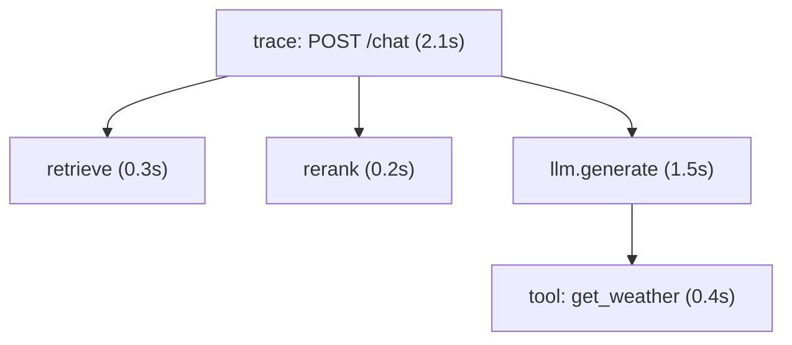

When an AI request is slow, wrong, or expensive, "the model gave a bad answer" is not a
diagnosis. A single user request fans out into many steps, embed the query, retrieve,
rerank, call the model, maybe call a tool and loop, and the problem lives in *one* of
them. **Observability** is the practice of instrumenting the system so you can see that
internal structure after the fact. For AI systems the right tool is distributed
**tracing**, because the unit of work is a multi-step pipeline, not a single function
call<FN n="1" />.

## Spans and traces

A **span** is a timed unit of work: it records a name, a start and end time (so its
duration), and metadata (tokens used, model name, document count). A **trace** is the
tree of spans for one request: a root span for the whole request, with child spans for
each step, nested to mirror the call structure.

Reading the tree answers the questions raw logs cannot. **Where did the latency go?**
Sum and compare span durations, here the model call dominates at $1.5$ s, so optimizing
retrieval would be wasted effort. **Where did the tokens (and cost) go?** Each span
carries its token count, so you can attribute spend to a step. **Where did it break?** A
failed span shows exactly which step errored and with what inputs. This is what turns a
[latency SLO](I4/slos-and-error-budgets) from a number into something you can act on: the
trace tells you which span to fix.

## Why AI needs more than metrics and logs

Traditional monitoring leans on aggregate **metrics** (p99 latency, error rate) and
**logs** (lines of text). Both fall short for AI. Metrics tell you *that* p99 rose but
not *which step* caused it. Logs record events but lose the causal structure, which log
line belongs to which request, and which step produced it, is guesswork once requests
interleave. Tracing keeps the structure: every span is tagged with its trace id, so the
full causal path of one request is reconstructable even under heavy concurrency<FN n="2" />.

AI adds a further demand: you usually need to see the **actual inputs and outputs** of
each step, the exact prompt sent, the documents retrieved, the raw model response,
because a "wrong answer" bug is almost always a bad prompt or bad retrieval, invisible in
timing data alone. This is precisely what LLM-focused tracing tools (LangSmith, and the
OpenTelemetry-based stacks) capture: the span tree *plus* the content flowing through it.
Recording prompts and outputs also raises a privacy concern, those traces can contain
user data, which is one more reason [security](prompt-injection-security) and governance
run through every layer. With the service observable, the next lesson confronts the
threat unique to giving a model instructions and untrusted data in the same context:
[prompt injection](prompt-injection-security).

<Footnotes>
  <FNItem n="1">**OpenTelemetry Authors.** (2025). *OpenTelemetry Specification: Traces.* CNCF. [opentelemetry.io](https://opentelemetry.io/docs/specs/otel/trace/). The span/trace data model behind modern tracing stacks.</FNItem>
  <FNItem n="2">**Sigelman, B. H., et al.** (2010). "Dapper, a large-scale distributed systems tracing infrastructure". *Google Technical Report.* [research.google](https://research.google/pubs/pub36356/). The seminal distributed-tracing design.</FNItem>
</Footnotes>
