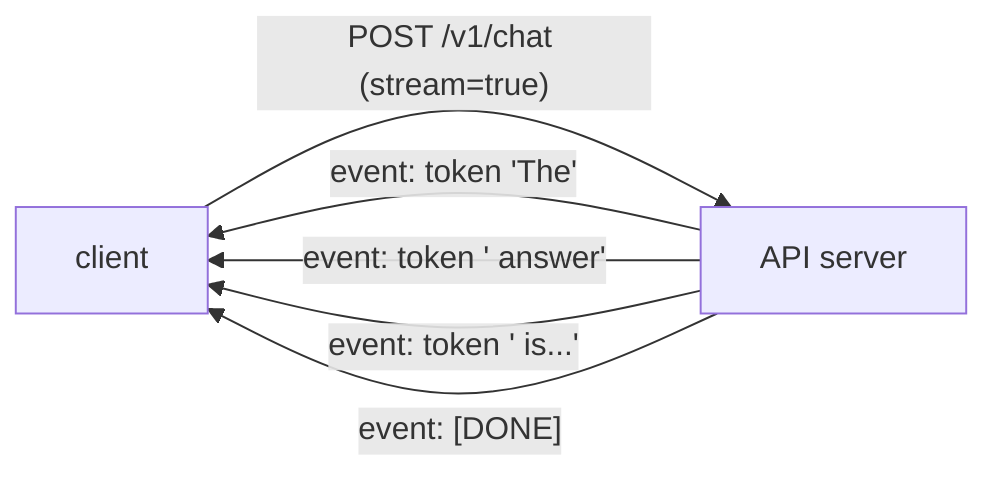

A model behind an [inference engine](I3/llm-serving) still needs a front door: an HTTP
API that applications call. AI APIs differ from ordinary CRUD APIs in three ways that
all trace back to one fact, generation is slow and produces output incrementally. That
single property drives the case for streaming, for async concurrency, and for taking
versioning seriously from day one.

## Streaming: send tokens as they arrive

A chat completion can take many seconds. If the API waits for the full response and
returns it in one shot, the user stares at a blank screen the whole time. **Streaming**
sends each token (or small group) the instant the model produces it, so text appears
progressively, the experience every chat UI has. The standard transport is
**server-sent events** (SSE): the server holds the HTTP connection open and pushes a
sequence of events down it until the generation ends.



The shift is from one request mapping to one response, to one request mapping to a
*stream* of partial responses. It cuts the **time to first token**, the latency users
actually perceive, from seconds to milliseconds, even though total generation time is
unchanged.

## Async: don't block a worker while the model thinks

A request that takes five seconds spends almost all of it *waiting* on the model, not
using CPU. In a synchronous server, that waiting worker is blocked and cannot serve
anyone else, so concurrency collapses. **Async I/O** (Python's `async`/`await`, served
by FastAPI on an ASGI server) lets a single worker `await` the slow model call and, in
the meantime, make progress on other requests. Because AI serving is dominated by
waiting, async is not a micro-optimization here, it is the difference between handling
ten concurrent requests and a thousand on the same hardware. The shape is illustrative:

```python-static
@app.post("/v1/chat")
async def chat(req: ChatRequest):
    async def stream():
        async for token in model.generate(req.messages):   # await: frees the worker
            yield f"data: {token}\n\n"                       # SSE event per token
        yield "data: [DONE]\n\n"
    return StreamingResponse(stream(), media_type="text/event-stream")
```

## Versioning: the contract outlives the code

Clients integrate against your request and response shapes, and they do not redeploy
when you do. So the API is a **contract**, and breaking it, renaming a field, changing a
default, tightening validation, breaks live integrations silently. The discipline is to
version the surface (the `/v1/` in the path is not decoration) and treat
backward-incompatible changes as a new version, `/v2/`, run alongside `/v1/` through a
deprecation window. Additive changes (a new optional field) are safe within a version;
removals and semantic changes are not. This is the same evolution discipline as
[MCP server versioning](J2/designing-mcp-servers), applied to the HTTP boundary.

Streaming for perceived latency, async for concurrency, versioning for stability: these
make the API usable. What sits *in front* of it, deciding who may call and how much,
is the [governance layer](governance-rate-limiting).
