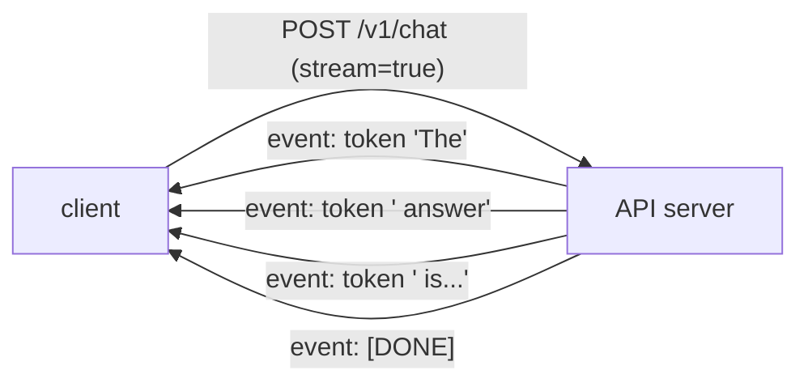

A model behind an [inference engine](I3/llm-serving) still needs a front door: an HTTP
API that applications call. AI APIs differ from ordinary CRUD APIs in three ways that
all trace back to one fact, generation is slow and produces output incrementally. That
single property drives the case for streaming, for async concurrency, and for taking
versioning seriously from day one<FN n="1" />.

## Streaming: send tokens as they arrive

A chat completion can take many seconds. If the API waits for the full response and
returns it in one shot, the user stares at a blank screen the whole time. **Streaming**
sends each token (or small group) the instant the model produces it, so text appears
progressively, the experience every chat UI has. The standard transport is
**server-sent events** (SSE): the server holds the HTTP connection open and pushes a
sequence of events down it until the generation ends<FN n="2" />.



The shift is from one request mapping to one response, to one request mapping to a
*stream* of partial responses. It cuts the **time to first token**, the latency users
actually perceive, from seconds to milliseconds, even though total generation time is
unchanged.

## Async: don't block a worker while the model thinks

A request that takes five seconds spends almost all of it *waiting* on the model, not
using CPU. In a synchronous server, that waiting worker is blocked and cannot serve
anyone else, so concurrency collapses. **Async I/O** (Python's `async`/`await`, served
by FastAPI on an ASGI server) lets a single worker `await` the slow model call and, in
the meantime, make progress on other requests. Because AI serving is dominated by
waiting, async is not a micro-optimization here, it is the difference between handling
ten concurrent requests and a thousand on the same hardware. The shape is illustrative:

```python-static
@app.post("/v1/chat")
async def chat(req: ChatRequest):
    async def stream():
        async for token in model.generate(req.messages):   # await: frees the worker
            yield f"data: {token}\n\n"                       # SSE event per token
        yield "data: [DONE]\n\n"
    return StreamingResponse(stream(), media_type="text/event-stream")
```

## Versioning: the contract outlives the code

Clients integrate against your request and response shapes, and they do not redeploy
when you do. So the API is a **contract**, and breaking it, renaming a field, changing a
default, tightening validation, breaks live integrations silently. The discipline is to
version the surface (the `/v1/` in the path is not decoration) and treat
backward-incompatible changes as a new version, `/v2/`, run alongside `/v1/` through a
deprecation window. Additive changes (a new optional field) are safe within a version;
removals and semantic changes are not. This is the same evolution discipline as
[MCP server versioning](J2/designing-mcp-servers), applied to the HTTP boundary.

## Exercises

**Exercise 1.** A non-streaming `/chat` endpoint returns the full completion in
one response. For a request whose total generation takes 4 s, contrast the
non-streaming time to first token with the streaming time to first token, and
explain why streaming improves the user's experience even though total generation
time is unchanged.

<details>
<summary>Solution</summary>

**Step 1.** Non-streaming. The server buffers the entire completion and sends it
only when generation finishes, so the user sees nothing until the full 4 s have
elapsed. Time to first token equals total generation time, about 4 s of blank
screen.

**Step 2.** Streaming. Each token is pushed (over server-sent events) the instant
the model produces it, so the first token arrives roughly when the model emits it,
on the order of milliseconds to a few hundred milliseconds, not 4 s. Time to first
token drops to that initial latency.

**Step 3.** Total generation time is identical: all 4 s of tokens still have to be
produced. What changed is *perceived* latency. The user starts reading
immediately and watches the answer build, which is the latency a person actually
feels, rather than staring at a blank screen for the same 4 s.

</details>

**Exercise 2.** A synchronous server runs 16 workers. Each `/chat` request takes
5 s, of which roughly 4.9 s is spent awaiting the model and about 0.1 s is CPU
work. Explain why this server collapses under concurrency, and why async I/O on a
single worker can serve far more concurrent requests on the same hardware.

<details>
<summary>Solution</summary>

**Step 1.** Synchronous bottleneck. A synchronous worker is occupied for the
whole 5 s of a request, including the 4.9 s it spends merely waiting on the model,
during which it does no CPU work but still cannot serve anyone else. With 16
workers, at most 16 requests are in flight at once; the 17th waits, even though
the machine's CPU is almost idle. Concurrency is capped by worker count, not by
real resource use.

**Step 2.** Async frees the waiting worker. With async I/O, a worker that hits the
slow model call `await`s it and, instead of blocking, picks up other requests
while that call is pending. The 4.9 s of waiting per request is now overlapped
across many requests on the same worker.

**Step 3.** Why the gain is large here. The work is dominated by waiting (4.9 s of
5 s), and waiting is exactly what async overlaps. A single async worker can hold
hundreds or thousands of `await`ing requests because each consumes almost no CPU
while waiting, so the same hardware goes from tens of concurrent requests to
thousands. Async is decisive precisely because AI serving is wait-bound, not
CPU-bound.

</details>

**Exercise 3.** Your API is at `/v1/chat`. Classify each proposed change as safe
within `v1` or as requiring a new `/v2/`, and justify the rule you are applying:
(a) add a new optional `temperature` field to the request; (b) rename the response
field `text` to `content`; (c) change the default `max_tokens` from 1024 to 256;
(d) start rejecting requests that were previously accepted with a missing
`model` field.

<details>
<summary>Solution</summary>

**Step 1.** The rule. The API is a contract clients integrate against without
redeploying when you do. Additive, backward-compatible changes are safe within a
version; backward-incompatible changes (renames, removals, semantic or default
changes, tighter validation) silently break live integrations and require a new
version run alongside the old one through a deprecation window.

**Step 2.** (a) Add an optional `temperature` field: safe within `v1`. It is
additive; existing clients that omit it are unaffected.

**Step 3.** (b) Rename `text` to `content`: new `/v2/`. Every client reading
`response.text` breaks the moment the field disappears; a rename is a removal plus
an addition, backward-incompatible.

**Step 4.** (c) Change the default `max_tokens` from 1024 to 256: new `/v2/`. It is
a semantic change to behavior clients rely on; a client that omitted `max_tokens`
expecting 1024 now silently gets truncated output. Same response shape, different
meaning, still a break.

**Step 5.** (d) Reject previously accepted requests missing `model`: new `/v2/`.
Tightening validation rejects inputs that used to succeed, breaking any client
that relied on the lenient behavior.

</details>

Streaming for perceived latency, async for concurrency, versioning for stability: these
make the API usable. What sits *in front* of it, deciding who may call and how much,
is the [governance layer](governance-rate-limiting).

<Footnotes>
  <FNItem n="1">**Huyen, C.** (2024). *AI Engineering: Building Applications with Foundation Models.* O'Reilly. Inference API design, streaming, and serving tradeoffs.</FNItem>
  <FNItem n="2">**WHATWG.** (2025). *HTML Living Standard*, §9.2 "Server-sent events". [html.spec.whatwg.org](https://html.spec.whatwg.org/multipage/server-sent-events.html). The `text/event-stream` transport spec.</FNItem>
</Footnotes>
