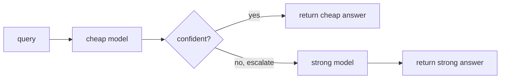

Always calling the most capable model is the simplest design and often the most wasteful.
Most production traffic is easy, a greeting, a simple lookup, a routine classification,
and a small cheap model answers those perfectly well. Paying frontier-model prices for
them is burning money. **Model routing** sends each query to the cheapest model that can
handle it, and the **cascade** is the most robust way to do that. Combined with caching,
it is the highest-leverage cost lever in AI serving, on top of the
[per-request economics](I4/cost-monitoring) from MLOps.

## The cascade

A cascade arranges models from cheap to expensive and tries them in order. Run the cheap
model first; if its answer is good enough, stop, otherwise **escalate** to the next model
up. The decision uses a **confidence signal**: the cheap model's own probability, a judge
score, or a difficulty estimate. When confidence clears a threshold, accept the cheap
answer; when it does not, escalate.



The economics work because traffic is **skewed toward easy**. If a large fraction of
queries are handled correctly by the cheap model, you pay the cheap price on most of them
and the expensive price (cheap + strong, since the cheap call already ran) only on the
hard minority. The blended cost lands far below always-expensive, while accuracy stays
close to it, *provided the router escalates the genuinely hard queries*. The threshold is
the knob: tighter escalation buys more accuracy at more cost, looser buys savings at some
accuracy. The router itself must be cheap, or it eats the savings.

## Caching: don't pay twice for the same answer

The complementary lever is to not call any model when you do not have to. **Exact-match
caching** stores the response for a given prompt and returns it instantly on a repeat, the
[prompt-cache](I4/cost-monitoring) idea at the application layer. **Semantic caching** goes
further: it embeds the query and returns a cached answer if a *semantically similar* prior
query exists (cosine similarity above a threshold), catching paraphrases that exact match
misses. Each cache hit is a model call avoided, latency and cost both going to near zero,
at the risk of a stale or slightly-off answer if the similarity threshold is too loose.

## Worked example

We route a stream of queries of varying difficulty through a cheap-then-strong cascade and
compare its blended accuracy and cost against always-cheap and always-expensive.

```python
import numpy as np
rng = np.random.default_rng(0)
N = 10000

difficulty = rng.uniform(0, 1, size=N)       # 0 = easy, 1 = hard
cheap_correct = difficulty < 0.60            # cheap model handles easy queries
exp_correct   = difficulty < 0.95            # strong model handles almost all
cost_cheap, cost_exp = 1.0, 10.0             # relative per-call cost

conf = 1 - difficulty + rng.normal(0, 0.1, size=N)   # noisy confidence from cheap model
escalate = conf < 0.45                                # low confidence -> escalate

# Cascade: cheap call always runs; escalation adds the strong call's cost.
cost    = np.where(escalate, cost_cheap + cost_exp, cost_cheap)
correct = np.where(escalate, exp_correct, cheap_correct)

print(f"always cheap:     acc {cheap_correct.mean():.3f}  cost {cost_cheap:.1f}")
print(f"always expensive: acc {exp_correct.mean():.3f}  cost {cost_exp:.1f}")
print(f"cascade router:   acc {correct.mean():.3f}  cost {cost.mean():.2f}  "
      f"(escalated {escalate.mean():.0%})")
assert correct.mean() > cheap_correct.mean() and cost.mean() < cost_exp
print(f"=> {correct.mean() / exp_correct.mean():.0%} of strong-model accuracy "
      f"at {cost.mean() / cost_exp:.0%} of the cost")
```

The cascade reaches $98\%$ of the strong model's accuracy at $55\%$ of its cost by paying
the premium only on the $45\%$ of queries the router flags as hard. Routing and caching
close the advanced-patterns subsection; the next subsection drops back down to the data
platform that feeds all of this, starting with [dbt](J5/dbt-transformations).
