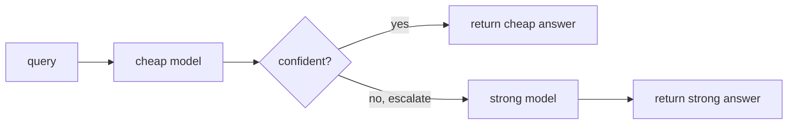

Always calling the most capable model is the simplest design and often the most wasteful.
Most production traffic is easy, a greeting, a simple lookup, a routine classification,
and a small cheap model answers those perfectly well. Paying frontier-model prices for
them is burning money. **Model routing** sends each query to the cheapest model that can
handle it, and the **cascade** is the most robust way to do that. Combined with caching,
it is the highest-leverage cost lever in AI serving, on top of the
[per-request economics](I4/cost-monitoring) from MLOps.

## The cascade

A cascade arranges models from cheap to expensive and tries them in order. Run the cheap
model first; if its answer is good enough, stop, otherwise **escalate** to the next model
up. The decision uses a **confidence signal**: the cheap model's own probability, a judge
score, or a difficulty estimate. When confidence clears a threshold, accept the cheap
answer; when it does not, escalate<FN n="1" />.



The economics work because traffic is **skewed toward easy**. If a large fraction of
queries are handled correctly by the cheap model, you pay the cheap price on most of them
and the expensive price (cheap + strong, since the cheap call already ran) only on the
hard minority. The blended cost lands far below always-expensive, while accuracy stays
close to it, *provided the router escalates the genuinely hard queries*. The threshold is
the knob: tighter escalation buys more accuracy at more cost, looser buys savings at some
accuracy. The router itself must be cheap, or it eats the savings.

## Caching: don't pay twice for the same answer

The complementary lever is to not call any model when you do not have to. **Exact-match
caching** stores the response for a given prompt and returns it instantly on a repeat, the
[prompt-cache](I4/cost-monitoring) idea at the application layer. **Semantic caching** goes
further: it embeds the query and returns a cached answer if a *semantically similar* prior
query exists (cosine similarity above a threshold), catching paraphrases that exact match
misses. Each cache hit is a model call avoided, latency and cost both going to near zero,
at the risk of a stale or slightly-off answer if the similarity threshold is too loose<FN n="2" />.

## Worked example

We route a stream of queries of varying difficulty through a cheap-then-strong cascade and
compare its blended accuracy and cost against always-cheap and always-expensive.

```python
import numpy as np
rng = np.random.default_rng(0)
N = 10000

difficulty = rng.uniform(0, 1, size=N)       # 0 = easy, 1 = hard
cheap_correct = difficulty < 0.60            # cheap model handles easy queries
exp_correct   = difficulty < 0.95            # strong model handles almost all
cost_cheap, cost_exp = 1.0, 10.0             # relative per-call cost

conf = 1 - difficulty + rng.normal(0, 0.1, size=N)   # noisy confidence from cheap model
escalate = conf < 0.45                                # low confidence -> escalate

# Cascade: cheap call always runs; escalation adds the strong call's cost.
cost    = np.where(escalate, cost_cheap + cost_exp, cost_cheap)
correct = np.where(escalate, exp_correct, cheap_correct)

print(f"always cheap:     acc {cheap_correct.mean():.3f}  cost {cost_cheap:.1f}")
print(f"always expensive: acc {exp_correct.mean():.3f}  cost {cost_exp:.1f}")
print(f"cascade router:   acc {correct.mean():.3f}  cost {cost.mean():.2f}  "
      f"(escalated {escalate.mean():.0%})")
assert correct.mean() > cheap_correct.mean() and cost.mean() < cost_exp
print(f"=> {correct.mean() / exp_correct.mean():.0%} of strong-model accuracy "
      f"at {cost.mean() / cost_exp:.0%} of the cost")
```

The cascade reaches $98\%$ of the strong model's accuracy at $55\%$ of its cost by paying
the premium only on the $45\%$ of queries the router flags as hard.

## Exercises

**Exercise 1.** A cascade always runs a cheap model at cost $c_1 = 1$ and escalates a
fraction $e$ of queries to a strong model at cost $c_2 = 12$ (the cheap call still counts,
since it ran first). Write the blended expected cost per query as a function of $e$, then
evaluate it at $e = 0.30$.

<details>
<summary>Solution</summary>

**Step 1.** Every query pays $c_1$. An escalated query additionally pays $c_2$, and a
fraction $e$ of queries escalate, so the expected extra is $e\,c_2$. The blended cost is

$$
\mathbb{E}[\text{cost}] = c_1 + e\,c_2.
$$

**Step 2.** Substitute $c_1 = 1$, $c_2 = 12$, $e = 0.30$:

$$
\mathbb{E}[\text{cost}] = 1 + 0.30 \cdot 12 = 1 + 3.6 = 4.6.
$$

That is $4.6 / 12 \approx 38\%$ of the always-strong cost, a $62\%$ saving, bought by
escalating fewer than a third of queries.

</details>

**Exercise 2.** You have a cost budget of $B = 6$ per query for the same cascade
($c_1 = 1$, $c_2 = 12$). What is the largest escalation rate $e^\star$ the budget allows,
and what does exceeding it mean operationally?

<details>
<summary>Solution</summary>

**Step 1.** Set the blended cost from Exercise 1 equal to the budget and solve for $e$:

$$
c_1 + e\,c_2 \le B \quad\Longrightarrow\quad e \le \frac{B - c_1}{c_2}.
$$

**Step 2.** Substitute the numbers:

$$
e^\star = \frac{6 - 1}{12} = \frac{5}{12} \approx 0.417.
$$

So up to about $42\%$ of traffic can escalate before the budget breaks. If the router
flags more than that as hard, the confidence threshold must be tightened (accept more
cheap answers) or the budget raised; the threshold is the single knob trading accuracy
against this cost ceiling.

</details>

**Exercise 3 (code).** Simulate the cascade's blended cost on a stream of queries with a
given escalation rate, confirm it matches the closed form $c_1 + e\,c_2$, and find the
threshold escalation rate that keeps the blended cost under a budget.

<details>
<summary>Solution</summary>

```python
import numpy as np
rng = np.random.default_rng(0)

N = 200_000
c1, c2 = 1.0, 12.0
e = 0.30                                   # target escalation rate

escalate = rng.random(N) < e               # mark ~30% of queries hard
cost = np.where(escalate, c1 + c2, c1)     # cheap always runs; +strong if escalated

empirical = cost.mean()
closed_form = c1 + e * c2
print("empirical blended cost:", round(empirical, 3))
print("closed form  c1 + e*c2:", round(closed_form, 3))
assert np.isclose(empirical, closed_form, atol=0.05)

# Largest escalation rate under a budget B (Exercise 2's formula).
B = 6.0
e_star = (B - c1) / c2
print("max escalation rate under budget", B, ":", round(e_star, 4))
assert np.isclose(e_star, 5 / 12)
```

The simulated cost tracks $c_1 + e\,c_2$ to within sampling noise, and the threshold
$e^\star = 5/12 \approx 0.417$ matches the hand computation.

</details>

Routing and caching
close the advanced-patterns subsection; the next subsection drops back down to the data
platform that feeds all of this, starting with [dbt](J5/dbt-transformations).

<Footnotes>
  <FNItem n="1">**Chen, L., Zaharia, M., & Zou, J.** (2023). "FrugalGPT: how to use large language models while reducing cost and improving performance". [arXiv:2305.05176](https://arxiv.org/abs/2305.05176). The LLM cascade and cost-quality tradeoff.</FNItem>
  <FNItem n="2">**Huyen, C.** (2024). *AI Engineering: Building Applications with Foundation Models.* O'Reilly. Routing, caching, and inference cost optimization.</FNItem>
</Footnotes>
