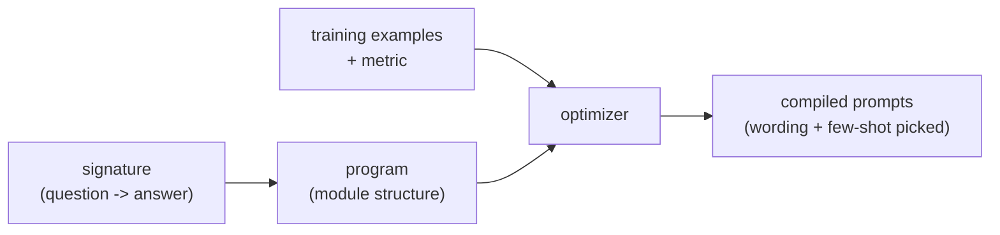

Hand-tuning prompts is how most LLM applications start and how many get stuck. You tweak
a wording, eyeball a few outputs, tweak again, an unmeasured, unrepeatable process that
does not survive a model upgrade (the prompt you tuned for one model may be wrong for the
next). **DSPy** reframes the problem: stop writing prompt *strings* and start writing
prompt *programs* whose wording is **optimized** against a metric, the same shift from
manual tuning to automatic optimization that gradient descent brought to model weights.

## Prompts as parameters

The core idea is a change of what you specify by hand. In DSPy you declare the *structure*
of a step, its inputs and outputs (a **signature**, like `question -> answer`), and the
*control flow* (retrieve, then reason, then answer). What you do **not** write is the
exact prompt text, the phrasing, the instructions, the few-shot examples. Those are
treated as **parameters** to be filled in by an optimizer<FN n="1" />.

An **optimizer** then "compiles" the program: given a handful of training examples and a
[metric](J2/llm-as-judge) (could be exact match, or an LLM judge), it searches over prompt
phrasings and, crucially, *selects which examples to include as few-shot demonstrations*<FN n="2" />,
keeping the choices that score best on the metric. The output is a concrete, tuned prompt,
but you arrived at it by measurement, not vibes.

## Why this matters: context engineering

The deeper shift the discipline names is from **prompt engineering** (crafting one good
string) to **context engineering** (systematically assembling everything in the model's
context: instructions, retrieved documents, few-shot examples, tool results, memory). The
context window is the model's entire working memory for a task, and what goes into it, and
in what order, often matters more than the model choice. Treating that assembly as
something to *optimize against a metric*, rather than handcraft, is what makes an
LLM pipeline improvable and portable:

- **Measurable.** A metric replaces eyeballing, so "better" is a number you can track and
  gate releases on.
- **Portable across models.** Re-run the optimizer when you switch models and it re-tunes
  the prompts for the new one, instead of you re-tuning by hand.
- **Composable.** Multi-step pipelines ([RAG](J2/production-rag), [ReAct](J1/react-loop))
  are optimized end to end, so the steps are tuned to work *together*, not in isolation.

The takeaway is not "use DSPy specifically" but the principle it embodies: the prompt and
the context are parameters of your system, and parameters should be optimized against a
metric, not hand-set.

## Exercises

**Exercise 1.** A team hand-tunes a prompt that scores well on GPT-4, then upgrades to a
newer model and quality drops. Using the prompts-as-parameters framing, explain why this
is expected and what the DSPy workflow does differently.

Solution

**Step 1.** A hand-tuned prompt is a point chosen to work for one specific model. The
wording, instruction phrasing, and few-shot examples were selected (implicitly) to score
well under that model's behavior. They are parameters fit to that model, even though no one
called them parameters.

**Step 2.** A new model has different behavior, so the old point is no longer near optimal
for it. Nothing carried the prompt to the new model's optimum, because the fitting was
manual and unrecorded; the prompt is stuck where the human left it.

**Step 3.** In DSPy the human specifies only the signature (`question -> answer`) and
control flow, and the optimizer fits the prompt text and few-shot picks against a metric.
On a model switch you re-run the optimizer against the same metric and it re-fits the
prompts for the new model automatically. The portable artifact is the program plus the
metric, not the frozen prompt string.

**Exercise 2.** Two engineers both want a question-answering step. One writes a polished
prompt string with three hand-picked examples. The other writes a DSPy signature
`question -> answer` plus a metric (exact match) and a pool of 50 candidate examples.
Identify which inputs each provides by hand, and which DSPy fills in by optimization.

Solution

**Step 1.** The first engineer hand-provides everything that reaches the model: the
instruction wording, the format, and the three demonstrations. There is no metric in the
loop; "good" is whatever they eyeballed.

**Step 2.** The second engineer hand-provides only the structure (the signature, the input
and output fields) and the optimization target (the metric and the candidate pool). The
exact instruction phrasing and which examples to include as few-shot demonstrations are
left blank.

**Step 3.** DSPy's optimizer fills the blanks: it searches phrasings and selects which of
the 50 candidates to show as demonstrations, keeping the choices that maximize the exact-
match metric. So the second engineer specifies a search problem; the first specifies a
fixed answer. Only the second has a number to gate releases on and a procedure to re-run
after a model change.

**Exercise 3.** "Context engineering" is broader than the prompt string. List the kinds of
content that share the context window in a RAG-plus-tools pipeline, and argue why ordering
and selection of that content can matter more than which base model is used.

Solution

**Step 1.** The context window is assembled from several sources: the system and task
instructions, retrieved documents, few-shot demonstrations, tool-call results, and any
running memory or scratchpad. All of these compete for the same finite window.

**Step 2.** The model can only condition on what is in the window, and only as well as the
ordering surfaces it. Irrelevant or poorly ordered retrieved chunks crowd out the relevant
ones and can bury the key fact deep where the model attends to it less. A strong base model
fed the wrong context answers the wrong question confidently; a weaker model fed precisely
the right context often answers correctly.

**Step 3.** So the assembly (what to retrieve, how much, in what order, which
demonstrations) is a high-leverage design surface. Context engineering treats that assembly
as something to optimize against a metric, which is why a measured pipeline on a modest
model can beat an unmeasured one on a stronger model.

The next lesson scales the *structure* the same way, coordinating
several models with [multi-agent orchestration](multi-agent-orchestration).

<Footnotes>
  <FNItem n="1">**Khattab, O., et al.** (2024). "DSPy: compiling declarative language model calls into self-improving pipelines". *ICLR.* [arXiv:2310.03714](https://arxiv.org/abs/2310.03714)</FNItem>
  <FNItem n="2">**Brown, T. B., et al.** (2020). "Language models are few-shot learners". *NeurIPS.* [arXiv:2005.14165](https://arxiv.org/abs/2005.14165). In-context demonstrations as the unit DSPy optimizes over.</FNItem>
</Footnotes>
