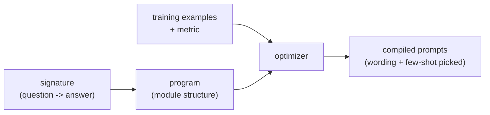

Hand-tuning prompts is how most LLM applications start and how many get stuck. You tweak
a wording, eyeball a few outputs, tweak again, an unmeasured, unrepeatable process that
does not survive a model upgrade (the prompt you tuned for one model may be wrong for the
next). **DSPy** reframes the problem: stop writing prompt *strings* and start writing
prompt *programs* whose wording is **optimized** against a metric, the same shift from
manual tuning to automatic optimization that gradient descent brought to model weights.

## Prompts as parameters

The core idea is a change of what you specify by hand. In DSPy you declare the *structure*
of a step, its inputs and outputs (a **signature**, like `question -> answer`), and the
*control flow* (retrieve, then reason, then answer). What you do **not** write is the
exact prompt text, the phrasing, the instructions, the few-shot examples. Those are
treated as **parameters** to be filled in by an optimizer<FN n="1" />.

An **optimizer** then "compiles" the program: given a handful of training examples and a
[metric](J2/llm-as-judge) (could be exact match, or an LLM judge), it searches over prompt
phrasings and, crucially, *selects which examples to include as few-shot demonstrations*<FN n="2" />,
keeping the choices that score best on the metric. The output is a concrete, tuned prompt,
but you arrived at it by measurement, not vibes.

## Why this matters: context engineering

The deeper shift the discipline names is from **prompt engineering** (crafting one good
string) to **context engineering** (systematically assembling everything in the model's
context: instructions, retrieved documents, few-shot examples, tool results, memory). The
context window is the model's entire working memory for a task, and what goes into it, and
in what order, often matters more than the model choice. Treating that assembly as
something to *optimize against a metric*, rather than handcraft, is what makes an
LLM pipeline improvable and portable:

- **Measurable.** A metric replaces eyeballing, so "better" is a number you can track and
  gate releases on.
- **Portable across models.** Re-run the optimizer when you switch models and it re-tunes
  the prompts for the new one, instead of you re-tuning by hand.
- **Composable.** Multi-step pipelines ([RAG](J2/production-rag), [ReAct](J1/react-loop))
  are optimized end to end, so the steps are tuned to work *together*, not in isolation.

The takeaway is not "use DSPy specifically" but the principle it embodies: the prompt and
the context are parameters of your system, and parameters should be optimized against a
metric, not hand-set. The next lesson scales the *structure* the same way, coordinating
several models with [multi-agent orchestration](multi-agent-orchestration).

<Footnotes>
  <FNItem n="1">**Khattab, O., et al.** (2024). "DSPy: compiling declarative language model calls into self-improving pipelines". *ICLR.* [arXiv:2310.03714](https://arxiv.org/abs/2310.03714)</FNItem>
  <FNItem n="2">**Brown, T. B., et al.** (2020). "Language models are few-shot learners". *NeurIPS.* [arXiv:2005.14165](https://arxiv.org/abs/2005.14165). In-context demonstrations as the unit DSPy optimizes over.</FNItem>
</Footnotes>
