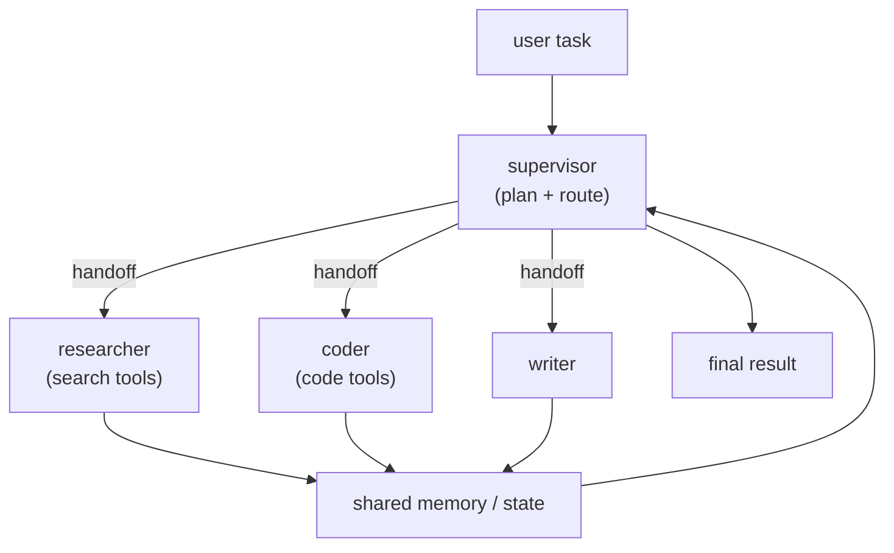

A single [agent](J1/react-loop) with many tools eventually strains: its context fills with
dozens of tool schemas, its reasoning has to juggle unrelated concerns, and one long loop
becomes hard to steer. The **multi-agent** pattern splits the work across several
specialized agents that coordinate, the software-engineering instinct of decomposition
applied to agents. The [concept](E/multi-agent) was sketched from the model side; here it
is an [orchestration](J1/langgraph-state-machines) problem, and the main lesson is when the
extra complexity is worth it.

## Supervisor, workers, handoffs, shared memory

The dominant structure is **supervisor-worker**:

- **Supervisor.** A coordinator agent that decomposes the task, decides which worker
  handles each part, and assembles the result. It holds the plan, not the domain detail.
- **Workers.** Specialized agents, each with a focused role and a *small* tool set: a
  researcher with search tools, a coder with a sandbox, a writer. Each sees only what its
  job needs, which keeps its context and reasoning sharp.
- **Handoffs.** The explicit transfer of control (and the relevant context) from one agent
  to another. Clear handoffs are what keep the system coherent rather than a free-for-all.
- **Shared memory.** A common state, the [LangGraph state object](J1/langgraph-state-machines)
  generalized, that agents read and write so work done by one is visible to the others.

Specialization is the benefit: each agent has a narrow context and a small toolset, so it
reasons better than one generalist drowning in fifty tools, and you can develop, test, and
swap workers independently.

## The cost, and the baseline to beat

Multi-agent systems are not free, and the failure mode is reaching for them too early.
Every handoff is a chance to lose context or miscommunicate; more agents mean more model
calls, so more **latency and cost**; and coordination bugs (two agents stepping on each
other, an infinite hand-off loop) are harder to debug than a single trace. The
**coordination overhead is real**, and for many tasks it outweighs the benefit.

So the baseline to beat is always the **single agent**. Multi-agent earns its keep when
the task genuinely decomposes into distinct skills (research *and* code *and* write), when
one agent's tool set or context has grown unmanageable, or when parts can run in parallel.
If a single well-prompted agent with a reasonable tool set does the job, that is the right
answer, simpler, cheaper, and easier to observe. Add agents to solve a *demonstrated*
problem, not in anticipation of one. Whether one agent or many, each call costs tokens and
time; the next lesson attacks that bill directly with [routing and caching](cost-latency-routing).
