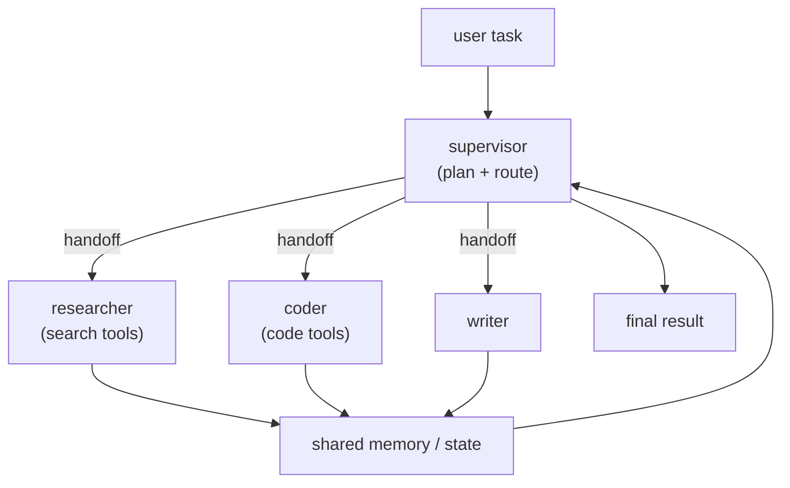

A single [agent](J1/react-loop) with many tools eventually strains: its context fills with
dozens of tool schemas, its reasoning has to juggle unrelated concerns, and one long loop
becomes hard to steer. The **multi-agent** pattern splits the work across several
specialized agents that coordinate, the software-engineering instinct of decomposition
applied to agents<FN n="1" />. The [concept](E/multi-agent) was sketched from the model side; here it
is an [orchestration](J1/langgraph-state-machines) problem, and the main lesson is when the
extra complexity is worth it.

## Supervisor, workers, handoffs, shared memory

The dominant structure is **supervisor-worker**<FN n="2" />:

- **Supervisor.** A coordinator agent that decomposes the task, decides which worker
  handles each part, and assembles the result. It holds the plan, not the domain detail.
- **Workers.** Specialized agents, each with a focused role and a *small* tool set: a
  researcher with search tools, a coder with a sandbox, a writer. Each sees only what its
  job needs, which keeps its context and reasoning sharp.
- **Handoffs.** The explicit transfer of control (and the relevant context) from one agent
  to another. Clear handoffs are what keep the system coherent rather than a free-for-all.
- **Shared memory.** A common state, the [LangGraph state object](J1/langgraph-state-machines)
  generalized, that agents read and write so work done by one is visible to the others.

Specialization is the benefit: each agent has a narrow context and a small toolset, so it
reasons better than one generalist drowning in fifty tools, and you can develop, test, and
swap workers independently.

## The cost, and the baseline to beat

Multi-agent systems are not free, and the failure mode is reaching for them too early.
Every handoff is a chance to lose context or miscommunicate; more agents mean more model
calls, so more **latency and cost**; and coordination bugs (two agents stepping on each
other, an infinite hand-off loop) are harder to debug than a single trace. The
**coordination overhead is real**, and for many tasks it outweighs the benefit.

So the baseline to beat is always the **single agent**. Multi-agent earns its keep when
the task genuinely decomposes into distinct skills (research *and* code *and* write), when
one agent's tool set or context has grown unmanageable, or when parts can run in parallel.
If a single well-prompted agent with a reasonable tool set does the job, that is the right
answer, simpler, cheaper, and easier to observe. Add agents to solve a *demonstrated*
problem, not in anticipation of one.

## Exercises

**Exercise 1.** For each task, decide whether a single agent or a supervisor-worker
multi-agent system is the better starting point, and justify it from the
decompose-when-distinct-skills rule: (a) summarize a single PDF, (b) build a research
report that needs web search, code execution for charts, and prose writing, (c) classify
support tickets into five categories.

Solution

**Step 1.** Task (a) is one skill (read and condense) over a bounded input. A single agent
with no tools, or one retrieval tool, covers it. Multi-agent adds handoffs and cost with no
distinct skill to assign, so single agent.

**Step 2.** Task (b) genuinely decomposes into distinct skills: searching, running code,
and writing each want a different tool set and a different reasoning style. This is the
case multi-agent is for: a supervisor plans and routes, a researcher searches, a coder runs
the chart code, a writer composes. Multi-agent.

**Step 3.** Task (c) is a single narrow skill (classification) with a small fixed output
space. A well-prompted single agent, or even a non-agentic classifier, is right; splitting
it across agents only adds coordination overhead. Single agent.

The rule: reach for multiple agents only when the task splits into distinct skills, a tool
set has grown unmanageable, or parts can run in parallel.

**Exercise 2.** Name the four structural elements of the supervisor-worker pattern
(supervisor, workers, handoffs, shared memory) and, for each, state one failure that arises
when it is missing or done badly.

Solution

**Step 1.** *Supervisor.* Without a coordinator holding the plan, no agent owns
decomposition and routing; workers either duplicate work or leave gaps, and there is no
single place to assemble the final result.

**Step 2.** *Workers.* If workers are not specialized (each given a focused role and small
tool set), every agent carries the full tool schema and reasons over unrelated concerns,
losing the sharpness that was the reason to split.

**Step 3.** *Handoffs.* A handoff that fails to transfer the relevant context drops
information at the boundary; the receiving agent reasons from a partial picture, and the
system becomes a free-for-all rather than a coherent pipeline.

**Step 4.** *Shared memory.* Without a common state that agents read and write, work done
by one is invisible to the others, so they cannot build on each other and may redo or
contradict prior steps.

**Exercise 3.** A team replaces a working single agent with a five-agent system and
observes higher latency, higher cost, and a new class of bugs. Explain the source of each
of the three regressions, and state the principle that should have governed the decision.

Solution

**Step 1.** *Latency and cost.* Each agent is its own model call (often several, for its
own reasoning loop), so five agents mean many more calls than one. Every call adds tokens
and round-trip time, so both the bill and the wall-clock time rise roughly with the number
of agents and handoffs.

**Step 2.** *New bugs.* Multi-agent introduces coordination failures that a single trace
never had: two agents stepping on each other's state, context lost at a handoff, or an
infinite hand-off loop. These are distributed-system bugs, harder to reproduce and debug
than one linear trace.

**Step 3.** *The governing principle.* The single agent is the baseline to beat; add agents
only to solve a demonstrated problem (a task that genuinely decomposes, an unmanageable
tool set, or parallelizable parts), not in anticipation of one. Adding five agents to a
task the single agent already handled spent all the overhead and bought nothing.

Whether one agent or many, each call costs tokens and
time; the next lesson attacks that bill directly with [routing and caching](cost-latency-routing).

<Footnotes>
  <FNItem n="1">**Wu, Q., et al.** (2023). "AutoGen: enabling next-gen LLM applications via multi-agent conversation". [arXiv:2308.08155](https://arxiv.org/abs/2308.08155). Conversable agents, roles, and handoffs.</FNItem>
  <FNItem n="2">**Wooldridge, M.** (2009). *An Introduction to MultiAgent Systems* (2nd ed.). Wiley. Foundations of agent coordination and decomposition.</FNItem>
</Footnotes>
