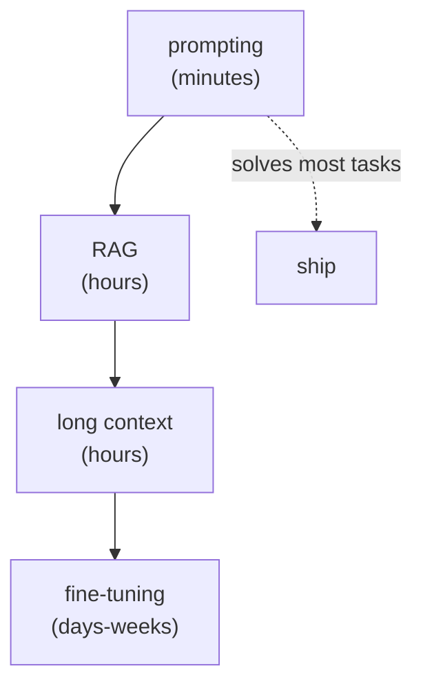

[Fine-tuning](E/sft) is the most powerful-sounding tool in the kit, and the most often
misused. Engineers reach for it to "teach the model our domain," then spend weeks
building a training set, only to find a careful prompt plus [RAG](J2/production-rag) would
have worked better, faster, and cheaper. The skill is knowing the ladder of cheaper
options and climbing it first, fine-tuning is the last rung, not the first<FN n="1" />.

## The ladder, cheapest first

Each rung is faster to try and easier to change than the next. Exhaust each before
climbing:

- **Prompting.** Clear instructions, a few examples in the prompt (few-shot), and a
  structured format solve a surprising fraction of tasks. It is instant to iterate, costs
  nothing to set up, and changing behavior is editing text.
- **Retrieval (RAG).** When the gap is *knowledge*, the model does not know your
  documents, the fix is to retrieve and inject that knowledge, not to bake it into
  weights<FN n="2" />. RAG updates the instant your documents change; a fine-tuned model is frozen at
  training time.
- **Long context.** When the relevant material is bounded, paste it all into the model's
  (now very large) context window. No retrieval infrastructure, no training, and the model
  sees everything.

The decisive question is **what kind of gap** you are closing. Fine-tuning changes the
model's *behavior and style*<FN n="3" />; it does not reliably inject *facts* (and trying to teach
facts by fine-tuning tends to cause hallucination, the model learns the shape of the
answers without the underlying knowledge). If the problem is "the model doesn't know X,"
that is a knowledge gap, and the answer is RAG or context, not fine-tuning.

## When fine-tuning actually pays

Fine-tuning earns its cost in a narrow set of conditions, usually several at once:

- **The task is stable.** The behavior you are training will not change often, so the
  frozen-at-training-time weights are not a liability. A task whose requirements shift
  weekly should stay in the prompt, where it is editable.
- **You need a behavior prompting cannot reach.** A consistent output format, a specific
  tone, or a skill (like reliable function-calling in a niche schema) that few-shot
  examples do not pin down.
- **Latency or cost constraints favor a small model.** Fine-tuning lets a small, cheap
  model match a large model's quality *on your specific task*, so you trade a one-time
  training cost for a permanently cheaper, faster forward pass. This is often the real
  reason to fine-tune.
- **You have enough high-quality data.** Hundreds to thousands of clean examples. Without
  them, fine-tuning overfits or does nothing.

The honest default: try prompting, then RAG or long context, and fine-tune only when a
stable task has a behavior or economics requirement that the cheaper rungs genuinely
cannot meet. When that case *does* arrive, the next lesson makes fine-tuning itself cheap,
with [LoRA and QLoRA](lora-qlora).

<Footnotes>
  <FNItem n="1">**Huyen, C.** (2024). *AI Engineering: Building Applications with Foundation Models.* O'Reilly. The prompting-before-finetuning decision and when finetuning pays.</FNItem>
  <FNItem n="2">**Lewis, P., et al.** (2020). "Retrieval-augmented generation for knowledge-intensive NLP tasks". *NeurIPS.* [arXiv:2005.11401](https://arxiv.org/abs/2005.11401). Injecting knowledge by retrieval rather than weights.</FNItem>
  <FNItem n="3">**Ouyang, L., et al.** (2022). "Training language models to follow instructions with human feedback". *NeurIPS.* [arXiv:2203.02155](https://arxiv.org/abs/2203.02155). Finetuning as behavior and instruction alignment.</FNItem>
</Footnotes>
