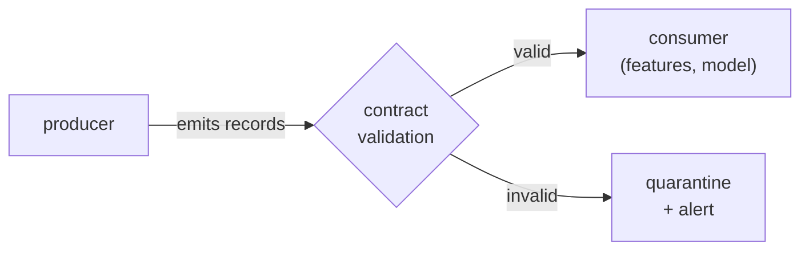

Data pipelines break most often not because the code is wrong but because the *data*
changed underneath them: an upstream team renamed a column, started sending nulls in a
field that was never null, or shipped ages as strings. Downstream, a [feature](I1/feature-stores)
silently goes missing or a model trains on garbage, and the failure surfaces days later, far
from its cause. A **data contract** is the fix: a schema that producers and consumers agree
on and that is *enforced at the boundary*, so a violation is caught the moment bad data
arrives, not after it has propagated<FN n="1" />.

## A schema as an enforced agreement

A contract is more than documentation; it is the agreement plus the enforcement. It
specifies, per field, the **type**, whether it is **required**, and any **constraints**
(ranges, allowed values, formats). The producer promises to emit data matching it; the
consumer relies on that promise; and a validation step at the ingestion boundary checks
every record against the contract, *rejecting or quarantining* anything that violates it.



The shift this enforces is from **fail-silent to fail-fast**. Without a contract, a bad
record flows downstream and corrupts results invisibly. With one, the bad record is stopped
at the door and an alert fires, so the failure happens *where the bad data entered*, with a
clear message, instead of as a mysterious metric drift a week later. It complements the
statistical view of [data quality](I1/drift-detection): drift detection asks "has the
*distribution* shifted?"; a contract asks "is this record even *shaped* right?", structural
validation versus distributional monitoring<FN n="2" />.

## Worked example

We declare a contract and validate a batch of records against it, accepting the conforming
one and rejecting violations of range, presence, and type.

```python
# A data contract: per field, its type, whether required, and any range constraint.
CONTRACT = {
    "user_id": {"type": int,   "required": True},
    "age":     {"type": int,   "required": True,  "min": 0,   "max": 120},
    "email":   {"type": str,   "required": True},
    "score":   {"type": float, "required": False, "min": 0.0, "max": 1.0},
}

def validate(record, contract):
    errors = []
    for field, rule in contract.items():
        if field not in record:
            if rule["required"]:
                errors.append(f"{field}: missing required field")
            continue                                  # absent optional field is fine
        val = record[field]
        if not isinstance(val, rule["type"]):
            errors.append(f"{field}: expected {rule['type'].__name__}, "
                          f"got {type(val).__name__}")
            continue
        if "min" in rule and val < rule["min"]:
            errors.append(f"{field}: {val} below min {rule['min']}")
        if "max" in rule and val > rule["max"]:
            errors.append(f"{field}: {val} above max {rule['max']}")
    return errors

records = [
    {"user_id": 1, "age": 30,  "email": "a@x.com", "score": 0.9},   # valid
    {"user_id": 2, "age": 200, "email": "b@x.com"},                 # age out of range
    {"user_id": 3, "email": "c@x.com"},                             # missing required age
    {"user_id": "4", "age": 25, "email": "d@x.com"},                # user_id wrong type
]
accepted, rejected = [], []
for r in records:
    errs = validate(r, CONTRACT)
    (accepted if not errs else rejected).append(r)
    if errs:
        print(f"REJECT user {r.get('user_id')}: {errs}")

print(f"\n{len(accepted)} accepted, {len(rejected)} rejected at the boundary")
assert len(accepted) == 1 and len(rejected) == 3
```

The one conforming record passes; the out-of-range age, the missing required field, and the
mistyped id are each caught at the boundary with a precise reason, instead of slipping
through to corrupt a downstream model.

## Exercises

**Exercise 1.** A contract marks `score` as optional with range $[0, 1]$. A producer
starts emitting records where `score` is present but set to the integer $0$ instead of a
float. Using the `validate` function from the lesson, walk through which checks fire and
explain why the record is rejected even though $0$ is inside the allowed range.

<details>
<summary>Solution</summary>

**Step 1.** `score` is present, so the missing-field branch is skipped. Validation moves
to the type check: the rule says `"type": float`, and `isinstance(0, float)` is `False`
because $0$ is an `int`.

**Step 2.** The type check appends an error (`expected float, got int`) and runs
`continue`, which skips the range checks entirely. The record never even reaches the
`min`/`max` comparison.

**Step 3.** So the rejection is on *type*, not range. The value $0$ would satisfy
$0 \le \text{score} \le 1$, but a contract enforces the declared type first; a downstream
consumer expecting a float that does arithmetic on it could behave differently on an int
(integer division, for example), so the contract refuses to guess. The fix belongs to the
producer: emit $0.0$.

</details>

**Exercise 2.** Two consumers depend on the same producer. Consumer X requires the field
`region`; consumer Y does not use it at all. The producer wants to stop sending `region`.
Frame this as a contract-compatibility question: under what contract is this change safe,
and what makes it a breaking change for X?

<details>
<summary>Solution</summary>

**Step 1.** A field is part of the contract only if some consumer relies on it. If
`region` is declared `required: True`, dropping it violates the presence check for every
record, so X's validation rejects the whole stream: a breaking change.

**Step 2.** The change is safe only if the contract no longer marks `region` as required
(or removes it). That is a contract renegotiation, not a unilateral producer edit: X must
first stop depending on `region` (or accept a default), and the contract is updated to
make the field optional or drop it.

**Step 3.** Y is irrelevant to the decision because Y never read `region`; compatibility
is governed by the strictest consumer. This is why a contract is the agreement plus the
enforcement: the schema encodes which removals are safe, so the producer can check
compatibility before shipping instead of discovering X broke in production.

</details>

**Exercise 3 (code).** Implement the validator and confirm it accepts exactly one of four
records. One subtlety: in Python `bool` is a subclass of `int`, so `isinstance(True, int)`
is `True`. Guard the integer fields so a boolean does not sneak past an `int` type check,
then assert the per-record error counts.

<details>
<summary>Solution</summary>

```python
import numpy as np

CONTRACT = {
    "user_id": {"type": int, "required": True},
    "age":     {"type": int, "required": True, "min": 0, "max": 120},
    "active":  {"type": bool, "required": False},
}

def validate(record, contract):
    errors = []
    for field, rule in contract.items():
        if field not in record:
            if rule["required"]:
                errors.append(f"{field}: missing")
            continue
        val = record[field]
        # bool subclasses int, so an int field must reject a bool explicitly
        if rule["type"] is int and isinstance(val, bool):
            errors.append(f"{field}: bool is not int")
            continue
        if not isinstance(val, rule["type"]):
            errors.append(f"{field}: wrong type")
            continue
        if "min" in rule and val < rule["min"]:
            errors.append(f"{field}: below min")
        if "max" in rule and val > rule["max"]:
            errors.append(f"{field}: above max")
    return errors

records = [
    {"user_id": 1, "age": 30, "active": True},   # valid
    {"user_id": 2, "age": 150},                  # age above max
    {"user_id": True, "age": 40},                # user_id is a bool, not an int
    {"age": 22},                                 # missing required user_id
]
n_errs = np.array([len(validate(r, CONTRACT)) for r in records])
accepted = int((n_errs == 0).sum())
print("error counts:", n_errs.tolist(), "accepted:", accepted)
assert accepted == 1
assert n_errs.tolist() == [0, 1, 1, 1]
```

The first record alone has zero errors; the others trip the range, type, and presence
checks respectively, and the boolean `user_id` is caught because the int field guards
against `bool` before the generic `isinstance`.

</details>

Contracts keep the data *correct*; the rest of the
subsection makes the retrieval *fast at scale*, starting with
[approximate nearest neighbors](vector-infra-ann).

<Footnotes>
  <FNItem n="1">**Reis, J., & Housley, M.** (2022). *Fundamentals of Data Engineering.* O'Reilly. Data contracts and schema enforcement between producers and consumers.</FNItem>
  <FNItem n="2">**Kleppmann, M.** (2017). *Designing Data-Intensive Applications.* O'Reilly. Schema evolution, encoding, and the compatibility guarantees a contract enforces (Ch. 4).</FNItem>
</Footnotes>
