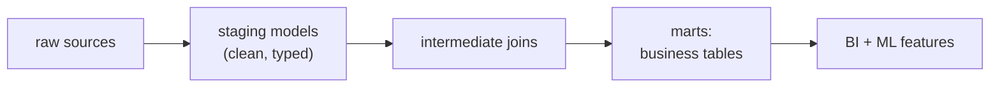

The [dbt mental model](J3/multi-source-ingestion), a transformation is a `SELECT`, models
reference each other to form a DAG, was the introduction. This lesson goes a level deeper
into the machinery that makes dbt the backbone of the data platform: `ref`-based
dependencies, materializations, and the tests-and-docs that turn a pile of SQL into a
maintained codebase.

## refs build the DAG automatically

A dbt **model** is a `.sql` file holding one `SELECT`. The key construct is that a model
refers to another not by hard-coding a table name but through `ref('other_model')`:

```python-static
-- models/customer_orders.sql
SELECT c.id, c.name, count(o.id) AS order_count
FROM {{ ref('stg_customers') }} c
LEFT JOIN {{ ref('stg_orders') }} o ON o.customer_id = c.id
GROUP BY 1, 2
```

Because every dependency is expressed as a `ref`, dbt reads the files and **infers the
dependency DAG** from them, no one maintains the graph by hand. It then runs models in
[topological order](I1/orchestration-dags) and, in production, inserts the right schema
names per environment. Raw inputs are declared as `source`s, so the DAG's roots are
explicit too. The result is a graph dbt can build, visualize, and trace end to end.

## Materializations: how a model becomes physical

The same `SELECT` can be made physical in different ways, chosen per model by its
**materialization**, and the choice trades freshness against compute:

- **View.** The model is a saved query, recomputed every time it is read. Zero storage,
  always fresh, but slow if queried often or built on heavy logic.
- **Table.** The model is rebuilt into a stored table on each run. Fast to query, but
  recomputes everything each run, expensive for large data.
- **Incremental.** Only *new or changed* rows are processed and appended each run. This is
  how dbt handles large, append-mostly data efficiently, the [idempotent](I1/orchestration-dags)
  partition logic of a pipeline, expressed declaratively.

Choosing materializations is the main performance lever in a dbt project: views for cheap
staging logic, tables for frequently-queried marts, incremental for the big event tables<FN n="1" />.



## Tests and docs make it a codebase

Two features turn transformations into maintained software. **Tests** are declarative
assertions on a model's output, declared in YAML: `unique` and `not_null` on a key,
`accepted_values` on an enum, `relationships` for referential integrity. They run in the
same pipeline, so a transformation that would violate an invariant fails the build instead
of silently corrupting a downstream mart, the [data-quality](I1/drift-detection) gate moved
into the transformation layer. **Documentation and lineage** are generated from the same
project: descriptions live beside the models, and because the DAG is known, dbt produces a
browsable lineage graph showing exactly which sources feed which marts.

Put together, `ref`-inferred DAG, per-model materializations, and built-in tests and docs,
dbt makes warehouse transformations version-controlled, tested, and traceable, which is why
it anchors the analytics-engineering workflow<FN n="2" />. Transformations assume the data already
arrived correctly; guaranteeing *that* at the boundary is the job of
[data contracts](data-contracts).

<Footnotes>
  <FNItem n="1">**Armbrust, M., Ghodsi, A., Xin, R., & Zaharia, M.** (2021). "Lakehouse: a new generation of open platforms that unify data warehousing and advanced analytics". *CIDR*. Motivates the warehouse-as-tables substrate dbt models build on.</FNItem>
  <FNItem n="2">**Reis, J., & Housley, M.** (2022). *Fundamentals of Data Engineering.* O'Reilly. The analytics-engineering workflow and the transformation layer in the data-engineering lifecycle.</FNItem>
</Footnotes>
