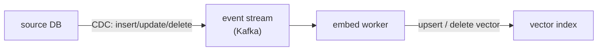

A [vector index](vector-infra-ann) is a snapshot: it reflects the documents as they were when
you embedded them. But documents change, new ones arrive, old ones get edited or deleted, and
an index that does not keep up serves stale answers. Worse, the *embedding model itself*
changes, and when it does, every vector in the index is suddenly speaking a different language
than the query. Keeping retrieval honest over time is two problems: streaming updates to keep
content fresh, and managing the embedding lifecycle across model upgrades.

## Event-driven freshness and CDC

Re-embedding the whole corpus on a schedule (a [batch](I1/pipeline-paradigms) job) is simple
but always at least one cycle stale, and wasteful when only a handful of documents changed.
The **event-driven** alternative reacts to each change as it happens: when a document is
created, updated, or deleted, an event fires, and a consumer re-embeds just that document and
upserts (or removes) its vector in the index.

The mechanism that turns database changes into events is **change data capture** (CDC): rather
than polling the database for "what changed," CDC taps the database's own write-ahead log and
emits each row change as an event onto a stream (Kafka). This is the [streaming](I1/pipeline-paradigms)
paradigm applied to the index: the index becomes a continuously-maintained materialized view of
the source data, lagging it by seconds instead of a batch cycle<FN n="1" />. A subtlety that matters:
**deletes must propagate**, a document removed at the source but left in the index will keep
being retrieved, surfacing content that should be gone.

## The embedding lifecycle

The harder, and more often botched, problem is changing the **embedding model**. Embeddings
from two different models (or two versions of one) are **not comparable**: they live in
different vector spaces, so a query embedded with the new model and a document embedded with
the old one have a meaningless similarity<FN n="2" />. The instant you upgrade the embedding model, every
existing vector in the index is stale in this deeper sense.

The consequence is a hard operational rule: **upgrading the embedding model requires
re-embedding the entire corpus**, not just new documents. You cannot mix old and new vectors in
one index. The safe procedure is a **backfill with cutover**: build a new index by re-embedding
everything with the new model in the background, and switch queries over to it atomically only
once it is complete, keeping the old index serving until then. Because a full re-embed of a
large corpus is expensive and slow, embedding-model upgrades are planned migrations, not casual
config changes, the same backfill discipline as any [versioned data](I1/data-versioning)
migration. Treating the embedding model as a versioned dependency of the index, one whose change
triggers a full rebuild, is what keeps retrieval coherent across upgrades.

## Exercises

**Exercise 1.** A document is deleted at the source database, but the CDC consumer is written
to handle only inserts and updates (it upserts a vector on each event and ignores delete
events). Describe the concrete failure this produces in retrieval, and the minimal fix.

Solution

**Step 1.** The delete event fires on the stream but the consumer ignores it, so the document's
vector stays in the index even though the document no longer exists at the source. The index
and the source have diverged.

**Step 2.** At query time that orphaned vector is still a candidate, so the deleted document can
be retrieved and surfaced to the user, content that was supposed to be gone (a removed policy
page, a retracted record). The bug is silent: nothing errors, the wrong document just keeps
appearing.

**Step 3.** The minimal fix is to make deletes propagate: the consumer must handle the delete
event by removing (not upserting) the vector, so the index stays a faithful materialized view
of the source. Freshness for inserts and updates is not enough; the delete path is part of
correctness.

**Exercise 2.** A team upgrades from embedding model v1 to v2 and, to save cost, embeds only
*new* documents with v2 while leaving existing v1 vectors in place in the same index. Explain
why retrieval quality degrades, in terms of the vector spaces involved.

Solution

**Step 1.** A query is embedded once, with v2. Similarity is then computed between the v2 query
vector and whatever is in the index. For old documents the index holds v1 vectors.

**Step 2.** v1 and v2 are different models trained to different parameters, so they map text to
*different* vector spaces. A v2 query vector and a v1 document vector have no shared geometry;
their cosine similarity is not a meaningful relevance signal, it is comparing coordinates from
two unrelated spaces.

**Step 3.** So old documents get effectively random similarity scores against the new query,
while new documents are scored coherently. Relevant old documents can be ranked far too low and
irrelevant ones too high, and the corpus's retrievability now depends on which model embedded
each item rather than on relevance. Mixing model versions in one index breaks the comparability
that retrieval relies on.

**Exercise 3.** You must upgrade the embedding model for a large production corpus with zero
downtime. Lay out the backfill-with-cutover procedure step by step, and state what guarantees
each step provides (no stale spaces, no downtime, safe rollback).

Solution

**Step 1.** Keep the current (old-model) index serving all live queries untouched. This is the
no-downtime guarantee: users never hit a half-built index.

**Step 2.** In the background, build a *new* index by re-embedding the entire corpus with the
new model, every document, not just new ones. Re-embedding everything is what guarantees the new
index is internally single-space and comparable, avoiding the mixed-version failure of Exercise 2.

**Step 3.** When the new index is fully built and validated, switch query traffic to it
**atomically** (a single pointer/alias flip), so no query ever spans both indexes. Keep the old
index around briefly after cutover: if the new one misbehaves, flip the pointer back, which is
the safe-rollback guarantee. Only then decommission the old index. Because the rebuild is
expensive and slow, this is a planned migration with the same discipline as any versioned-data
migration, not a casual config change.

Fresh content via streaming, coherent vectors via lifecycle management: together they keep the
retrieval layer trustworthy in production. That closes the data-platform subsection. The next
one moves up to the cloud platforms and enterprise concerns that wrap all of this, starting with
[managed AI platforms](J6/managed-ai-platforms).

<Footnotes>
  <FNItem n="1">**Kleppmann, M.** (2017). *Designing Data-Intensive Applications.* O'Reilly. Change data capture, event logs, and derived data as continuously-maintained materialized views (Ch. 11).</FNItem>
  <FNItem n="2">**Karpukhin, V., et al.** (2020). "Dense passage retrieval for open-domain question answering". *EMNLP*. [arXiv:2004.04906](https://arxiv.org/abs/2004.04906). Query and passage encoders share a learned space, so re-embedding must use one consistent model.</FNItem>
</Footnotes>
