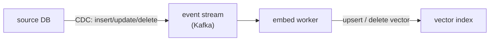

A [vector index](vector-infra-ann) is a snapshot: it reflects the documents as they were when
you embedded them. But documents change, new ones arrive, old ones get edited or deleted, and
an index that does not keep up serves stale answers. Worse, the *embedding model itself*
changes, and when it does, every vector in the index is suddenly speaking a different language
than the query. Keeping retrieval honest over time is two problems: streaming updates to keep
content fresh, and managing the embedding lifecycle across model upgrades.

## Event-driven freshness and CDC

Re-embedding the whole corpus on a schedule (a [batch](I1/pipeline-paradigms) job) is simple
but always at least one cycle stale, and wasteful when only a handful of documents changed.
The **event-driven** alternative reacts to each change as it happens: when a document is
created, updated, or deleted, an event fires, and a consumer re-embeds just that document and
upserts (or removes) its vector in the index.

The mechanism that turns database changes into events is **change data capture** (CDC): rather
than polling the database for "what changed," CDC taps the database's own write-ahead log and
emits each row change as an event onto a stream (Kafka). This is the [streaming](I1/pipeline-paradigms)
paradigm applied to the index: the index becomes a continuously-maintained materialized view of
the source data, lagging it by seconds instead of a batch cycle<FN n="1" />. A subtlety that matters:
**deletes must propagate**, a document removed at the source but left in the index will keep
being retrieved, surfacing content that should be gone.

## The embedding lifecycle

The harder, and more often botched, problem is changing the **embedding model**. Embeddings
from two different models (or two versions of one) are **not comparable**: they live in
different vector spaces, so a query embedded with the new model and a document embedded with
the old one have a meaningless similarity<FN n="2" />. The instant you upgrade the embedding model, every
existing vector in the index is stale in this deeper sense.

The consequence is a hard operational rule: **upgrading the embedding model requires
re-embedding the entire corpus**, not just new documents. You cannot mix old and new vectors in
one index. The safe procedure is a **backfill with cutover**: build a new index by re-embedding
everything with the new model in the background, and switch queries over to it atomically only
once it is complete, keeping the old index serving until then. Because a full re-embed of a
large corpus is expensive and slow, embedding-model upgrades are planned migrations, not casual
config changes, the same backfill discipline as any [versioned data](I1/data-versioning)
migration. Treating the embedding model as a versioned dependency of the index, one whose change
triggers a full rebuild, is what keeps retrieval coherent across upgrades.

Fresh content via streaming, coherent vectors via lifecycle management: together they keep the
retrieval layer trustworthy in production. That closes the data-platform subsection. The next
one moves up to the cloud platforms and enterprise concerns that wrap all of this, starting with
[managed AI platforms](J6/managed-ai-platforms).

<Footnotes>
  <FNItem n="1">**Kleppmann, M.** (2017). *Designing Data-Intensive Applications.* O'Reilly. Change data capture, event logs, and derived data as continuously-maintained materialized views (Ch. 11).</FNItem>
  <FNItem n="2">**Karpukhin, V., et al.** (2020). "Dense passage retrieval for open-domain question answering". *EMNLP*. [arXiv:2004.04906](https://arxiv.org/abs/2004.04906). Query and passage encoders share a learned space, so re-embedding must use one consistent model.</FNItem>
</Footnotes>
