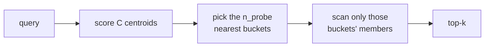

[RAG retrieval](J1/rag-from-scratch) ranks chunks by [similarity](E/dense-retrieval) to the
query. Done exactly, that means comparing the query against *every* vector in the index, an
$O(N)$ brute-force scan. With a few thousand vectors that is instant; with a hundred million
it is hopeless at interactive latency. Every vector database (pgvector, Pinecone, Weaviate,
FAISS) is built around the same escape: give up *exactly* the right neighbors for *almost*
the right neighbors, computed far faster. This is **approximate nearest neighbor** (ANN)
search, and the central object is the recall-versus-speed tradeoff it exposes<FN n="1" />.

## Why exact search does not scale

Exact k-nearest-neighbor search has no shortcut in high dimensions: to be *sure* of the top
$k$, you must score all $N$ candidates, because any unscored vector could be the closest.
The cost grows linearly with the corpus, and at scale the query latency budget is blown long
before you finish. ANN indexes break the $O(N)$ barrier by **not looking at most of the
vectors**, accepting that they will occasionally miss a true neighbor.

## The inverted-file idea

One simple, widely-used ANN scheme is the **inverted file** (IVF). Build the index in two
steps: pick $C$ representative **centroids** (cluster centers), and assign every vector to
its nearest centroid, partitioning the corpus into $C$ buckets. At query time, instead of
scanning all $N$ vectors:



- Score the query against the $C$ centroids (cheap, $C \ll N$).
- Pick the `n_probe` nearest buckets.
- Scan only the vectors in those buckets for the top $k$.

The comparison count drops from $N$ to roughly $C + N \cdot (\texttt{n\_probe} / C)$: the
centroid scan plus the members of a few buckets. The approximation: a true neighbor sitting
in a bucket you did not probe is *missed*. (Production indexes like HNSW use a navigable
graph rather than buckets<FN n="2" />, but the same tradeoff governs them; the idea here is the
[probabilistic-structure](A/probabilistic-structures) instinct of trading exactness for
speed.)

## Recall versus speed

The quality of an ANN search is its **recall@k**: of the true top-$k$ neighbors (what exact
search would return), what fraction did the approximate search actually find?

$$
\text{recall@}k = \frac{|\text{approx top-}k \,\cap\, \text{exact top-}k|}{k}.
$$

`n_probe` is the dial. Probe more buckets and recall rises toward $1$ but you scan more
vectors (slower); probe fewer and you go faster but miss more. **There is no free lunch**:
every vector database exposes this knob, and tuning it to the application's tolerance for
misses against its latency budget is the core operational decision of running one.

## Worked example

We build an IVF index over $6000$ vectors and sweep `n_probe`, measuring recall@10 and the
comparison count against exact brute-force search.

```python
import numpy as np
rng = np.random.default_rng(0)
N, d, C = 6000, 16, 64

centers = rng.normal(0, 1.6, size=(C, d))            # cluster centers
labels = rng.integers(0, C, size=N)
data = centers[labels] + rng.normal(0, 1.0, size=(N, d))

def sqdist(q, pts):
    return ((pts - q) ** 2).sum(axis=-1)

# Build the IVF index: assign each vector to its nearest centroid (its bucket).
assign = np.stack([sqdist(c, data) for c in centers]).argmin(axis=0)

k = 10
queries = rng.normal(0, 1.6, size=(200, d)) + rng.normal(0, 1.0, size=(200, d))
exact_sets = [set(np.argsort(sqdist(q, data))[:k]) for q in queries]   # ground truth

print(f"{'n_probe':>7} {'recall@10':>10} {'comparisons':>12}")
for n_probe in [1, 4, 16]:
    recalls, comps = [], []
    for q, exact in zip(queries, exact_sets):
        probes = np.argsort(sqdist(q, centers))[:n_probe]     # nearest buckets
        cand = np.where(np.isin(assign, probes))[0]           # only their members
        approx = set(cand[np.argsort(sqdist(q, data[cand]))[:k]])
        recalls.append(len(exact & approx) / k)
        comps.append(C + cand.size)
    print(f"{n_probe:>7} {np.mean(recalls):>10.3f} {np.mean(comps):>12.0f}")

print(f"exact search: {N} comparisons per query (recall 1.000 by definition)")
```

Probing one bucket finds under half the true neighbors but scans only $\sim 160$ of $6000$
vectors; probing sixteen recovers $99\%$ of them while still scanning a quarter of the
corpus. That curve, recall climbing with comparisons, *is* the vector-database tuning knob<FN n="3" />.

## Exercises

**Exercise 1.** An exact search returns the true top-$5$ neighbors
$\{12, 7, 40, 3, 88\}$. An IVF search with a given `n_probe` returns $\{12, 40, 3, 51, 9\}$.
Compute recall@5 by hand, and explain in IVF terms what most likely happened to the two
missing true neighbors.

<details>
<summary>Solution</summary>

**Step 1.** recall@$k$ is the fraction of the true top-$k$ that the approximate set recovered:

$$
\text{recall@}5 = \frac{|\{12, 7, 40, 3, 88\} \cap \{12, 40, 3, 51, 9\}|}{5}.
$$

The intersection is $\{12, 40, 3\}$, size $3$, so recall@$5 = 3/5 = 0.6$.

**Step 2.** The two missed true neighbors are $7$ and $88$. In IVF, the query scans only the
`n_probe` buckets nearest the query. The most likely cause is that $7$ and $88$ were assigned
to centroids whose buckets were *not among* the probed ones, so they were never scored at all.

**Step 3.** The two extras $51$ and $9$ are documents from the probed buckets that ranked into
the top $5$ only because the true neighbors $7, 88$ were absent from the candidate pool.
Raising `n_probe` to include the buckets holding $7$ and $88$ would recover them and push
recall back up, at the cost of scanning more vectors.

</details>

**Exercise 2.** In the lesson's IVF index, the per-query comparison count is roughly
$C + N \cdot (\texttt{n\_probe} / C)$. With $N = 6000$, $C = 64$, evaluate this estimate at
$\texttt{n\_probe} = 1$ and $\texttt{n\_probe} = 16$, and explain why the measured counts in
the worked example are only approximate matches to it.

<details>
<summary>Solution</summary>

**Step 1.** At $\texttt{n\_probe} = 1$: $64 + 6000 \cdot (1/64) = 64 + 93.75 \approx 158$
comparisons. At $\texttt{n\_probe} = 16$: $64 + 6000 \cdot (16/64) = 64 + 1500 = 1564$
comparisons. So probing $16\times$ more buckets scans roughly $10\times$ more vectors, against
$6000$ for exact search.

**Step 2.** The formula assumes vectors are split *evenly* across the $C$ buckets, so each
bucket holds about $N/C$ members. In the worked example, vectors are assigned to their nearest
centroid, so bucket sizes are uneven: some centroids attract more vectors than others.

**Step 3.** The `n_probe` nearest buckets to a query are not a random sample; they tend to be
the buckets near dense regions, which can hold more than the average $N/C$ members. So the
measured comparison count fluctuates around the even-split estimate rather than hitting it
exactly. The estimate is the right order of magnitude and the right scaling in `n_probe`, which
is what it is for.

</details>

**Exercise 3 (code).** Reproduce the IVF index from the worked example and sweep `n_probe`
over $\{1, 2, 4, 8, 16, 32\}$. Assert that mean recall@$10$ is **monotone non-decreasing** in
`n_probe`, and that probing all $C$ buckets gives recall exactly $1.0$ (probing every bucket
reduces IVF to exact search).

<details>
<summary>Solution</summary>

```python
import numpy as np
rng = np.random.default_rng(0)
N, d, C = 6000, 16, 64

centers = rng.normal(0, 1.6, size=(C, d))
labels = rng.integers(0, C, size=N)
data = centers[labels] + rng.normal(0, 1.0, size=(N, d))

def sqdist(q, pts):
    return ((pts - q) ** 2).sum(axis=-1)

assign = np.stack([sqdist(c, data) for c in centers]).argmin(axis=0)
k = 10
queries = rng.normal(0, 1.6, size=(200, d)) + rng.normal(0, 1.0, size=(200, d))
exact_sets = [set(np.argsort(sqdist(q, data))[:k]) for q in queries]

def recall_at(n_probe):
    recalls = []
    for q, exact in zip(queries, exact_sets):
        probes = np.argsort(sqdist(q, centers))[:n_probe]
        cand = np.where(np.isin(assign, probes))[0]
        approx = set(cand[np.argsort(sqdist(q, data[cand]))[:k]])
        recalls.append(len(exact & approx) / k)
    return np.mean(recalls)

curve = [recall_at(p) for p in [1, 2, 4, 8, 16, 32]]
print("recall@10 sweep:", [round(r, 3) for r in curve])

assert all(curve[i] <= curve[i + 1] + 1e-9 for i in range(len(curve) - 1))
assert np.isclose(recall_at(C), 1.0)     # probing every bucket = exact search
```

Recall climbs from about $0.48$ at one probe to $1.0$ once enough buckets are probed, never
dipping as `n_probe` grows, and probing all $C$ buckets recovers exact search by construction.

</details>

A single index answers one query type; combining a vector index with keyword search is
[hybrid search](hybrid-search-rrf).

<Footnotes>
  <FNItem n="1">**Huyen, C.** (2024). *AI Engineering: Building Applications with Foundation Models.* O'Reilly. Vector search infrastructure and the recall-versus-latency tradeoff in retrieval.</FNItem>
  <FNItem n="2">**Malkov, Y. A., & Yashunin, D. A.** (2018). "Efficient and robust approximate nearest neighbor search using Hierarchical Navigable Small World graphs". *IEEE TPAMI*. [arXiv:1603.09320](https://arxiv.org/abs/1603.09320)</FNItem>
  <FNItem n="3">**Johnson, J., Douze, M., & Jégou, H.** (2019). "Billion-scale similarity search with GPUs". *IEEE Transactions on Big Data*. [arXiv:1702.08734](https://arxiv.org/abs/1702.08734). The FAISS library and its IVF / quantization indexes.</FNItem>
</Footnotes>
