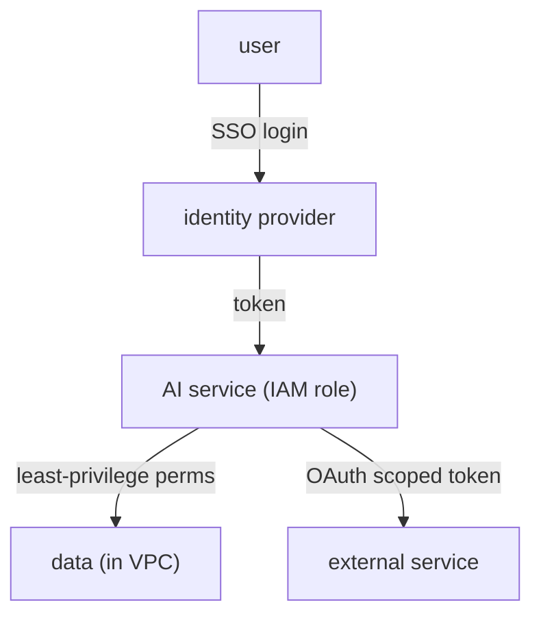

[Prompt injection](J3/prompt-injection-security) showed that you must assume a model can be
turned against you, and the best defense was least privilege: bound what a compromised model can
*reach*. That defense is enforced not in the prompt but in the **cloud identity and security**
layer, the same primitives that secure any enterprise system, applied with AI's particular risks
in mind. The organizing principle is least privilege, and four primitives implement it.

## The primitives

- **IAM (identity and access management).** Every actor, a user, a service, the model's serving
  process, has an **identity** with explicitly granted **permissions**. An IAM **role** is a
  bundle of permissions an identity assumes to do a job. The default is *deny*: an identity can do
  only what it was explicitly granted. This is where least privilege is actually enforced, by
  granting the AI service the minimum permissions its task requires and nothing more.
- **VPC (virtual private cloud).** A private, isolated network for your resources. Putting the
  model service and its databases inside a VPC means they are not exposed to the public internet;
  traffic enters only through controlled gateways. **Network isolation** contains a breach: a
  compromised component cannot freely reach the rest of the system.
- **SSO (single sign-on).** Users authenticate once with a central identity provider, which then
  vouches for them to every application. Centralizing authentication means access can be granted
  and, critically, *revoked* in one place, so a departing employee loses access everywhere at once.
- **OAuth.** A protocol for **delegated** authorization: it lets an application act on a user's
  behalf against another service *without* handling the user's password, by exchanging scoped,
  revocable tokens. This is how an AI agent is granted access to a user's calendar or email, with a
  token limited to exactly the needed scope.

## Why AI raises the stakes

These primitives are standard, but AI sharpens why they matter. An AI agent is an identity that
acts *autonomously* and can be *manipulated* through its inputs, a combination ordinary services do
not have. So the **blast radius** of a compromise is whatever that identity was permitted to do,
and [prompt injection](J3/prompt-injection-security) is a live path to triggering it. The
consequences chain directly:

- Scope the agent's IAM role to the minimum, and a hijacked agent can touch little.
- Isolate data in a VPC, and a compromised component cannot reach the rest.
- Issue narrowly-scoped OAuth tokens, and a leaked token grants only a sliver of access.

The mental model is **defense in depth around an identity you must assume is fallible**: layer the
controls so that no single failure, a successful injection, a leaked token, a buggy tool, gives an
attacker the whole system. Securing one identity is the per-component view; serving *many*
customers from one system safely is the [multi-tenancy](multi-tenancy-gateway) problem.
