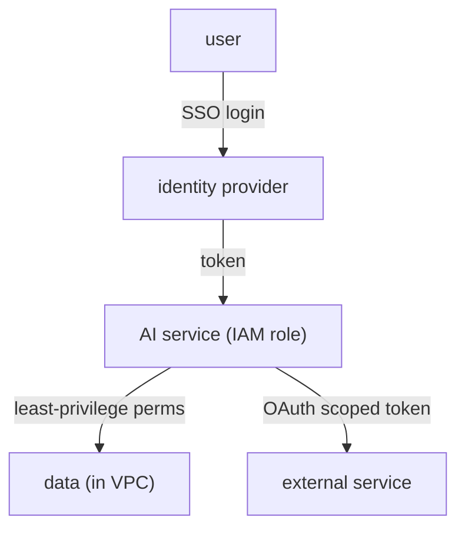

[Prompt injection](J3/prompt-injection-security) showed that you must assume a model can be
turned against you, and the best defense was least privilege: bound what a compromised model can
*reach*. That defense is enforced not in the prompt but in the **cloud identity and security**
layer, the same primitives that secure any enterprise system, applied with AI's particular risks
in mind. The organizing principle is least privilege, and four primitives implement it<FN n="1" />.

## The primitives

- **IAM (identity and access management).** Every actor, a user, a service, the model's serving
  process, has an **identity** with explicitly granted **permissions**. An IAM **role** is a
  bundle of permissions an identity assumes to do a job. The default is *deny*: an identity can do
  only what it was explicitly granted. This is where least privilege is actually enforced, by
  granting the AI service the minimum permissions its task requires and nothing more.
- **VPC (virtual private cloud).** A private, isolated network for your resources. Putting the
  model service and its databases inside a VPC means they are not exposed to the public internet;
  traffic enters only through controlled gateways. **Network isolation** contains a breach: a
  compromised component cannot freely reach the rest of the system.
- **SSO (single sign-on).** Users authenticate once with a central identity provider, which then
  vouches for them to every application. Centralizing authentication means access can be granted
  and, critically, *revoked* in one place, so a departing employee loses access everywhere at once.
- **OAuth.** A protocol for **delegated** authorization: it lets an application act on a user's
  behalf against another service *without* handling the user's password, by exchanging scoped,
  revocable tokens. This is how an AI agent is granted access to a user's calendar or email, with a
  token limited to exactly the needed scope.

## Why AI raises the stakes

These primitives are standard, but AI sharpens why they matter. An AI agent is an identity that
acts *autonomously* and can be *manipulated* through its inputs, a combination ordinary services do
not have<FN n="2" />. So the **blast radius** of a compromise is whatever that identity was permitted to do,
and [prompt injection](J3/prompt-injection-security) is a live path to triggering it. The
consequences chain directly:

- Scope the agent's IAM role to the minimum, and a hijacked agent can touch little.
- Isolate data in a VPC, and a compromised component cannot reach the rest.
- Issue narrowly-scoped OAuth tokens, and a leaked token grants only a sliver of access.

The mental model is **defense in depth around an identity you must assume is fallible**: layer the
controls so that no single failure, a successful injection, a leaked token, a buggy tool, gives an
attacker the whole system.

## Exercises

**Exercise 1.** A retrieval agent needs to read documents from one storage bucket and call one
external search API on the user's behalf. A teammate proposes granting it an IAM role with full
read/write access to all storage and a long-lived API key shared across every agent instance. Name
the two least-privilege violations and give the minimal correct grant for each.

Solution

**Step 1.** Identify the first violation. Full read/write to all storage is broader than the task,
which only reads one bucket. The default is deny, so the role should grant read-only on the single
bucket and nothing else. A compromised agent then cannot write anywhere or read other buckets.

**Step 2.** Identify the second violation. A long-lived key shared across instances means one leak
exposes every agent and cannot be revoked without breaking all of them. The OAuth-style fix is a
scoped, short-lived, per-request token limited to the search API, revocable on its own.

**Step 3.** State the minimal grant. Read-only IAM permission on the one bucket, plus a
narrowly-scoped revocable token for the one external API. Each grant matches exactly what the task
requires, so the blast radius of a compromise is one bucket's contents and one API's scope, not the
whole system.

**Exercise 2.** Two designs isolate a model service's database. Design A puts the service and
database in a VPC with no public ingress, reachable only through one controlled gateway. Design B
leaves both on the public internet but protects the database with a strong password. A prompt
injection later hijacks the serving process. Compare the blast radius under each design.

Solution

**Step 1.** Under Design B, the hijacked process already holds the database password (it must, to
function). The attacker inherits that credential and reaches the database directly, and because the
database is publicly routable, can also exfiltrate to any external host. Network reachability gives
the breach a path off the box.

**Step 2.** Under Design A, the hijacked process can still issue queries the service is permitted to
issue, but network isolation means it cannot reach hosts outside the VPC, and the database is not
exposed to the public internet, so an external attacker cannot pivot to it independently. The breach
is contained to what the one identity could already do inside the VPC.

**Step 3.** Conclude. A password authenticates but does not isolate; the VPC contains the breach by
removing network paths. Design A has the smaller blast radius because isolation is a separate,
independent layer from authentication, which is the defense-in-depth point.

**Exercise 3.** An employee with SSO access to the AI platform leaves the company. Under a
centralized SSO model, what single action revokes their access everywhere, and why is this strictly
harder if each of five applications managed its own logins? Identify the residual risk SSO does not
by itself remove.

Solution

**Step 1.** With centralized SSO, every application trusts one identity provider rather than holding
its own credentials. Disabling the employee's identity at that provider means it stops vouching for
them to all five applications at once, so a single revocation removes access everywhere.

**Step 2.** Without SSO, each application stores its own login. Revoking access requires finding and
disabling the account in all five places independently, and any one missed leaves a live path in.
The work scales with the number of applications and is error-prone.

**Step 3.** State the residual risk. SSO revokes *interactive* access tied to that identity, but any
OAuth tokens already issued on the employee's behalf, or any standalone API keys they created,
persist until separately revoked or expired. Least privilege still requires short-lived, revocable
tokens so revocation at the identity provider is not undercut by a long-lived credential left behind.

Securing one identity is the per-component view; serving *many*
customers from one system safely is the [multi-tenancy](multi-tenancy-gateway) problem.

<Footnotes>
  <FNItem n="1">**Kleppmann, M.** (2017). *Designing Data-Intensive Applications.* O'Reilly. Trust boundaries, isolation, and the reliability/security properties this layer enforces.</FNItem>
  <FNItem n="2">**Huyen, C.** (2024). *AI Engineering: Building Applications with Foundation Models.* O'Reilly. Why an autonomous, input-manipulable AI identity sharpens the least-privilege and blast-radius argument.</FNItem>
</Footnotes>
