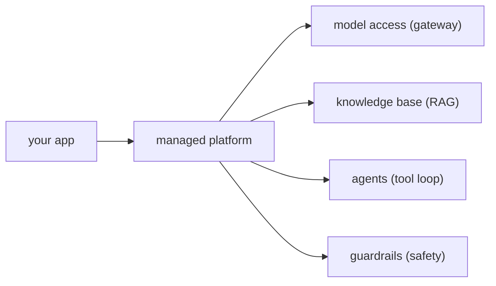

Everything built so far, [RAG](J2/production-rag), agents, retrieval infrastructure, can be
assembled from open components *or* rented as managed services. Cloud platforms (AWS Bedrock,
Google Vertex AI, Azure AI) package the same patterns into pre-assembled building blocks. The
engineering skill is not "use the managed thing" or "build it yourself" but knowing what each
block *is* in terms you already understand, and making the build-versus-buy call deliberately<FN n="1" />.

## Managed blocks are patterns you know

A managed AI platform is a menu of the patterns from earlier lessons, operated for you. Reading
AWS Bedrock as an example, each offering maps to something already covered:

- **Model access.** One API in front of many foundation models, the [gateway](J4/cost-latency-routing)
  idea as a service: switch or route models without managing inference servers.
- **Knowledge Bases.** Managed [RAG](J2/production-rag): you point it at documents, and it does the
  chunking, embedding, vector storage, and retrieval. A managed version of the whole J1-J2
  pipeline.
- **Agents.** Managed [tool-use loops](J1/react-loop): you declare tools (as API schemas) and the
  platform runs the reason-act-observe orchestration.
- **Guardrails.** A managed safety layer: content filtering, PII redaction, and topic blocking
  applied around the model, the [governance](J3/governance-rate-limiting) and [safety](J3/prompt-injection-security)
  concerns as a configurable service.

Seen this way, a managed platform is not magic; it is the curriculum's patterns with the
operational burden lifted, which is exactly why understanding the patterns first lets you use
the platform well and recognize its limits.

## The build-versus-buy decision

For each block, the choice is the classic build-versus-buy trade, and it usually comes down to
four forces:

- **Time to ship.** Managed blocks get a system to production in days, not months. When speed is
  the constraint and the use case is standard, buy.
- **Control and flexibility.** Building yourself means you control every detail, the exact
  chunking, the precise retrieval logic, custom reranking. Managed services expose knobs but cap
  how far you can deviate. When your needs are non-standard, the managed block's ceiling becomes a
  wall, and you build.
- **Operational burden.** Buying offloads scaling, patching, and uptime to the provider. Building
  means you own all of it. A small team usually cannot afford to operate what a platform operates
  for them.
- **Lock-in and cost.** Managed convenience comes with provider lock-in (proprietary APIs, data in
  their ecosystem) and a margin on top of raw compute. At small scale the margin is worth it; at
  large scale the [economics](J6/finops-for-ai) can flip toward self-hosting.

The mature pattern is rarely all-or-nothing: buy the standard, undifferentiated blocks (model
access, guardrails) and build only the parts that are your actual differentiator. Whichever you
choose, the system still needs to be secured, which the next lesson takes up as
[cloud identity and security](cloud-identity-security).

<Footnotes>
  <FNItem n="1">**Huyen, C.** (2024). *AI Engineering: Building Applications with Foundation Models.* O'Reilly. Reading managed model APIs, RAG, and agent platforms as building blocks, and the build-versus-buy decision.</FNItem>
</Footnotes>
