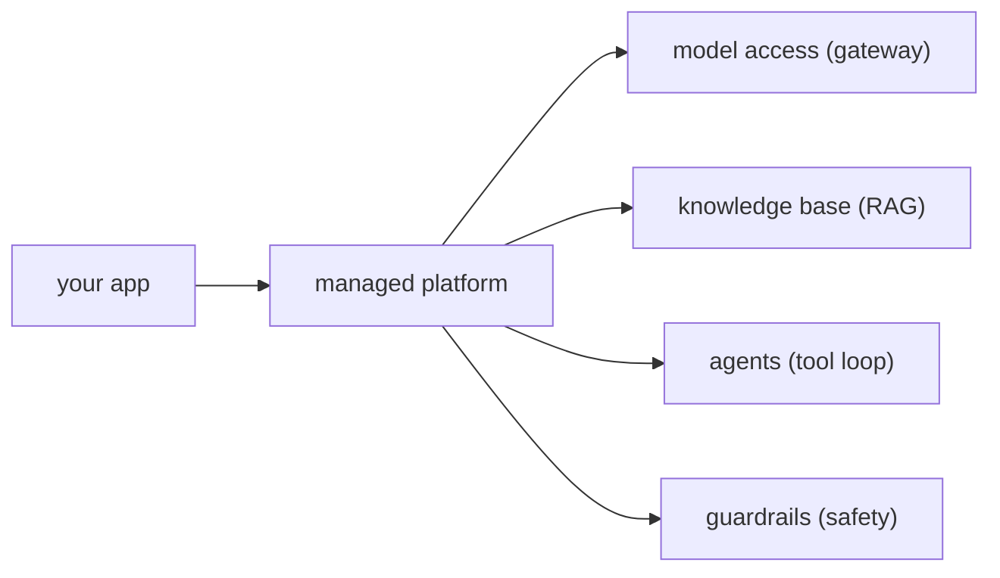

Everything built so far, [RAG](J2/production-rag), agents, retrieval infrastructure, can be
assembled from open components *or* rented as managed services. Cloud platforms (AWS Bedrock,
Google Vertex AI, Azure AI) package the same patterns into pre-assembled building blocks. The
engineering skill is not "use the managed thing" or "build it yourself" but knowing what each
block *is* in terms you already understand, and making the build-versus-buy call deliberately<FN n="1" />.

## Managed blocks are patterns you know

A managed AI platform is a menu of the patterns from earlier lessons, operated for you. Reading
AWS Bedrock as an example, each offering maps to something already covered:

- **Model access.** One API in front of many foundation models, the [gateway](J4/cost-latency-routing)
  idea as a service: switch or route models without managing inference servers.
- **Knowledge Bases.** Managed [RAG](J2/production-rag): you point it at documents, and it does the
  chunking, embedding, vector storage, and retrieval. A managed version of the whole J1-J2
  pipeline.
- **Agents.** Managed [tool-use loops](J1/react-loop): you declare tools (as API schemas) and the
  platform runs the reason-act-observe orchestration.
- **Guardrails.** A managed safety layer: content filtering, PII redaction, and topic blocking
  applied around the model, the [governance](J3/governance-rate-limiting) and [safety](J3/prompt-injection-security)
  concerns as a configurable service.

Seen this way, a managed platform is not magic; it is the curriculum's patterns with the
operational burden lifted, which is exactly why understanding the patterns first lets you use
the platform well and recognize its limits.

## The build-versus-buy decision

For each block, the choice is the classic build-versus-buy trade, and it usually comes down to
four forces:

- **Time to ship.** Managed blocks get a system to production in days, not months. When speed is
  the constraint and the use case is standard, buy.
- **Control and flexibility.** Building yourself means you control every detail, the exact
  chunking, the precise retrieval logic, custom reranking. Managed services expose knobs but cap
  how far you can deviate. When your needs are non-standard, the managed block's ceiling becomes a
  wall, and you build.
- **Operational burden.** Buying offloads scaling, patching, and uptime to the provider. Building
  means you own all of it. A small team usually cannot afford to operate what a platform operates
  for them.
- **Lock-in and cost.** Managed convenience comes with provider lock-in (proprietary APIs, data in
  their ecosystem) and a margin on top of raw compute. At small scale the margin is worth it; at
  large scale the [economics](J6/finops-for-ai) can flip toward self-hosting.

The mature pattern is rarely all-or-nothing: buy the standard, undifferentiated blocks (model
access, guardrails) and build only the parts that are your actual differentiator.

## Exercises

**Exercise 1.** Map each managed Bedrock block back to the open-component pattern it operates for
you, and state, for each, the one capability you would lose by adopting the managed version over a
hand-built stack.

Solution

**Step 1.** Model access maps to the gateway pattern: one API routing across many foundation models.
Adopting the managed version, you lose the ability to route to models outside the provider's catalog
and to set custom routing logic beyond its exposed knobs.

**Step 2.** Knowledge Bases maps to the RAG pipeline (chunking, embedding, vector store, retrieval).
You lose control over the exact chunking strategy and the retrieval/reranking logic, which the
managed service fixes to a small set of configurable options.

**Step 3.** Agents maps to the reason-act-observe tool loop. You lose control over the orchestration
itself: how the loop decides, retries, and budgets steps is the platform's, not yours. Guardrails
maps to the safety layer (filtering, PII redaction, topic blocking); you lose the ability to define
detectors the managed policy set does not offer.

**Exercise 2.** A four-person startup must ship a standard internal-docs Q&A assistant in three
weeks. Walk the four build-versus-buy forces (time to ship, control, operational burden, lock-in and
cost) and reach a recommendation, justifying it from the forces rather than asserting it.

Solution

**Step 1.** Time to ship: the deadline is three weeks and the use case is standard, so a managed
Knowledge Base reaches production in days. This force points to buy.

**Step 2.** Control: the requirement is a standard docs Q&A with no stated non-standard chunking or
retrieval need, so the managed service's ceiling is not a wall here. This force does not push toward
build.

**Step 3.** Operational burden: four people cannot afford to run scaling, patching, and uptime for a
self-hosted vector store and serving stack. This force points strongly to buy. Lock-in and cost: at
a small team's scale the provider margin is small in absolute dollars and the convenience dominates;
lock-in is a future concern, not a launch blocker. Recommendation: buy the managed block now, and
revisit only if scale or a non-standard requirement later turns the ceiling into a wall.

**Exercise 3.** A company runs 50 million model calls a month on a managed platform whose per-call
margin over raw compute is roughly 40%. Their workload is one standard pattern at steady, predictable
load. Argue when the economics justify migrating that block to self-hosting, and which single
managed block you would keep regardless.

Solution

**Step 1.** At small scale the managed margin is small in absolute terms and the offloaded
operational burden is worth it. At 50 million calls a month, a 40% margin is a large absolute sum,
and steady predictable load is exactly the case self-hosted (or reserved) capacity serves
efficiently, so the economics begin to favor building the high-volume serving block.

**Step 2.** The migration only pays off if the team can actually operate what it takes over: scaling,
patching, and uptime for the serving stack. The decision is the margin saved against the engineering
cost to run it reliably at that volume, so self-hosting wins once saved margin clearly exceeds that
operating cost.

**Step 3.** Keep guardrails managed regardless. Safety filtering and PII redaction are
undifferentiated, change as new attacks appear, and carry compliance risk if mis-built, so the
managed block's maintained policy set is worth its margin even when raw serving is brought in-house.

Whichever you choose, the system still needs to be secured, which the next lesson takes up as
[cloud identity and security](cloud-identity-security).

<Footnotes>
  <FNItem n="1">**Huyen, C.** (2024). *AI Engineering: Building Applications with Foundation Models.* O'Reilly. Reading managed model APIs, RAG, and agent platforms as building blocks, and the build-versus-buy decision.</FNItem>
</Footnotes>
