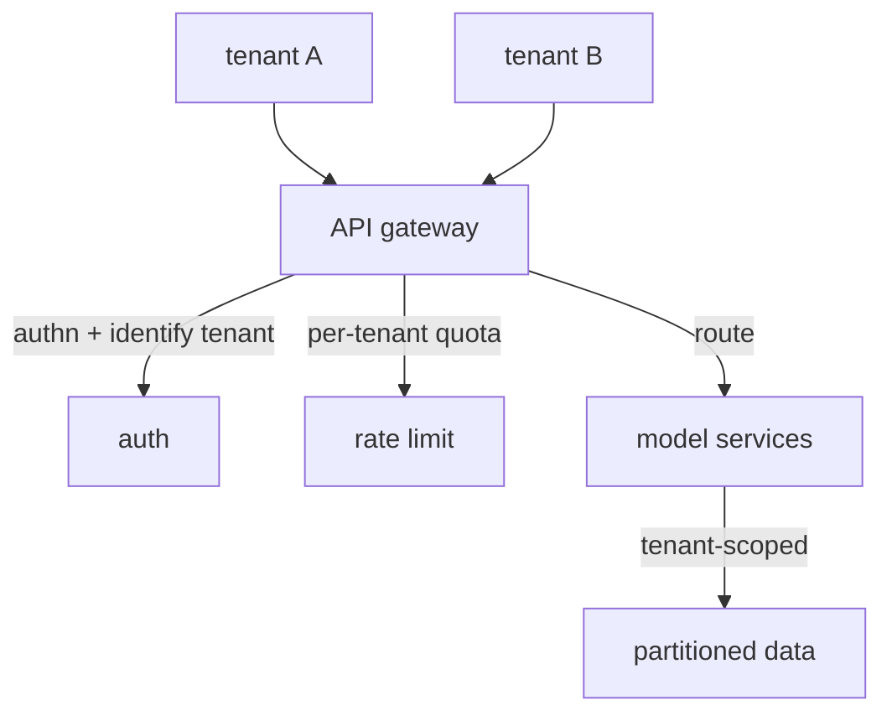

An enterprise AI product usually serves many customer organizations, **tenants**, from one
deployment. Running a separate copy per tenant does not scale; sharing one system across all of
them raises the questions that define **multi-tenancy**: how to keep tenants' data and load from
leaking into each other, and how to enforce per-tenant policy. The [governance](J3/governance-rate-limiting)
layer becomes a tenant-aware control plane, and the **API gateway** is where it lives.

## Isolation: the non-negotiable

The first requirement is **isolation**: tenant A must never see tenant B's data, and A's traffic
must not degrade B's service. Two dimensions:

- **Data isolation.** Every query, retrieval, and cache lookup must be scoped to the calling
  tenant. The standard mechanisms are a tenant id partitioning the data (every row, every vector,
  tagged and filtered by tenant) or, for stricter needs, a separate database per tenant<FN n="1" />. A bug here
  is a [data breach](J6/cloud-identity-security), so tenant scoping is enforced at the data layer,
  not left to application code to remember.
- **Performance isolation.** One tenant's spike must not starve the others, the **noisy neighbor**
  problem. Per-tenant [rate limits and quotas](J3/governance-rate-limiting) cap any single tenant's
  consumption so the shared capacity stays fair.

## The gateway as the control plane

Rather than scatter auth, tenant identification, rate limiting, and routing across every service,
multi-tenant systems concentrate them in an **API gateway**, a single entry point every request
passes through. The gateway:

- **Authenticates** the caller and resolves which **tenant** they belong to, attaching that
  identity to the request, the hook every downstream isolation and [attribution](J3/governance-rate-limiting)
  check depends on.
- **Enforces** per-tenant rate limits and quotas before any expensive work happens.
- **Routes** the request to the right backend service (and version), centralizing the
  [model-routing](J4/cost-latency-routing) and API-versioning logic.

Centralizing this is what makes multi-tenancy manageable: policy is defined and enforced in one
place instead of re-implemented per service, and the backend services can assume every request
arriving has already been authenticated and tagged with its tenant. A **service mesh** extends the
same idea to service-to-service traffic *inside* the system (mutual TLS, observability, retries
between internal services), but the tenant-facing control plane is the gateway.

## Exercises

**Exercise 1.** Two designs scope tenant data. Design A tags every row and vector with a tenant id
and filters by it in application code. Design B gives each tenant a separate database. For a system
where a scoping bug is a data breach, compare the two on isolation strength and operational cost, and
state where Design A's filter must be enforced to be safe.

Solution

**Step 1.** Compare isolation strength. Design B gives the strongest isolation: tenants share no
storage, so a query against tenant A's database physically cannot return tenant B's rows. Design A
shares one store and relies on a filter, so a single missing or wrong filter clause leaks across
tenants.

**Step 2.** Compare operational cost. Design A scales to many tenants cheaply (one schema, one store)
but concentrates the risk in correct filtering. Design B multiplies databases to provision, migrate,
patch, and back up, which grows with tenant count and is heavy at high tenant counts.

**Step 3.** State where the filter must live. For Design A to be safe, tenant scoping is enforced at
the data layer (a mandatory row/partition filter the query path cannot bypass), not left to each
call site to remember, because one forgotten filter in application code is the breach.

**Exercise 2.** A multi-tenant system scatters authentication, tenant identification, rate limiting,
and routing across every backend service. List two concrete failures this invites, and explain how a
single API gateway as the control plane removes each.

Solution

**Step 1.** First failure: inconsistent policy. With each service implementing its own auth and rate
limiting, one service can drift (an unpatched check, a different quota) and become the weak entry
point, while the others assume the system is uniformly protected.

**Step 2.** Second failure: unattributed or unprotected requests. A backend reached directly, or one
that forgets to resolve the tenant, performs expensive work for an unidentified caller, defeating
per-tenant quotas and attribution.

**Step 3.** How the gateway fixes both. Concentrating auth, tenant resolution, rate limiting, and
routing in one entry point means policy is defined and enforced once, so it cannot drift per service,
and every request reaching a backend has already been authenticated and tagged with its tenant. The
backends can assume that invariant instead of each re-implementing it.

**Exercise 3.** The gateway handles tenant-facing traffic, but internal service-to-service calls
inside the system also need authentication, encryption, and observability. Explain why the gateway
alone does not cover this, and name the mechanism that does, distinguishing its role from the
gateway's.

Solution

**Step 1.** Explain the gap. The gateway sits at the system's edge: it authenticates and tags
requests entering from tenants. Once a request is inside, calls between internal services do not pass
back through the gateway, so traffic among them is unauthenticated and unencrypted by default, and
its behavior is unobserved.

**Step 2.** Name the mechanism. A service mesh handles internal service-to-service traffic, providing
mutual TLS between services, retries, and observability on those internal hops.

**Step 3.** Distinguish the roles. The gateway is the tenant-facing control plane (who is calling,
which tenant, are they within quota, where does it route). The mesh is the internal traffic plane
(are services talking to each other securely and observably). They are complementary layers, edge
versus interior, not substitutes.

Isolation plus a gateway control plane let one system safely serve many customers<FN n="2" />. Serving them is
one thing; understanding and controlling what they *cost* at scale is [FinOps for AI](finops-for-ai).

<Footnotes>
  <FNItem n="1">**Kleppmann, M.** (2017). *Designing Data-Intensive Applications.* O'Reilly. Partitioning and the data-isolation mechanisms multi-tenant scoping rests on (Ch. 6).</FNItem>
  <FNItem n="2">**Huyen, C.** (2024). *AI Engineering: Building Applications with Foundation Models.* O'Reilly. The gateway as the control plane for auth, routing, and per-tenant rate limiting in front of model services.</FNItem>
</Footnotes>
