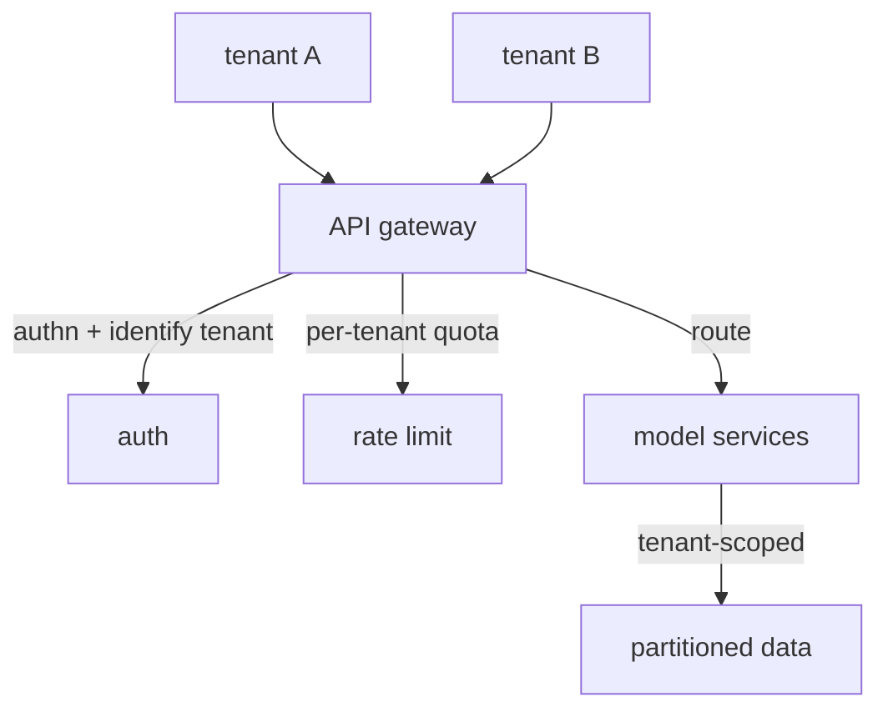

An enterprise AI product usually serves many customer organizations, **tenants**, from one
deployment. Running a separate copy per tenant does not scale; sharing one system across all of
them raises the questions that define **multi-tenancy**: how to keep tenants' data and load from
leaking into each other, and how to enforce per-tenant policy. The [governance](J3/governance-rate-limiting)
layer becomes a tenant-aware control plane, and the **API gateway** is where it lives.

## Isolation: the non-negotiable

The first requirement is **isolation**: tenant A must never see tenant B's data, and A's traffic
must not degrade B's service. Two dimensions:

- **Data isolation.** Every query, retrieval, and cache lookup must be scoped to the calling
  tenant. The standard mechanisms are a tenant id partitioning the data (every row, every vector,
  tagged and filtered by tenant) or, for stricter needs, a separate database per tenant<FN n="1" />. A bug here
  is a [data breach](J6/cloud-identity-security), so tenant scoping is enforced at the data layer,
  not left to application code to remember.
- **Performance isolation.** One tenant's spike must not starve the others, the **noisy neighbor**
  problem. Per-tenant [rate limits and quotas](J3/governance-rate-limiting) cap any single tenant's
  consumption so the shared capacity stays fair.

## The gateway as the control plane

Rather than scatter auth, tenant identification, rate limiting, and routing across every service,
multi-tenant systems concentrate them in an **API gateway**, a single entry point every request
passes through. The gateway:

- **Authenticates** the caller and resolves which **tenant** they belong to, attaching that
  identity to the request, the hook every downstream isolation and [attribution](J3/governance-rate-limiting)
  check depends on.
- **Enforces** per-tenant rate limits and quotas before any expensive work happens.
- **Routes** the request to the right backend service (and version), centralizing the
  [model-routing](J4/cost-latency-routing) and API-versioning logic.

Centralizing this is what makes multi-tenancy manageable: policy is defined and enforced in one
place instead of re-implemented per service, and the backend services can assume every request
arriving has already been authenticated and tagged with its tenant. A **service mesh** extends the
same idea to service-to-service traffic *inside* the system (mutual TLS, observability, retries
between internal services), but the tenant-facing control plane is the gateway.

Isolation plus a gateway control plane let one system safely serve many customers<FN n="2" />. Serving them is
one thing; understanding and controlling what they *cost* at scale is [FinOps for AI](finops-for-ai).

<Footnotes>
  <FNItem n="1">**Kleppmann, M.** (2017). *Designing Data-Intensive Applications.* O'Reilly. Partitioning and the data-isolation mechanisms multi-tenant scoping rests on (Ch. 6).</FNItem>
  <FNItem n="2">**Huyen, C.** (2024). *AI Engineering: Building Applications with Foundation Models.* O'Reilly. The gateway as the control plane for auth, routing, and per-tenant rate limiting in front of model services.</FNItem>
</Footnotes>
