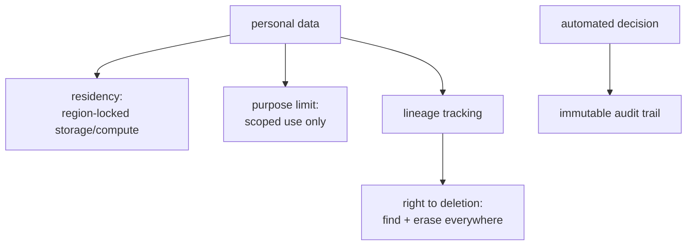

An AI system that processes personal data is subject to data-protection law, GDPR in Europe, LGPD
in Brazil, and similar regimes elsewhere, and these are engineering requirements, not just legal
paperwork. They constrain what you may store, where, for how long, and what you must be able to do
on request. An architect designs the controls in from the start, because retrofitting deletion or
audit trails into a system that was not built for them is painful and often infeasible<FN n="1" />. Four
obligations have the most direct architectural impact.

## The obligations that shape the architecture

- **Data residency.** The law may require that personal data stays within a geographic region (EU
  data in EU regions). This dictates *where* your storage, compute, and even model inference run, and
  rules out casually sending data to an API in another jurisdiction. It is a deployment-topology
  constraint, decided up front.
- **Purpose limitation and data minimization.** You may collect and use personal data only for the
  specific purpose the user consented to, and only as much as you need. For AI this bites hard:
  feeding personal data into a [training set](J4/when-not-to-finetune) or a prompt for a *different*
  purpose than it was collected for can be a violation. The principle pushes toward collecting less
  and scoping its use tightly, the data analogue of [least privilege](J6/cloud-identity-security).
- **The right to deletion (right to be forgotten).** A user can demand their personal data be
  erased. This is genuinely hard for AI: deleting a row is easy, but data baked into a fine-tuned
  model's weights or sitting in a [vector index](J5/vector-infra-ann) is not. The architecture must
  track *where every piece of personal data flows* so it can be found and removed, which is why
  data lineage is a compliance feature, not just an analytics nicety.
- **Auditability of automated decisions.** When an AI system makes a decision that affects someone
  (a loan, a hiring screen), regimes grant rights to an explanation and to human review<FN n="2" />. The system
  must therefore **log its decisions and their inputs** in an immutable [audit trail](J3/observability-tracing),
  so any decision can be reconstructed and justified after the fact.

## Governance as a design input

The throughline is that compliance is a **design input**, not a feature bolted on at the end. Data
residency shapes the deployment topology; the right to deletion forces end-to-end lineage; auditability
forces decision logging; purpose limitation constrains what data the [pipeline](J3/multi-source-ingestion)
may even carry. An architect who treats these as first-class requirements, alongside latency and cost,
designs a system that can satisfy a regulator and a deletion request without a rebuild.

## Exercises

**Exercise 1.** A user invokes the right to deletion. Their data was ingested, embedded into a vector
index, and also included in the training set of a fine-tuned model now in production. Walk the
deletion through the system and identify which step is genuinely hard and why, naming the architectural
feature that makes the request answerable at all.

Solution

**Step 1.** Trace the data's footprint. The raw record sits in a primary store; an embedding of it
sits in the vector index; and its content was folded into the fine-tuned model's weights during
training. Deletion must reach all three locations.

**Step 2.** Resolve the easy steps. Deleting the source row is a direct delete. Removing the
corresponding vector from the index is also tractable, find the vector keyed to that record and
delete it, provided the system tracked which vector came from which record.

**Step 3.** Identify the hard step. Data baked into model weights cannot be deleted by erasing a row;
the contribution is diffused across parameters. The practical remedies are retraining or fine-tuning
without that data, both expensive. What makes the whole request answerable is data lineage: tracking
where every piece of personal data flows, so each copy can be located. Lineage is a compliance
feature, not just analytics, which is why an architect designs it in from the start.

**Exercise 2.** Personal data was collected to provide a support chatbot. A team proposes reusing the
stored conversations to fine-tune a separate sales-recommendation model. Decide whether purpose
limitation permits this, and state the design principle that would have prevented the question from
arising.

Solution

**Step 1.** Apply purpose limitation. Personal data may be used only for the specific purpose the
user consented to. The consent here was for support, and sales recommendation is a different purpose,
so feeding the conversations into that training set is a violation absent fresh consent for the new
purpose.

**Step 2.** Note the AI-specific bite. Folding the data into a second model's weights also entangles
it with the deletion problem from Exercise 1, compounding the violation with a hard-to-reverse copy.

**Step 3.** Name the preventing principle. Data minimization, the data analogue of least privilege:
collect only what the stated purpose needs and scope its use tightly. Had use been scoped to support
from the outset, the proposal would have been blocked by design rather than debated after the data
was already broadly available.

**Exercise 3.** An AI system screens loan applications and rejects one. The applicant exercises a
right to an explanation and human review. List the minimum the system must have logged at decision
time to satisfy this, and explain why the audit trail must be immutable rather than a regular
mutable log.

Solution

**Step 1.** Enumerate what auditability requires. To reconstruct and justify the decision after the
fact, the system must have logged the decision itself (reject), the inputs it acted on (the
application features and any retrieved context), the model or version that produced it, and a
timestamp. Without the inputs and the version, the decision cannot be reproduced or explained.

**Step 2.** Explain immutability. A mutable log can be altered after a decision is challenged,
deliberately or by a bug, which would let the recorded justification be rewritten to fit the outcome.
An immutable, append-only audit trail guarantees the record reflects what the system actually saw and
did at decision time, which is what gives the explanation and the human review something trustworthy
to stand on.

**Step 3.** Connect to the obligation. The right to explanation and human review is only meaningful if
the reconstructed decision is the real one, so immutability is what turns logging into evidence rather
than a story told afterward.

Governance also
covers *safety* obligations, the duty to test the system against misuse, which the next lesson scales up
as [red teaming](red-teaming-at-scale).

<Footnotes>
  <FNItem n="1">**NIST.** (2023). *Artificial Intelligence Risk Management Framework (AI RMF 1.0).* NIST AI 100-1. [doi:10.6028/NIST.AI.100-1](https://doi.org/10.6028/NIST.AI.100-1). Govern/map/measure/manage functions that make compliance a design input.</FNItem>
  <FNItem n="2">**European Parliament and Council.** (2024). "Regulation (EU) 2024/1689 (Artificial Intelligence Act)". *Official Journal of the European Union*. Risk tiers, transparency, and human-oversight duties for automated decisions.</FNItem>
</Footnotes>
