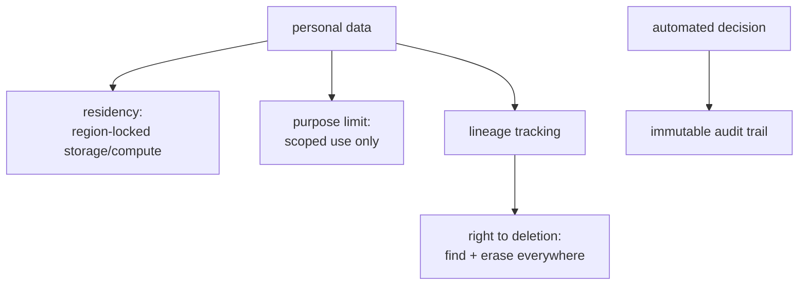

An AI system that processes personal data is subject to data-protection law, GDPR in Europe, LGPD
in Brazil, and similar regimes elsewhere, and these are engineering requirements, not just legal
paperwork. They constrain what you may store, where, for how long, and what you must be able to do
on request. An architect designs the controls in from the start, because retrofitting deletion or
audit trails into a system that was not built for them is painful and often infeasible<FN n="1" />. Four
obligations have the most direct architectural impact.

## The obligations that shape the architecture

- **Data residency.** The law may require that personal data stays within a geographic region (EU
  data in EU regions). This dictates *where* your storage, compute, and even model inference run, and
  rules out casually sending data to an API in another jurisdiction. It is a deployment-topology
  constraint, decided up front.
- **Purpose limitation and data minimization.** You may collect and use personal data only for the
  specific purpose the user consented to, and only as much as you need. For AI this bites hard:
  feeding personal data into a [training set](J4/when-not-to-finetune) or a prompt for a *different*
  purpose than it was collected for can be a violation. The principle pushes toward collecting less
  and scoping its use tightly, the data analogue of [least privilege](J6/cloud-identity-security).
- **The right to deletion (right to be forgotten).** A user can demand their personal data be
  erased. This is genuinely hard for AI: deleting a row is easy, but data baked into a fine-tuned
  model's weights or sitting in a [vector index](J5/vector-infra-ann) is not. The architecture must
  track *where every piece of personal data flows* so it can be found and removed, which is why
  data lineage is a compliance feature, not just an analytics nicety.
- **Auditability of automated decisions.** When an AI system makes a decision that affects someone
  (a loan, a hiring screen), regimes grant rights to an explanation and to human review<FN n="2" />. The system
  must therefore **log its decisions and their inputs** in an immutable [audit trail](J3/observability-tracing),
  so any decision can be reconstructed and justified after the fact.

## Governance as a design input

The throughline is that compliance is a **design input**, not a feature bolted on at the end. Data
residency shapes the deployment topology; the right to deletion forces end-to-end lineage; auditability
forces decision logging; purpose limitation constrains what data the [pipeline](J3/multi-source-ingestion)
may even carry. An architect who treats these as first-class requirements, alongside latency and cost,
designs a system that can satisfy a regulator and a deletion request without a rebuild. Governance also
covers *safety* obligations, the duty to test the system against misuse, which the next lesson scales up
as [red teaming](red-teaming-at-scale).

<Footnotes>
  <FNItem n="1">**NIST.** (2023). *Artificial Intelligence Risk Management Framework (AI RMF 1.0).* NIST AI 100-1. [doi:10.6028/NIST.AI.100-1](https://doi.org/10.6028/NIST.AI.100-1). Govern/map/measure/manage functions that make compliance a design input.</FNItem>
  <FNItem n="2">**European Parliament and Council.** (2024). "Regulation (EU) 2024/1689 (Artificial Intelligence Act)". *Official Journal of the European Union*. Risk tiers, transparency, and human-oversight duties for automated decisions.</FNItem>
</Footnotes>
