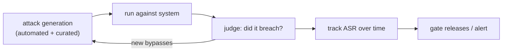

[Safety evaluation](I4/safety-evals-red-teaming) gave the metric, an attack success rate with a
confidence interval, and [prompt injection](J3/prompt-injection-security) gave the central threat. At
the architect's scale, the question is *process*: how do you keep a system safe as it, its models, and
its attackers all keep changing? A one-time red-team exercise tests a snapshot that is stale the moment
you ship a new prompt or model. The answer is to make red teaming **continuous and automated**, and to
assume it will never catch everything, hence **defense in depth**.

## From an exercise to a pipeline

Manual red teaming, experts hand-crafting attacks, is valuable but does not scale or repeat. At scale,
red teaming becomes a pipeline that runs like a [regression suite](J2/llm-as-judge):

- **Automated attack generation.** Use models to generate adversarial prompts at volume, mutate known
  jailbreaks, and explore variations a human would not try, so coverage scales past hand-written cases<FN n="1" />.
- **Continuous execution.** Run the attack suite on every release and on a schedule, tracking the
  [attack success rate](I4/safety-evals-red-teaming) over time. A spike means a change regressed safety,
  the same gate as quality regression.
- **A growing corpus.** Every newly discovered bypass (from the pipeline, bug bounties, or real
  incidents) is added to the suite, so the system is permanently tested against every attack it has ever
  seen. Coverage compounds.

The shift is treating safety like quality: measured continuously, gated on, and never "done," because
the [adversary adapts](J3/prompt-injection-security)<FN n="2" />.

## Defense in depth

No detector catches every attack, the input space is natural language, so a single line of defense will
eventually be bypassed. **Defense in depth** layers independent controls so that getting past one still
leaves the attacker facing the next:

- **Input layer.** Filter and classify incoming prompts for known attack patterns. Cheap, catches the
  obvious, never sufficient alone.
- **Architecture layer.** [Least privilege](J6/cloud-identity-security) and trust boundaries so that even
  a successful [injection](J3/prompt-injection-security) has a small blast radius, the most durable
  control, because it does not rely on *detecting* the attack.
- **Output layer.** Scan responses for leaked data, policy violations, or unexpected [tool calls](J1/tool-use)
  before they reach the user or take effect.
- **Monitoring layer.** [Trace and log](J3/observability-tracing) behavior to detect attacks in
  progress and feed new bypasses back into the red-team corpus.

The layers are deliberately **independent**: an attacker who crafts a prompt past the input filter still
faces a model that *cannot* reach sensitive data (architecture), whose output is scanned (output), and
whose anomaly is logged (monitoring). Safety comes from the *combination*, designed so no single failure
is catastrophic, not from any one perfect filter. Capturing these layered decisions so a team can build
and maintain them is the documentation discipline of [reference architectures and ADRs](reference-architectures-adrs).

<Footnotes>
  <FNItem n="1">**Perez, E., et al.** (2022). "Red teaming language models with language models". *EMNLP*. [arXiv:2202.03286](https://arxiv.org/abs/2202.03286). Using models to generate adversarial prompts at scale.</FNItem>
  <FNItem n="2">**Ganguli, D., et al.** (2022). "Red teaming language models to reduce harms: methods, scaling behaviors, and lessons learned". [arXiv:2209.07858](https://arxiv.org/abs/2209.07858). The continuous, scaling practice of red teaming.</FNItem>
</Footnotes>
