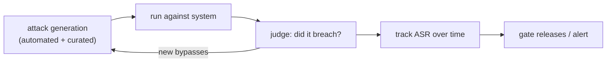

[Safety evaluation](I4/safety-evals-red-teaming) gave the metric, an attack success rate with a
confidence interval, and [prompt injection](J3/prompt-injection-security) gave the central threat. At
the architect's scale, the question is *process*: how do you keep a system safe as it, its models, and
its attackers all keep changing? A one-time red-team exercise tests a snapshot that is stale the moment
you ship a new prompt or model. The answer is to make red teaming **continuous and automated**, and to
assume it will never catch everything, hence **defense in depth**.

## From an exercise to a pipeline

Manual red teaming, experts hand-crafting attacks, is valuable but does not scale or repeat. At scale,
red teaming becomes a pipeline that runs like a [regression suite](J2/llm-as-judge):

- **Automated attack generation.** Use models to generate adversarial prompts at volume, mutate known
  jailbreaks, and explore variations a human would not try, so coverage scales past hand-written cases<FN n="1" />.
- **Continuous execution.** Run the attack suite on every release and on a schedule, tracking the
  [attack success rate](I4/safety-evals-red-teaming) over time. A spike means a change regressed safety,
  the same gate as quality regression.
- **A growing corpus.** Every newly discovered bypass (from the pipeline, bug bounties, or real
  incidents) is added to the suite, so the system is permanently tested against every attack it has ever
  seen. Coverage compounds.

The shift is treating safety like quality: measured continuously, gated on, and never "done," because
the [adversary adapts](J3/prompt-injection-security)<FN n="2" />.

## Defense in depth

No detector catches every attack, the input space is natural language, so a single line of defense will
eventually be bypassed. **Defense in depth** layers independent controls so that getting past one still
leaves the attacker facing the next:

- **Input layer.** Filter and classify incoming prompts for known attack patterns. Cheap, catches the
  obvious, never sufficient alone.
- **Architecture layer.** [Least privilege](J6/cloud-identity-security) and trust boundaries so that even
  a successful [injection](J3/prompt-injection-security) has a small blast radius, the most durable
  control, because it does not rely on *detecting* the attack.
- **Output layer.** Scan responses for leaked data, policy violations, or unexpected [tool calls](J1/tool-use)
  before they reach the user or take effect.
- **Monitoring layer.** [Trace and log](J3/observability-tracing) behavior to detect attacks in
  progress and feed new bypasses back into the red-team corpus.

The layers are deliberately **independent**: an attacker who crafts a prompt past the input filter still
faces a model that *cannot* reach sensitive data (architecture), whose output is scanned (output), and
whose anomaly is logged (monitoring). Safety comes from the *combination*, designed so no single failure
is catastrophic, not from any one perfect filter.

## Exercises

**Exercise 1.** A team runs one expert red-team exercise before launch, finds and fixes the attacks,
and considers safety done. Two months later a new model version ships. Explain why the original
exercise no longer certifies the system, and describe the two changes that turn it into a process that
keeps pace.

Solution

**Step 1.** Explain the staleness. A one-time exercise tests a single snapshot: a fixed prompt, model,
and tool set. Shipping a new model (or prompt) changes the system under test, so the old results no
longer describe the deployed system, and the attackers themselves keep adapting. The certificate
expired the moment the snapshot changed.

**Step 2.** First change: make execution continuous. Run the attack suite on every release and on a
schedule, tracking the attack success rate over time, so a new version that regresses safety is caught
the same way a quality regression is, by the metric moving.

**Step 3.** Second change: make the corpus grow. Every newly discovered bypass, from the pipeline, bug
bounties, or real incidents, is added to the suite, so coverage compounds and the system is permanently
re-tested against every attack it has ever seen rather than a frozen set.

**Exercise 2.** An input filter catches $90\%$ of attack attempts. A teammate argues that tightening
it to $99\%$ is the priority investment. Argue from defense in depth why a single stronger filter is
the wrong place to concentrate, and which layer offers the most durable protection and why.

Solution

**Step 1.** State the limit of one layer. The input space is natural language, so no detector catches
every attack; a $99\%$ filter still lets $1\%$ through, and those are the cases that matter. Raising
one layer's catch rate buys diminishing returns while the system still falls entirely on that layer's
misses.

**Step 2.** Name the durable layer. The architecture layer, least privilege and trust boundaries, is
the most durable, because it does not rely on *detecting* the attack at all. A successful injection
that gets past every filter still faces a model that cannot reach sensitive data, so the blast radius
is small regardless of detection.

**Step 3.** Conclude. The investment belongs in independent layers (architecture, output scanning,
monitoring) so a bypass of the filter is not catastrophic, not in pushing one filter from $90\%$ to
$99\%$. Safety comes from the combination, not a single near-perfect filter.

**Exercise 3.** Design a four-layer defense for an agent that can call a payments tool. For each
layer (input, architecture, output, monitoring), give one concrete control specific to this agent, and
show how a single injection that slips past the input layer is still contained.

Solution

**Step 1.** Input and architecture layers. Input: classify incoming prompts for known injection
patterns and reject obvious payment-manipulation phrasings. Architecture: scope the agent's
permissions so it can only initiate payments below a small limit and only to pre-approved payees, so
even a hijacked agent cannot move large or arbitrary funds.

**Step 2.** Output and monitoring layers. Output: scan the agent's proposed tool call before it
executes, blocking any payment that violates the limit or payee allowlist. Monitoring: trace and log
every payment attempt, alert on anomalies (unusual amounts, new payees), and feed novel bypasses back
into the red-team corpus.

**Step 3.** Show containment. An injection that gets past the input filter reaches an agent that
*cannot* exceed the payment limit or pay an unknown payee (architecture), whose proposed call is
scanned and blocked if it tries (output), and whose attempt is logged and alerted (monitoring).
Getting past one layer leaves the attacker facing the next, so no single bypass is catastrophic.

Capturing these layered decisions so a team can build
and maintain them is the documentation discipline of [reference architectures and ADRs](reference-architectures-adrs).

<Footnotes>
  <FNItem n="1">**Perez, E., et al.** (2022). "Red teaming language models with language models". *EMNLP*. [arXiv:2202.03286](https://arxiv.org/abs/2202.03286). Using models to generate adversarial prompts at scale.</FNItem>
  <FNItem n="2">**Ganguli, D., et al.** (2022). "Red teaming language models to reduce harms: methods, scaling behaviors, and lessons learned". [arXiv:2209.07858](https://arxiv.org/abs/2209.07858). The continuous, scaling practice of red teaming.</FNItem>
</Footnotes>
