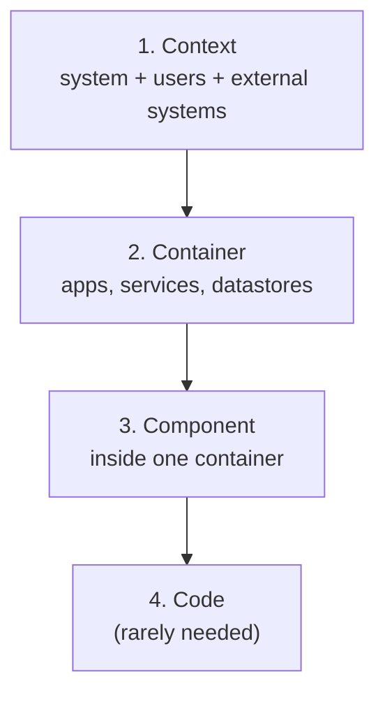

An architect's output is not code; it is **decisions and the communication of them**. A design that
lives only in one person's head, or in a sprawling diagram nobody can follow, does not survive contact
with a team. Three tools make designs reusable, durable, and legible: reference architectures (reusable
templates), architecture decision records (the captured *why*), and C4 diagrams (layered views). They
are how an architect scales a design past themselves.

## Reference architectures: don't start from blank

A **reference architecture** is a proven, reusable template for a class of problem, a blueprint that
encodes the standard components and how they fit. "A RAG system" has a reference architecture: ingestion,
chunking, embedding, a [vector store](J5/vector-infra-ann), retrieval, reranking, the model, a
[governance](J3/governance-rate-limiting) layer. Starting from the reference rather than a blank page
means you inherit the field's accumulated lessons instead of rediscovering them, and you spend your design
effort on what is *actually* unique to your problem. Reference architectures are the team-level analogue of
a [design pattern](J4/multi-agent-orchestration): a named, shared starting point.

## ADRs: capture the why, not just the what

Diagrams show *what* the system is; they do not show *why* it is that way. Six months later, "why did we
choose a managed vector DB over self-hosted?" is unanswerable, so the decision gets relitigated or, worse,
reversed by someone who did not know the reasons. An **architecture decision record** (ADR) is a short,
immutable document, one per significant decision, capturing:

- the **context** (the forces and constraints in play),
- the **decision** (what was chosen),
- the **consequences** (the trade accepted, what it makes easy and what it makes hard).

ADRs are append-only: a superseded decision is marked superseded by a new ADR, never edited away, so the
*history* of the design's reasoning is preserved. This is [version-controlled](J3/deployment-cicd)
reasoning, and it is what lets a team evolve a system without losing the thread of why it is the way it is.

## C4: diagrams at the right zoom

A single diagram that tries to show everything shows nothing. The **C4 model** fixes this with a fixed set
of zoom levels, each for a different audience:

- **Context:** the system as one box among its users and neighbors, for non-technical stakeholders.
- **Container:** the major deployable pieces (the API, the model service, the [vector DB](J5/vector-infra-ann)),
  for engineers and ops.
- **Component:** the inside of one container, for the team building it.

The discipline is to **match the diagram's zoom to its audience** and never mix levels, the failure mode is
the one diagram with fifty boxes that serves nobody. Reference architectures to start from, ADRs to record
the why, and C4 to communicate at the right altitude are the architect's communication kit. Using them to
drive an actual design end to end is the [system design](system-design-for-ai) lesson.
