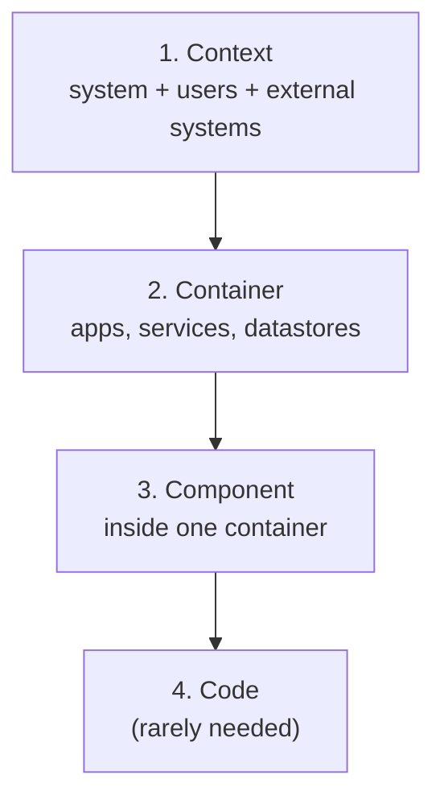

An architect's output is not code; it is **decisions and the communication of them**. A design that
lives only in one person's head, or in a sprawling diagram nobody can follow, does not survive contact
with a team. Three tools make designs reusable, durable, and legible: reference architectures (reusable
templates), architecture decision records (the captured *why*), and C4 diagrams (layered views). They
are how an architect scales a design past themselves.

## Reference architectures: don't start from blank

A **reference architecture** is a proven, reusable template for a class of problem, a blueprint that
encodes the standard components and how they fit. "A RAG system" has a reference architecture: ingestion,
chunking, embedding, a [vector store](J5/vector-infra-ann), retrieval, reranking, the model, a
[governance](J3/governance-rate-limiting) layer. Starting from the reference rather than a blank page
means you inherit the field's accumulated lessons instead of rediscovering them, and you spend your design
effort on what is *actually* unique to your problem. Reference architectures are the team-level analogue of
a [design pattern](J4/multi-agent-orchestration): a named, shared starting point.

## ADRs: capture the why, not just the what

Diagrams show *what* the system is; they do not show *why* it is that way. Six months later, "why did we
choose a managed vector DB over self-hosted?" is unanswerable, so the decision gets relitigated or, worse,
reversed by someone who did not know the reasons. An **architecture decision record** (ADR) is a short,
immutable document, one per significant decision, capturing:

- the **context** (the forces and constraints in play),
- the **decision** (what was chosen),
- the **consequences** (the trade accepted, what it makes easy and what it makes hard).

ADRs are append-only: a superseded decision is marked superseded by a new ADR, never edited away, so the
*history* of the design's reasoning is preserved. This is [version-controlled](J3/deployment-cicd)
reasoning, and it is what lets a team evolve a system without losing the thread of why it is the way it is.

## C4: diagrams at the right zoom

A single diagram that tries to show everything shows nothing. The **C4 model** fixes this with a fixed set
of zoom levels, each for a different audience<FN n="1" />:

- **Context:** the system as one box among its users and neighbors, for non-technical stakeholders.
- **Container:** the major deployable pieces (the API, the model service, the [vector DB](J5/vector-infra-ann)),
  for engineers and ops.
- **Component:** the inside of one container, for the team building it.

The discipline is to **match the diagram's zoom to its audience** and never mix levels, the failure mode is
the one diagram with fifty boxes that serves nobody.

## Exercises

**Exercise 1.** A team is asked to build an internal RAG assistant and starts from a blank diagram.
Argue from this lesson why beginning from the RAG reference architecture is the better move, and name
two components they are likely to forget if they start blank.

Solution

**Step 1.** State the value of the reference. A reference architecture is a proven template that
encodes the standard components and how they fit, so starting from it inherits the field's accumulated
lessons instead of rediscovering them, and concentrates design effort on what is actually unique to
this problem.

**Step 2.** Name likely omissions. Starting blank, a team usually wires the obvious path (embed,
store, retrieve, model) and forgets the reranking step that lifts retrieval quality and the governance
layer (rate limiting, safety) that the reference includes by default. Both are standard in the RAG
reference precisely because teams keep rediscovering their absence.

**Step 3.** Conclude. The reference is the team-level analogue of a design pattern: a named, shared
starting point. Beginning from it means the forgotten components are present by default, and the
team's effort goes to the genuinely novel parts.

**Exercise 2.** Six months ago a team chose a managed vector database over self-hosting. Today
someone proposes switching to self-hosted to cut cost. Write the three sections of the ADR that should
have recorded the original decision (context, decision, consequences), and explain why ADRs are
append-only rather than edited in place.

Solution

**Step 1.** Context. The forces and constraints at the time: a small team without operational capacity
to run a vector store, a near-term launch deadline, and a moderate scale where the managed margin is
small in absolute terms. These are the conditions the decision answered.

**Step 2.** Decision and consequences. Decision: adopt the managed vector database. Consequences: the
trade accepted, faster launch and no operational burden (made easy), at the cost of provider lock-in
and a per-unit margin that grows with scale (made hard). Recording the consequences is what lets a
later reader weigh the proposed switch against what was knowingly traded.

**Step 3.** Why append-only. A superseded decision is marked superseded by a new ADR, never edited
away, so the history of the reasoning is preserved. Editing in place would erase *why* the original
choice was right under its conditions, which is exactly the context a reviewer needs to judge whether
those conditions still hold before reversing it.

**Exercise 3.** A non-technical executive, the ops team, and the engineers building the retrieval
service each ask for a diagram of the same RAG system. Assign each audience the correct C4 level,
state what each diagram shows and omits, and name the failure mode of serving all three with one
diagram.

Solution

**Step 1.** Executive gets the Context level: the system as one box among its users and neighboring
systems. It shows where the system sits and who uses it, and omits all internal structure, which is
right for a non-technical stakeholder.

**Step 2.** Ops gets the Container level: the major deployable pieces (the API, the model service, the
vector DB) and how they connect. It shows what runs where, for people who deploy and operate it, and
omits the internals of any one piece. Engineers building the retrieval service get the Component level:
the inside of that one container, for the team building it.

**Step 3.** Name the failure mode. One diagram that tries to serve all three mixes levels and becomes
the fifty-box diagram that serves nobody: too detailed for the executive, too coarse for the
engineers, unmatched to any audience. The discipline is to match each diagram's zoom to its audience
and never mix levels.

Reference architectures to start from, ADRs to record
the why, and C4 to communicate at the right altitude are the architect's communication kit. Using them to
drive an actual design end to end is the [system design](system-design-for-ai) lesson.

<Footnotes>
  <FNItem n="1">**Brown, S.** (2018). *Software Architecture for Developers: the C4 model for visualising software architecture.* Leanpub. The four zoom levels (context, container, component, code). [c4model.com](https://c4model.com)</FNItem>
</Footnotes>
