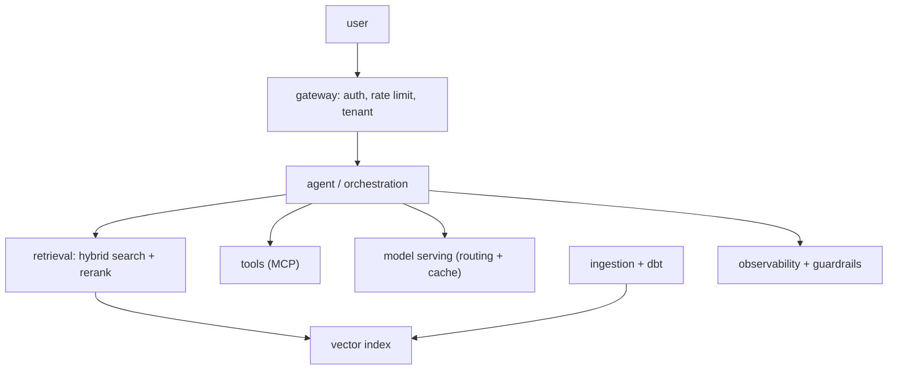

This lesson assembles the pillar. **System design for AI** is the architect's core skill: taking a vague
product ask ("build an AI assistant for our support team") and driving it to a concrete architecture,
justifying every choice against requirements. It is what an architect-interview tests, and what the job
actually is. The method is a disciplined progression, requirements, then components, then tradeoffs, and
the components are exactly the pieces this pillar built.

## Step 1: requirements before boxes

The most common failure is drawing boxes before understanding the problem. Start by pinning down two kinds
of requirement:

- **Functional.** What must it *do*? Answer from internal docs (so [RAG](J2/production-rag)), take actions
  like creating tickets (so [tools/agents](J1/react-loop)), handle multi-turn conversation (so memory).
- **Non-functional.** The constraints that actually decide the architecture: expected **scale** (queries
  per second), **latency** budget, **accuracy** bar, **cost** ceiling, and **compliance** regime. These
  numbers, not the features, drive the hard choices, so an architect extracts them first, with estimates
  when exact figures are unavailable<FN n="1" />.

## Step 2: assemble the components

With requirements fixed, lay out the architecture from the [reference architecture](reference-architectures-adrs)
for this class of system, instantiating each block with what the pillar covered:

Each box is a lesson: the [gateway](J6/multi-tenancy-gateway) for entry and governance, an
[agent](J4/multi-agent-orchestration) for orchestration, [hybrid retrieval](J5/hybrid-search-rrf) over a
[vector index](J5/vector-infra-ann) kept fresh by [ingestion](J5/streaming-embeddings), [tools](J2/mcp-protocol)
for actions, [model serving](J4/cost-latency-routing) with routing and caching, and
[observability](J3/observability-tracing) plus [guardrails](J3/prompt-injection-security) across it. The
architect's value is choosing *which* blocks the requirements justify, the simplest design that meets them,
not the most impressive<FN n="2" />.

## Step 3: name the tradeoffs

The final, distinguishing step is articulating the **tradeoffs** behind each choice, the reasoning an
[ADR](reference-architectures-adrs) would capture:

- **RAG vs fine-tuning:** retrieval for knowledge that changes, [not fine-tuning](J4/when-not-to-finetune).
- **Managed vs self-hosted:** [buy](J6/managed-ai-platforms) the undifferentiated blocks, build the
  differentiator.
- **Model routing:** [cascade](J4/cost-latency-routing) cheap-to-expensive to hit the cost and latency
  budget at the required accuracy.
- **Single vs multi-agent:** the [single-agent baseline](J4/multi-agent-orchestration) unless the task
  genuinely decomposes.

A senior design is not the one with the most components; it is the one where every component is justified by
a requirement and every omission is deliberate. Driving requirements to a justified architecture *is* the
synthesis of this pillar. The one quantitative skill that underpins the non-functional requirements, turning
a scale estimate into hardware and dollars, is [capacity and cost modeling](capacity-cost-modeling).

<Footnotes>
  <FNItem n="1">**Kleppmann, M.** (2017). *Designing Data-Intensive Applications.* O'Reilly. Reasoning from non-functional requirements (scale, latency, reliability) to architecture.</FNItem>
  <FNItem n="2">**Huyen, C.** (2024). *AI Engineering: Building Applications with Foundation Models.* O'Reilly. Assembling RAG, agents, serving, and data components into a production AI system.</FNItem>
</Footnotes>
