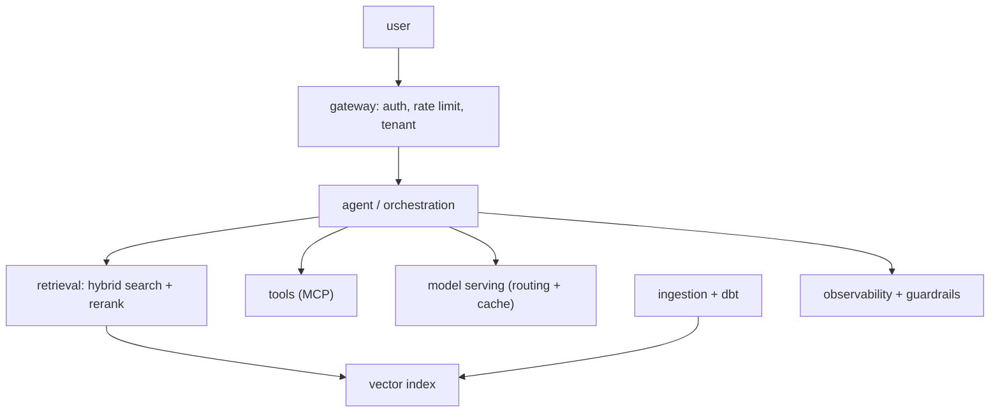

This lesson assembles the pillar. **System design for AI** is the architect's core skill: taking a vague
product ask ("build an AI assistant for our support team") and driving it to a concrete architecture,
justifying every choice against requirements. It is what an architect-interview tests, and what the job
actually is. The method is a disciplined progression, requirements, then components, then tradeoffs, and
the components are exactly the pieces this pillar built.

## Step 1: requirements before boxes

The most common failure is drawing boxes before understanding the problem. Start by pinning down two kinds
of requirement:

- **Functional.** What must it *do*? Answer from internal docs (so [RAG](J2/production-rag)), take actions
  like creating tickets (so [tools/agents](J1/react-loop)), handle multi-turn conversation (so memory).
- **Non-functional.** The constraints that actually decide the architecture: expected **scale** (queries
  per second), **latency** budget, **accuracy** bar, **cost** ceiling, and **compliance** regime. These
  numbers, not the features, drive the hard choices, so an architect extracts them first, with estimates
  when exact figures are unavailable<FN n="1" />.

## Step 2: assemble the components

With requirements fixed, lay out the architecture from the [reference architecture](reference-architectures-adrs)
for this class of system, instantiating each block with what the pillar covered:

Each box is a lesson: the [gateway](J6/multi-tenancy-gateway) for entry and governance, an
[agent](J4/multi-agent-orchestration) for orchestration, [hybrid retrieval](J5/hybrid-search-rrf) over a
[vector index](J5/vector-infra-ann) kept fresh by [ingestion](J5/streaming-embeddings), [tools](J2/mcp-protocol)
for actions, [model serving](J4/cost-latency-routing) with routing and caching, and
[observability](J3/observability-tracing) plus [guardrails](J3/prompt-injection-security) across it. The
architect's value is choosing *which* blocks the requirements justify, the simplest design that meets them,
not the most impressive<FN n="2" />.

## Step 3: name the tradeoffs

The final, distinguishing step is articulating the **tradeoffs** behind each choice, the reasoning an
[ADR](reference-architectures-adrs) would capture:

- **RAG vs fine-tuning:** retrieval for knowledge that changes, [not fine-tuning](J4/when-not-to-finetune).
- **Managed vs self-hosted:** [buy](J6/managed-ai-platforms) the undifferentiated blocks, build the
  differentiator.
- **Model routing:** [cascade](J4/cost-latency-routing) cheap-to-expensive to hit the cost and latency
  budget at the required accuracy.
- **Single vs multi-agent:** the [single-agent baseline](J4/multi-agent-orchestration) unless the task
  genuinely decomposes.

## Exercises

**Exercise 1.** A product owner asks for "an AI assistant for our support team" and lists the
features it should have. Following Step 1, separate the functional from the non-functional
requirements, and explain why the non-functional ones drive the architecture more than the feature
list does.

Solution

**Step 1.** Sort the requirements. Functional: answer from internal docs (so retrieval), create
tickets (so tools/agents), hold multi-turn conversation (so memory). These say what the system must
*do*. Non-functional: expected queries per second, latency budget, accuracy bar, cost ceiling, and
compliance regime. These are the constraints it must do it *under*.

**Step 2.** Explain the priority. The feature list tells you which boxes exist, but the non-functional
numbers decide how each is built: the QPS and latency budget set whether you need routing and caching
and how much serving capacity, the cost ceiling decides managed-versus-self-hosted, and the
compliance regime fixes data residency and audit logging. Two systems with identical features but
different scale and latency targets get different architectures.

**Step 3.** Conclude. An architect extracts the non-functional numbers first, with estimates when
exact figures are unavailable, because those numbers, not the features, drive the hard choices.

**Exercise 2.** For the support assistant, name the tradeoff each of these four decisions resolves and
give the default this pillar argues for: knowledge that changes weekly; a block that is standard and
undifferentiated; a cost and latency budget at a required accuracy; a task that is mostly single-step.

Solution

**Step 1.** Knowledge that changes weekly is the RAG-versus-fine-tuning tradeoff. Default: retrieval,
because retrieval serves knowledge that changes, while fine-tuning bakes it in and goes stale.

**Step 2.** A standard undifferentiated block is the managed-versus-self-hosted tradeoff. Default:
buy the undifferentiated block and build only the differentiator. A cost and latency budget at a
required accuracy is the model-routing tradeoff. Default: a cascade from cheap to expensive, so cheap
models handle what they can and expensive ones are reached only when needed.

**Step 3.** A mostly single-step task is the single-versus-multi-agent tradeoff. Default: the
single-agent baseline unless the task genuinely decomposes, because multi-agent adds coordination
cost that a single-step task does not repay.

**Exercise 3.** A junior engineer presents a design with eleven components, including a multi-agent
orchestrator and a fine-tuned model, for a system whose only requirement is answering from a small,
rarely-changing internal FAQ at low traffic. Critique it by the pillar's standard and propose the
minimal architecture the requirements actually justify.

Solution

**Step 1.** Apply the standard. A senior design is not the one with the most components; it is the one
where every component is justified by a requirement and every omission is deliberate. Eleven
components for a small, rarely-changing FAQ at low traffic means most are unjustified.

**Step 2.** Remove the unjustified pieces. Rarely-changing knowledge does not justify a fine-tuned
model (retrieval over the FAQ suffices, and a tiny corpus may not even need a vector index). A
single-step lookup does not justify multi-agent orchestration; the single-agent baseline holds. Low
traffic does not justify heavy routing or large serving capacity.

**Step 3.** Propose the minimal design. A small retrieval step over the FAQ feeding one model behind a
gateway for auth and rate limiting, with basic observability. Each remaining box maps to a stated
requirement, and every omission (fine-tuning, multi-agent, elaborate routing) is deliberate because no
requirement asks for it. The simplest design that meets the requirements is the senior one.

A senior design is not the one with the most components; it is the one where every component is justified by
a requirement and every omission is deliberate. Driving requirements to a justified architecture *is* the
synthesis of this pillar. The one quantitative skill that underpins the non-functional requirements, turning
a scale estimate into hardware and dollars, is [capacity and cost modeling](capacity-cost-modeling).

<Footnotes>
  <FNItem n="1">**Kleppmann, M.** (2017). *Designing Data-Intensive Applications.* O'Reilly. Reasoning from non-functional requirements (scale, latency, reliability) to architecture.</FNItem>
  <FNItem n="2">**Huyen, C.** (2024). *AI Engineering: Building Applications with Foundation Models.* O'Reilly. Assembling RAG, agents, serving, and data components into a production AI system.</FNItem>
</Footnotes>
