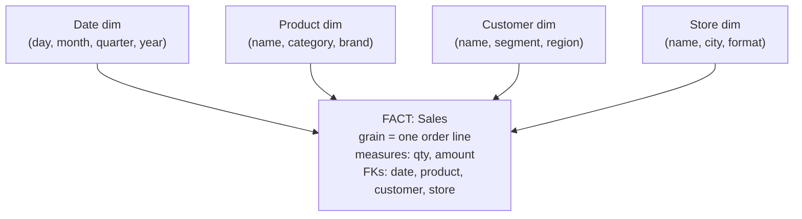

The warehouse on the right of the last lesson's diagram needs its own schema
design, and copying the [normalized OLTP layout](K1/relational-model) is the
wrong move: normalization minimizes redundancy by splitting facts across many
tables, but analytical queries pay for every split with a join. **Dimensional
modeling**, the method named after Ralph Kimball, designs the warehouse for the
analytical workload directly<FN n="1" />. It puts the numbers you measure in one central
table and the context you slice them by in tables arranged around it, producing
the **star schema** that aggregation queries scan cheaply and analysts read at a
glance.

## Facts: the things you measure

A **fact table** holds the **measurements** of a business process, one row per
event at a chosen **grain**. The grain is the precise meaning of a single row,
fixed first and never mixed: "one row per order line item" is a grain, and once
chosen, every row means exactly that. A fact row carries two kinds of columns:

- **Measures**: the numeric, additive quantities you aggregate, `quantity`,
  `amount`, `discount`. These are what `SUM` and `AVG` run over.
- **Foreign keys**: one key per dimension, pointing at the context tables. A
  sales-line fact references `date_key`, `product_key`, `customer_key`,
  `store_key`.

Fact tables are tall and narrow, billions of rows, few columns, and almost all
of those columns are either a measure or a foreign key.

## Dimensions: the context you slice by

A **dimension table** holds the **descriptive attributes** that give measures
meaning: who, what, where, when. A `Product` dimension carries name, category,
brand, size; a `Date` dimension carries day, month, quarter, year, weekday,
holiday flag. Dimensions are short and wide, thousands of rows, many columns, and
they are deliberately **denormalized**: the product's category lives right in the
product row rather than in a separate `Category` table. That denormalization is
the design choice that the OLTP world forbids and the warehouse embraces.

## The star schema

Put one fact table in the center and connect each dimension by a foreign key, and
the diagram is a star: the fact at the hub, dimensions as points.

A query like "total amount by product category and quarter" reads only the fact
table plus two dimensions, joins each dimension once on its key, groups by
`category` and `quarter`, and sums `amount`. Because every dimension hangs
directly off the fact by a single foreign key, the join graph is one hop deep:
the optimizer joins the big fact to a few small dimensions, never chains joins
through intermediate tables. That shallow, predictable join structure is why star
queries are both fast and legible.

## Star vs snowflake

If you *normalize* a dimension, splitting `Category` out of `Product` into its
own table, the star sprouts sub-branches and becomes a **snowflake schema**. The
snowflake saves a little storage (the category name is stored once, not per
product) but reintroduces exactly the multi-hop joins dimensional modeling exists
to avoid: now reaching `category` from the fact passes through `Product` then
`Category`. For analytics the trade rarely pays off, dimensions are small, so
their redundancy is cheap, while the extra joins tax every query, so the
denormalized **star is the default** and snowflaking is reserved for the rare
dimension large enough that its redundancy actually costs.

## Exercises

**Exercise 1.** A retailer wants to analyze sales at the grain of one product
sold per receipt line. Name the fact table's grain, list the measures it should
carry, and list the dimension foreign keys you would attach. State why the grain
must be fixed before any column is chosen.

Solution

**Step 1.** The grain is one row per receipt line item: a single product on a
single receipt. Every row of the fact table means exactly that, and no row mixes
a different level (no receipt-total rows, no daily-summary rows).

**Step 2.** The measures are the additive numeric quantities recorded at that
grain: `quantity` (units of the product on this line), `amount` (line revenue),
and `discount` (line discount). These are the columns `SUM` and `AVG` run over.

**Step 3.** The dimension foreign keys are the context each line is sliced by:
`date_key` (when), `product_key` (what), `customer_key` (who), and `store_key`
(where). One key per dimension, each pointing at a context table.

**Step 4.** The grain must be fixed first because it fixes the meaning of a row,
and therefore which measures are additive and which dimensions apply. If receipt
lines and receipt totals shared the fact table, a `SUM(amount)` would double-count
(line revenues plus their own total), so the additivity that makes the star fast
would silently break.

**Exercise 2.** A team proposes splitting the `Product` dimension's `category`
attribute into a separate `Category` table to save storage, turning the star into
a snowflake. The `Product` dimension has 50,000 rows; a category name averages 20
bytes; there are 40 distinct categories. Estimate the storage saved, and decide
whether the change is worth it for a read-heavy analytical workload.

Solution

**Step 1.** Snowflaked, the category name is stored once per distinct category:
$40 \times 20 = 800$ bytes, plus a small integer category key repeated on each
product row. As a star, the name repeats on every product row:
$50{,}000 \times 20 = 1{,}000{,}000$ bytes.

**Step 2.** The saving is roughly $1{,}000{,}000 - 800 \approx 1{,}000{,}000$
bytes, near one megabyte, before counting the integer key the snowflake still
repeats per product. Against a fact table of billions of rows, one megabyte on a
dimension is negligible.

**Step 3.** The cost is the join. Every query that slices by category must now
reach `category` through `Product` then `Category`, a two-hop join instead of one,
and this tax is paid on every analytical read, not once. Dimensions are small, so
their redundancy is cheap; the extra join is paid forever. The change is not worth
it, the star stays denormalized.

**Exercise 3.** A logistics analyst models package deliveries. They consider one
schema with grain "one row per package" carrying a `status` that changes as the
package moves, and another with grain "one row per status-change event" carrying a
timestamp. Explain which grain is the natural fact grain and why a mutable
`status` column on a per-package row is a poor fit for a fact table.

Solution

**Step 1.** A fact table records measurements of a business process as immutable
events, one row per event at a fixed grain. The "one row per status-change event"
schema fits this: each scan of a package (picked up, in transit, delivered) is one
event, recorded once and never altered, timestamped by a `date_key`.

**Step 2.** The "one row per package" schema with a mutable `status` is not an
event log but a current-state snapshot. Updating `status` in place rewrites
history: once a package reaches `delivered`, the table no longer records that it
was ever `in transit`, so a question like "how many packages were in transit on
a given day" cannot be answered.

**Step 3.** Mutating a row also breaks the additive, append-only discipline a fact
table relies on for fast bulk loads and stable aggregates. The status-change-event
grain keeps the fact table append-only and lets the package's state on any date be
reconstructed by reading the events up to that date, the same as-of reasoning the
next lesson formalizes for dimensions.

One subtlety the star leaves open: dimensions are not frozen. A customer changes
region, a product is rebranded, and the warehouse must decide whether to overwrite
the old value or preserve history<FN n="2" />. That is the subject of the next lesson,
[slowly changing dimensions](K1/slowly-changing-dimensions).

<Footnotes>
  <FNItem n="1">**Kimball, R., & Ross, M.** (2013). *The Data Warehouse Toolkit: The Definitive Guide to Dimensional Modeling* (3rd ed.). Wiley. The canonical reference for facts, dimensions, grain, and the star schema.</FNItem>
  <FNItem n="2">**Inmon, W. H.** (2005). *Building the Data Warehouse* (4th ed.). Wiley. The normalized, enterprise-warehouse counterpoint to Kimball's dimensional approach.</FNItem>
</Footnotes>
