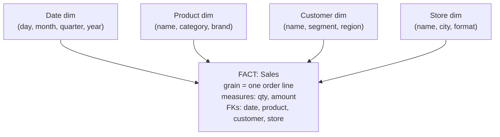

The warehouse on the right of the last lesson's diagram needs its own schema
design, and copying the [normalized OLTP layout](K1/relational-model) is the
wrong move: normalization minimizes redundancy by splitting facts across many
tables, but analytical queries pay for every split with a join. **Dimensional
modeling**, the method named after Ralph Kimball, designs the warehouse for the
analytical workload directly. It puts the numbers you measure in one central
table and the context you slice them by in tables arranged around it, producing
the **star schema** that aggregation queries scan cheaply and analysts read at a
glance.

## Facts: the things you measure

A **fact table** holds the **measurements** of a business process, one row per
event at a chosen **grain**. The grain is the precise meaning of a single row,
fixed first and never mixed: "one row per order line item" is a grain, and once
chosen, every row means exactly that. A fact row carries two kinds of columns:

- **Measures**: the numeric, additive quantities you aggregate, `quantity`,
  `amount`, `discount`. These are what `SUM` and `AVG` run over.
- **Foreign keys**: one key per dimension, pointing at the context tables. A
  sales-line fact references `date_key`, `product_key`, `customer_key`,
  `store_key`.

Fact tables are tall and narrow, billions of rows, few columns, and almost all
of those columns are either a measure or a foreign key.

## Dimensions: the context you slice by

A **dimension table** holds the **descriptive attributes** that give measures
meaning: who, what, where, when. A `Product` dimension carries name, category,
brand, size; a `Date` dimension carries day, month, quarter, year, weekday,
holiday flag. Dimensions are short and wide, thousands of rows, many columns, and
they are deliberately **denormalized**: the product's category lives right in the
product row rather than in a separate `Category` table. That denormalization is
the design choice that the OLTP world forbids and the warehouse embraces.

## The star schema

Put one fact table in the center and connect each dimension by a foreign key, and
the diagram is a star: the fact at the hub, dimensions as points.

A query like "total amount by product category and quarter" reads only the fact
table plus two dimensions, joins each dimension once on its key, groups by
`category` and `quarter`, and sums `amount`. Because every dimension hangs
directly off the fact by a single foreign key, the join graph is one hop deep:
the optimizer joins the big fact to a few small dimensions, never chains joins
through intermediate tables. That shallow, predictable join structure is why star
queries are both fast and legible.

## Star vs snowflake

If you *normalize* a dimension, splitting `Category` out of `Product` into its
own table, the star sprouts sub-branches and becomes a **snowflake schema**. The
snowflake saves a little storage (the category name is stored once, not per
product) but reintroduces exactly the multi-hop joins dimensional modeling exists
to avoid: now reaching `category` from the fact passes through `Product` then
`Category`. For analytics the trade rarely pays off, dimensions are small, so
their redundancy is cheap, while the extra joins tax every query, so the
denormalized **star is the default** and snowflaking is reserved for the rare
dimension large enough that its redundancy actually costs.

One subtlety the star leaves open: dimensions are not frozen. A customer changes
region, a product is rebranded, and the warehouse must decide whether to overwrite
the old value or preserve history. That is the subject of the next lesson,
[slowly changing dimensions](K1/slowly-changing-dimensions).
