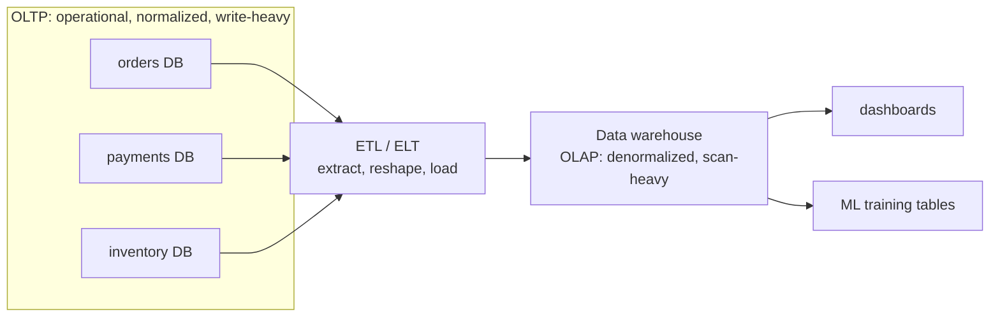

The [normalized schema](K1/relational-model) of the last lesson is built for one
job: recording individual business events correctly, one order, one payment, one
address change at a time. That is the **transactional** workload, and it is a
different animal from the **analytical** workload that asks "what were total
sales by region last quarter?" The two pull storage in opposite directions, which
is why production systems separate them into **OLTP** and **OLAP** layers rather
than serving both from one database<FN n="1" />.

## Two access patterns

**OLTP** (online transaction processing) is the system of record behind a
running application: checkout, banking, ticketing. Its work is **many small
transactions**, each touching a handful of rows: insert one order, look up one
account, update one inventory count. The unit of work is the **point operation**
(find or modify a specific row by key), it runs thousands of times a second, and
correctness under concurrency matters more than raw speed of any single query.

**OLAP** (online analytical processing) is the system of insight behind reporting
and data science: dashboards, cohort analysis, model training tables. Its work is
**few large queries**, each scanning millions of rows to compute an aggregate:
sum revenue over a year, average session length by country, count events per
bucket. The unit of work is the **scan-and-aggregate**, it runs a handful of
times an hour, and throughput over huge row counts matters more than latency on
any one row.

## Why the requirements conflict

The two workloads disagree on almost every design axis:

| Axis | OLTP (transactional) | OLAP (analytical) |
|---|---|---|
| Typical query | point lookup / small write | large scan + aggregate |
| Rows per query | few | millions |
| Write rate | high (constant small writes) | low (bulk loads) |
| Schema | normalized (no redundancy) | denormalized (read-optimized) |
| Optimize for | low per-transaction latency | high scan throughput |
| Columns touched | most columns of a few rows | few columns of most rows |

The last row is the deep one. A transaction reads a whole order row, every
column of one tuple, so storing each row's fields contiguously (a **row store**)
is ideal: one seek fetches the entire record. An analytical query reads `SUM(amount)`
over ten million rows but touches only the `amount` column, so a row store wastes
effort dragging every other field through memory. The analytical query wants the
`amount` column stored contiguously instead (a **column store**), so the scan
reads only the bytes it needs. A single physical layout cannot be contiguous both
ways at once. That tension is the entire reason the storage layer of the next
subsection splits into [row vs columnar](K2/row-vs-columnar) formats.

## The standard resolution: separate the systems

Rather than compromise, production architectures run two systems and move data
between them. The OLTP databases stay normalized and fast for writes; an **ETL**
or **ELT** pipeline periodically extracts their data, reshapes it for analysis,
and loads it into a **data warehouse** tuned for scans. Analysts query the
warehouse, never the live operational database, so heavy reporting scans never
contend with checkout traffic.

## Exercises

**Exercise 1.** Classify each of the following as predominantly OLTP or OLAP, and
justify each from its access pattern (rows touched, write rate, columns read):
(a) a payment service inserting one charge per checkout; (b) a nightly job
computing average order value per region for the last 90 days; (c) a mobile app
reading a single user's profile by id on app launch; (d) a data-science query
selecting two columns over the full event table to build a training set.

Solution

**Step 1.** (a) OLTP. Inserting one charge per checkout is a small write touching
a few rows at a high rate, the point-operation pattern of a system of record.

**Step 2.** (b) OLAP. Averaging order value over 90 days scans millions of rows to
return one aggregate, runs a handful of times, and reads few columns of most rows.

**Step 3.** (c) OLTP. Reading one profile by id is a point lookup, a few columns
of one row fetched by key, latency-sensitive and high-frequency.

**Step 4.** (d) OLAP. Selecting two columns over the full event table is a
large-scan, few-columns-of-most-rows access, the column-store-favoring pattern
that defines analytical work.

**Exercise 2.** A row store places all columns of a row contiguously on disk. For
a query computing `SUM(amount)` over a table of 100 million rows where each row is
200 bytes and the `amount` column is 8 bytes, estimate how many bytes a row store
must read versus the minimum a column store would read. Use the result to explain
why one physical layout cannot serve both workloads.

Solution

**Step 1.** A row store must drag whole rows through memory to reach one column:
$100{,}000{,}000 \times 200 = 2 \times 10^{10}$ bytes, 20 GB, even though the query
needs only `amount`.

**Step 2.** A column store keeps `amount` contiguous, so the scan reads only that
column: $100{,}000{,}000 \times 8 = 8 \times 10^{8}$ bytes, 0.8 GB, a 25x reduction.

**Step 3.** The row store wins the OLTP case (one seek fetches a whole order for a
point operation) and loses the OLAP case (it reads 25x the needed bytes). Bytes can
be contiguous by row or by column, not both at once, so a single layout cannot be
optimal for point operations and column scans simultaneously. That is why the two
workloads are split across separate systems with separate storage layouts.

**Exercise 3.** A startup runs all reporting directly against its live OLTP
checkout database to avoid building an ETL pipeline. Describe two concrete problems
this causes as traffic grows, and explain how the separate-systems architecture in
the diagram resolves each.

Solution

**Step 1.** Resource contention. A heavy reporting scan over millions of rows holds
locks and consumes I/O and memory that checkout transactions need, so a dashboard
refresh can slow or stall live payments. Separating the systems moves scans to a
warehouse, so reporting never competes with checkout traffic for the same resources.

**Step 2.** Layout mismatch. The OLTP database is normalized and row-stored for
fast small writes, which is the wrong shape for large aggregations: every analytical
query pays join and full-row-scan costs the layout was not built for. The ETL or ELT
pipeline reshapes the data into a denormalized, scan-tuned warehouse, so analysts
query a layout built for their workload.

**Step 3.** The cost is freshness: the warehouse lags the operational store by the
pipeline's load interval. For most reporting that staleness is acceptable, and it
buys both isolation and a layout matched to the workload, which is why production
architectures pay it.

The warehouse on the right is not normalized like the operational stores on the
left; it is deliberately reshaped for aggregation. The next lesson gives that
reshape its standard form, the star schema of
[dimensional modeling](K1/dimensional-modeling).

<Footnotes>
  <FNItem n="1">**Kleppmann, M.** (2017). *Designing Data-Intensive Applications.* O'Reilly. Chapter 3 contrasts transaction-processing and analytics workloads and the storage engines each favors.</FNItem>
</Footnotes>
