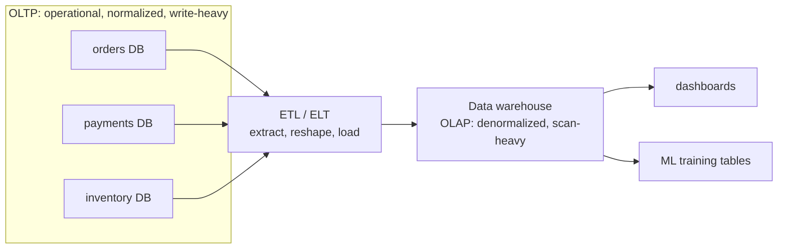

The [normalized schema](K1/relational-model) of the last lesson is built for one
job: recording individual business events correctly, one order, one payment, one
address change at a time. That is the **transactional** workload, and it is a
different animal from the **analytical** workload that asks "what were total
sales by region last quarter?" The two pull storage in opposite directions, which
is why production systems separate them into **OLTP** and **OLAP** layers rather
than serving both from one database.

## Two access patterns

**OLTP** (online transaction processing) is the system of record behind a
running application: checkout, banking, ticketing. Its work is **many small
transactions**, each touching a handful of rows: insert one order, look up one
account, update one inventory count. The unit of work is the **point operation**
(find or modify a specific row by key), it runs thousands of times a second, and
correctness under concurrency matters more than raw speed of any single query.

**OLAP** (online analytical processing) is the system of insight behind reporting
and data science: dashboards, cohort analysis, model training tables. Its work is
**few large queries**, each scanning millions of rows to compute an aggregate:
sum revenue over a year, average session length by country, count events per
bucket. The unit of work is the **scan-and-aggregate**, it runs a handful of
times an hour, and throughput over huge row counts matters more than latency on
any one row.

## Why the requirements conflict

The two workloads disagree on almost every design axis:

| Axis | OLTP (transactional) | OLAP (analytical) |
|---|---|---|
| Typical query | point lookup / small write | large scan + aggregate |
| Rows per query | few | millions |
| Write rate | high (constant small writes) | low (bulk loads) |
| Schema | normalized (no redundancy) | denormalized (read-optimized) |
| Optimize for | low per-transaction latency | high scan throughput |
| Columns touched | most columns of a few rows | few columns of most rows |

The last row is the deep one. A transaction reads a whole order row, every
column of one tuple, so storing each row's fields contiguously (a **row store**)
is ideal: one seek fetches the entire record. An analytical query reads `SUM(amount)`
over ten million rows but touches only the `amount` column, so a row store wastes
effort dragging every other field through memory. The analytical query wants the
`amount` column stored contiguously instead (a **column store**), so the scan
reads only the bytes it needs. A single physical layout cannot be contiguous both
ways at once. That tension is the entire reason the storage layer of the next
subsection splits into [row vs columnar](K2/row-vs-columnar) formats.

## The standard resolution: separate the systems

Rather than compromise, production architectures run two systems and move data
between them. The OLTP databases stay normalized and fast for writes; an **ETL**
or **ELT** pipeline periodically extracts their data, reshapes it for analysis,
and loads it into a **data warehouse** tuned for scans. Analysts query the
warehouse, never the live operational database, so heavy reporting scans never
contend with checkout traffic.

The warehouse on the right is not normalized like the operational stores on the
left; it is deliberately reshaped for aggregation. The next lesson gives that
reshape its standard form, the star schema of
[dimensional modeling](K1/dimensional-modeling).
